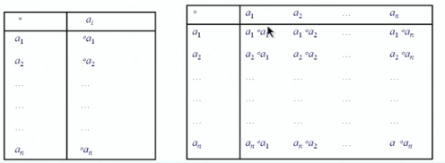

## 代数系统

#### **二元运算**

> 运算定义：设X是集合，$f:X^n \to Y$ 是一个映射，则称f是**X上的n元运算**
>
> ---
>
> 运算表示：
>
> - 解析公式：二元运算 f<x,y> = z  写成 $x \bigstar y = z$
>
> - 运算表：表示有穷集合上的运算
>
>     
>
>
> ---
>
> 二元运算性质
>
> - 设$\bigstar$是X上的二元运算，如果对任何x，y$\in X，有x\bigstar y \in X$，则称 $\bigstar$在X上**封闭**
> - $x\bigstar y = y\bigstar x$ 则 $\bigstar $具有**交换性**（在运算表上主斜线对称）
> - 结合性
> - 分配律
> - 吸收律
>
> ---
>
> 二元运算中特殊元
>
>  - 幂等元：设 $\bigstar$是X上的二元运算，如果有$a\in X$，满足 $a\bigstar a = a$，则a是X上关于$\bigstar $运算的幂等元
>
>  - 幺元：设$\bigstar$是X上的二元运算，$e_L\in X$，使得任意x$\in$X，均有$e_L \bigstar x = x$，则称$e_L是相对\bigstar的左幺元$，反之为右幺元，两边同时为左右幺元，则称为相对幺元
>
>    > 定义在X上的二元运算，如果存在左幺元和右幺元，则左幺元等于右幺元，并且幺元唯一
>
>  - 零元：设$\bigstar$是X上的二元运算，如果有$\theta \in X$ ，使得对任何$x\in X$,有${\theta}_L \bigstar x = \theta_L$ 
>
>    > 存在集合X上的二元运算，且|X| > 1，如果该运算在X中存在幺元e和零元$\theta$，则$\theta \neq e$
>
> - 逆元：$X_L^{-1} \in X$ , 存在$X_L^{-1} \bigstar x = e$  e为X上的幺元，则$X_L^{-1}$是x相对$\bigstar $的左逆元
>
>   > 在二元运算中，存在$x\in X$ x的左右逆元都存在，则相等唯一
>

#### **群与半群(一个运算)**

> **半群：**设S是非空集合，$\bigstar $是S上的二元运算，如果$\bigstar $在S上满足**封闭性**，**可结合性**，则称<S，$\bigstar $>是半群
>
> **独立点：** 设<M,$\bigstar $>是b半群，如果$\bigstar $运算有幺元，则称<M，$\bigstar $>是独异点，也称含幺半群
>
> 
>
>   

  

