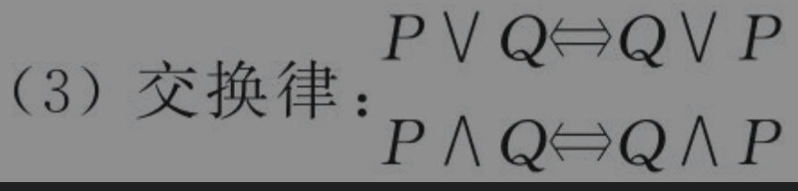
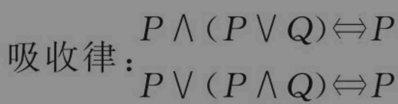

## 命题逻辑(proposition logic)

> **命题：具有真假意义的陈述语句均为命题**（唯一真值的陈述句，不能在某些条件下，出现即为真又为假的结果）
>
> 论证：用证据证明论题的真实性
>
> 驳论：别人提出观点，用论证反驳它，这种论证叫驳论
>
> **悖论：一个论点通过理性推理否定了自身** _eg：“这句话是假的”如过这句话是真的，那么通过这句话我们可以得知这句话是假的，因为一句话不可能又真又假，所以这是个悖论_
>
> **悖论不是命题**
>
> 
>
> #### 复合命题与联结词
>
> - $\lnot$   否定
> - $\land$ 合取  P$\land$Q 当且仅当P，Q为T时 则为T 否则都为F
> - $\lor$ 析取   P$\lor$ Q 当且仅当 P  Q 为F时 为F    **异或(P,Q之间具有相斥性) ** $(P\land\,\lnot Q)\lor(\lnot P\land Q)$
> - $\to$  条件  P$\to$Q 当且仅当P为真，Q为F时，  P$\to$Q 为F
> - $\leftrightarrow$ 双条件  当P与Q同时为真时  P$\leftrightarrow$ Q真
> - 联合词的执行顺序   $\lnot$   $\land$  $\lor$  $\to$  $\leftrightarrow$ 
>
> 
>
> **命题公式等价转换**
>
> - 元命题  存在字符P没有指定具体的命题时，字符P为元命题
> - 真值表  (P$\land$Q)$\to$R   真值表的行数为子命题的平方
>
> |  P   |  Q   |  R   | P$\land$Q | (P$\land$Q)$\to$R |
> | :--: | :--: | :--: | :-------: | :---------------: |
> |  F   |  F   |  F   |     F     |         T         |
> |  F   |  F   |  T   |     F     |         T         |
> |  F   |  T   |  F   |     F     |         T         |
> |  F   |  T   |  T   |     F     |         T         |
> |  T   |  F   |  F   |     F     |         T         |
> |  T   |  F   |  T   |     F     |         T         |
> |  T   |  T   |  F   |     T     |         T         |
> |  T   |  T   |  T   |     T     |         T         |
>
> - $\Leftrightarrow$等价命题   命题的真值表相同则为等价命题
>
> 
>
> **等值演算与蕴含式**
>
> - 定理
>
>   1. A ，B为命题公式，当A$\Leftrightarrow$B时，存在 A $\leftrightarrow$ B必定永真
>
>   2. P $\to$ Q 为永真，则 P $\Rightarrow$Q    $\Rightarrow$蕴含(永真条件)
>
>   3.  $\Rightarrow$ 具有传递性 结合性
>
>      A=>B ,B =>C 则 A=>C
>
>      A=>B, A=>C 则 A=>(B$\land C$)
>
>      A=>C ,B=>C 则 (A$\lor$B) =>C
>
> **推理定理**
>
> 1. 双重否定律  P$\Leftrightarrow$ $\lnot\lnot P$  P$\Leftrightarrow$ P$\lor P$
>
> 2. 交换律  
>
> 3. 分配律  
>
> 4. De Morgan 律 
>
> 5. 吸收律  
>
> |                   公式                   | 简化律 |
> | :--------------------------------------: | :----: |
> |      P $\Rightarrow$ （P $\lor$ Q）      | 附加律 |
> |      $\lnot$P $\Rightarrow$ P$\to$Q      |        |
> |          Q$\Rightarrow$P$\to$Q           |        |
> |      $\lnot$(P$\to$Q)$\Rightarrow$P      |        |
> | $\lnot$(P$\to$ Q)$\Rightarrow$  $\lnot$Q |        |
> |                                          |        |
>
> 
>

