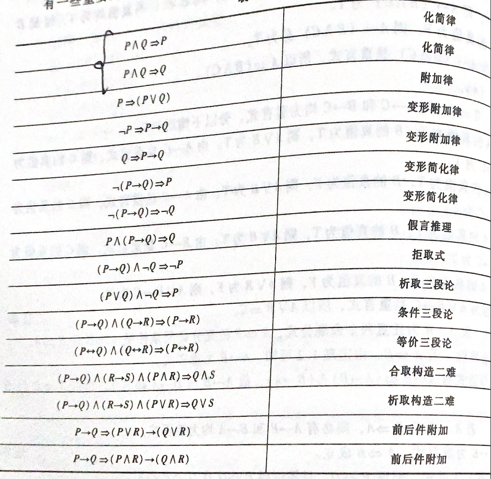

## 命题逻辑(proposition logic)

> **命题：具有真假意义的陈述语句均为命题**（唯一真值的陈述句，不能在某些条件下，出现即为真又为假的结果）
>
> 论证：用证据证明论题的真实性
>
> 驳论：别人提出观点，用论证反驳它，这种论证叫驳论
>
> **悖论：一个论点通过理性推理否定了自身** _eg：“这句话是假的”如过这句话是真的，那么通过这句话我们可以得知这句话是假的，因为一句话不可能又真又假，所以这是个悖论_
>
> **悖论不是命题**
>
> 
>
> #### 复合命题与联结词
>
> - $\lnot$   否定
> - $\land$ 合取  P$\land$Q 当且仅当P，Q为T时 则为T 否则都为F
> - $\lor$ 析取   P$\lor$ Q 当且仅当 P  Q 为F时 为F    **异或(P,Q之间具有相斥性) ** $(P\land\,\lnot Q)\lor(\lnot P\land Q)$
> - $\to$  条件  P$\to$Q 当且仅当P为真，Q为F时，  P$\to$Q 为F
> - $\leftrightarrow$ 双条件  当P与Q同时为真时  P$\leftrightarrow$ Q真
> - 联合词的执行顺序   $\lnot$   $\land$  $\lor$  $\to$  $\leftrightarrow$ 
>
> 
>
> **命题公式等价转换**
>
> - 元命题  存在字符P没有指定具体的命题时，字符P为元命题
> - 真值表  (P$\land$Q)$\to$R   真值表的行数为子命题的平方
>
> |  P   |  Q   |  R   | P$\land$Q | (P$\land$Q)$\to$R |
> | :--: | :--: | :--: | :-------: | :---------------: |
> |  F   |  F   |  F   |     F     |         T         |
> |  F   |  F   |  T   |     F     |         T         |
> |  F   |  T   |  F   |     F     |         T         |
> |  F   |  T   |  T   |     F     |         T         |
> |  T   |  F   |  F   |     F     |         T         |
> |  T   |  F   |  T   |     F     |         T         |
> |  T   |  T   |  F   |     T     |         T         |
> |  T   |  T   |  T   |     T     |         T         |
>
> - $\Leftrightarrow$等价命题   命题的真值表相同则为等价命题
>
> 
>
> **等值演算与蕴含式**
>
> - 定理
>
>   1. A ，B为命题公式，当A$\Leftrightarrow$B时，存在 A $\leftrightarrow$ B必定永真
>
>   2. P $\to$ Q 为永真，则 P $\Rightarrow$Q    $\Rightarrow$蕴含(永真条件)
>
>   3.  $\Rightarrow$ 具有传递性 结合性
>
>      A=>B ,B =>C 则 A=>C
>
>      A=>B, A=>C 则 A=>(B$\land C$)
>
>      A=>C ,B=>C 则 (A$\lor$B) =>C
>
> **推理定理**
>
> 1. 双重否定律  P$\Leftrightarrow$ $\lnot\lnot P$  P$\Leftrightarrow$ P$\lor P$
>
> 2. 结合律 
>
>    (A$\lor$B)$\lor$C$\Leftrightarrow$A$\lor$(B$\lor$C)
>
> 3. 分配律
>
>    A$\lor$(B$\land$C)$\Leftrightarrow$(A$\lor$B)$\land$(A$\lor$C)
>
>    A$\land$(B$\lor$C)$\Leftrightarrow$(A$\land$B)$\lor$(A$\land$C)
>
> 4. 吸收律
>
>    A$\lor$(A$\land$B)$\Leftrightarrow$A  
>
>    A$\land$(A$\lor$B)$\Leftrightarrow$A
>
> 5. **德摩根律**
>
>    $\lnot$(A$\lor$B)$\Leftrightarrow$$\lnot$ A$\land$$\lnot$B
>
>    $\lnot$(A$\land$B)$\Leftrightarrow$$\lnot$ A$\lor$$\lnot$B
>
> 6. **蕴含等式**
>
>    A$\to$B$\Leftrightarrow$ $\lnot$A$\lor$B
>    
> 7. **等价等值式**
>
>    A$\leftrightarrow$B $\Leftrightarrow$(A$\to$B)$\land$ (B$\to$A)
>
> 8. **假言易位**
>
>    A$\to$B$\Leftrightarrow$ $\lnot$B$\to$$\lnot$A
>
> 9. 等价否定
>
>    A$\leftrightarrow$B$\Leftrightarrow$ $\lnot$A$\leftrightarrow$$\lnot$B
>
> 10. **归谬论**
>
>     (A$\to$B)$\land$(A$\to$$\lnot$B)$\Leftrightarrow$ $\lnot$A

#### 推理定律表

>
>|                      公式                       | 简化律 |
>| :---------------------------------------------: | :----: |
>|         P $\Rightarrow$ （P $\lor$ Q）          | 附加律 |
>|         $\lnot$P $\Rightarrow$ P$\to$Q          |        |
>|              Q$\Rightarrow$P$\to$Q              |        |
>|         $\lnot$(P$\to$Q)$\Rightarrow$P          |        |
>|    $\lnot$(P$\to$ Q)$\Rightarrow$  $\lnot$Q     |        |
>|        P$\land$(P$\to$Q) $\Rightarrow$Q         |        |
>| (P$\to$Q)$\land$$\lnot$ Q$\Rightarrow$$\lnot$ P |        |
>
>Eg:
>
> 

#### 命题逻辑的推理理论

> - 合取式(conJunction) 由两个及以上的简单命题通过 $\land$ 联结起来的命题
> - 析取式 由两个及以上的简单命题通过 $\lor$ 联结起来的命题
> - 范式 由多个合取/析取式组成的公式 
>
> 对于任意一个命题公式,都存在与之等值得合取范式或析取范式,等值合取/析取范式转换
>
> 1. 任何命题公式都可以转换为{$\lnot\,\land\,\lor$}中的联结词公式 ($\to\,\leftrightarrow$转换为联结词)
> 2. 对于$\lnot$不允许出现括号面前(使用德摩根公式转换)
> 3. 将结合式转换为非结合式(不允许出现联结括号)  
>
>  
>
> #### 小项与大项
>
> - n个命题变元的**简单合取式**为小项 eg 存在P,Q两个**元命题**,则其小项有 $P\land Q\,P\land \lnot Q\,\lnot P\,\land Q, \lnot P \land \lnot Q$
> - n个命题变元的**析取合式**为大项
>
> 使用二进制编码下标代表命题变元可能性
>
> 三个命题变元P,Q,R构成大项/小项共有8个,对应的二进制编码分别为
> $$
> M_{000}\, M_{001}\, M_{010}\, M_{100}\, M_{011}\, M_{100}\, M_{101}\, M_{110}\,M_{111}\, 或 M_i(i=0,1,2,3,4,5,6,7)
> $$
> **大小项性质**
>
> 1. 大项只存在一种情况其真值为F,有$2^n-1$为真赋值
> 2. 任意两个不同大项的析取式为永真式
> 3. 全体大项的合取式为永假式
>
>  
>
> 

