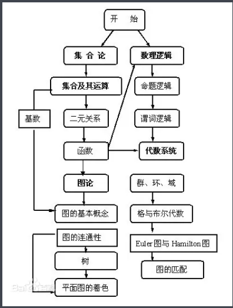

## 概论

> 离散数学*（Discrete mathematics）*是研究离散量的结构及其相互关系的数学学科，是[现代数学](https://baike.baidu.com/item/现代数学/3704792)的一个重要分支。离散的含义是指**不同的连接在一起的元素**，主要是研究基于**离散量的结构和相互间的关系**，其对象一般是有限个或可数个元素。离散数学在各学科领域，特别在[计算机科学与技术](https://baike.baidu.com/item/计算机科学与技术/663582)领域有着广泛的应用，同时离散数学也是[计算机专业](https://baike.baidu.com/item/计算机专业/10586245)的专业课程，如[程序设计语言](https://baike.baidu.com/item/程序设计语言/2317999)、[数据结构](https://baike.baidu.com/item/数据结构/1450)、[操作系统](https://baike.baidu.com/item/操作系统/192)、[编译技术](https://baike.baidu.com/item/编译技术/9854683)、[人工智能](https://baike.baidu.com/item/人工智能/9180)、[数据库](https://baike.baidu.com/item/数据库/103728)、[算法设计与分析](https://baike.baidu.com/item/算法设计与分析/4456166)、[理论计算机科学](https://baike.baidu.com/item/理论计算机科学/11034581)基础等必不可少的先行课程。通过离散数学的学习，不但可以掌握处理离散结构的描述工具和方法，为后续课程的学习创造条件，而且可以提高抽象思维和严格的[逻辑推理能力](https://baike.baidu.com/item/逻辑推理能力/9014049)，为将来参与创新性的研究和开发工作打下坚实的基础。
>
>  
>
> 离散数学是传统的[逻辑学](https://baike.baidu.com/item/逻辑学)，[集合论](https://baike.baidu.com/item/集合论)（包括[函数](https://baike.baidu.com/item/函数)），[数论](https://baike.baidu.com/item/数论)基础，[算法设计](https://baike.baidu.com/item/算法设计)，[组合分析](https://baike.baidu.com/item/组合分析)，离散[概率](https://baike.baidu.com/item/概率)，[关系](https://baike.baidu.com/item/关系)理论，[图论](https://baike.baidu.com/item/图论)与[树](https://baike.baidu.com/item/树)，[抽象代数](https://baike.baidu.com/item/抽象代数)（包括[代数系统](https://baike.baidu.com/item/代数系统)，[群](https://baike.baidu.com/item/群/6977479)、[环](https://baike.baidu.com/item/环)、[域](https://baike.baidu.com/item/域)等），[布尔代数](https://baike.baidu.com/item/布尔代数)，计算模型（语言与[自动机](https://baike.baidu.com/item/自动机)）等汇集起来的一门[综合学科](https://baike.baidu.com/item/综合学科)。
>
> 
>
> 1．集合论部分：[集合](https://baike.baidu.com/item/集合/2908117)及其运算、[二元关系](https://baike.baidu.com/item/二元关系)与函数、[自然数](https://baike.baidu.com/item/自然数)及自然数集、集合的基数。
>
> 2．图论部分：图的基本概念、[欧拉图](https://baike.baidu.com/item/欧拉图)与[哈密顿图](https://baike.baidu.com/item/哈密顿图)、树、图的[矩阵](https://baike.baidu.com/item/矩阵)表示、平面图、图着色、支配集、覆盖集、独立集与匹配、带权图及其应用。
>
> 3．代数结构部分：代数系统的基本概念、[半群](https://baike.baidu.com/item/半群)与[独异点](https://baike.baidu.com/item/独异点)、[群](https://baike.baidu.com/item/群)、[环](https://baike.baidu.com/item/环)与[域](https://baike.baidu.com/item/域)、[格](https://baike.baidu.com/item/格)与布尔代数。
>
> 4．组合数学部分：组合存在性定理、基本的计数公式、组合计数方法、组合计数定理。
>
> 5．数理逻辑部分：[命题逻辑](https://baike.baidu.com/item/命题逻辑)、一阶谓词演算、消解原理。
>
>  
>
> 

