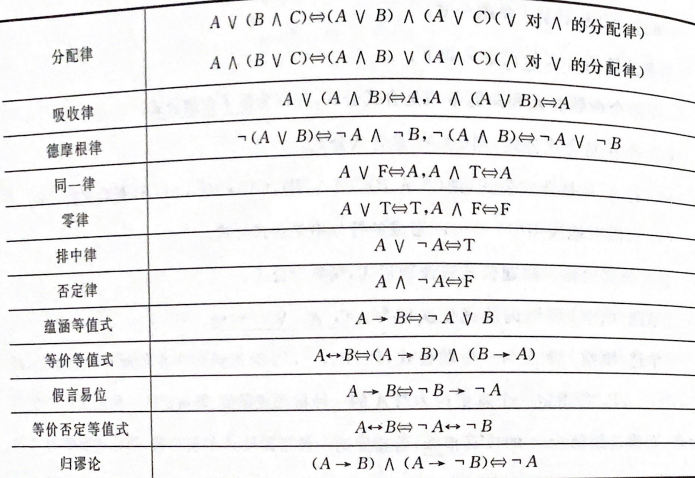
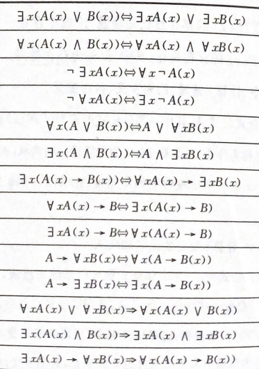

## 离散数学

1. **联合词的执行顺序   $\lnot$   $\land$  $\lor$  $\to$  $\leftrightarrow$** 

2. $\to$  条件  P$\to$Q 当且仅当P为真，Q为F时，  P$\to$Q 为F

3. $\leftrightarrow$ 双条件  当P与Q同时为真时  P$\leftrightarrow$ Q真

4. $P \to Q \Leftrightarrow \lnot P \lor Q \Leftrightarrow \lnot Q \to \lnot P$​​​

   

5. $A \leftrightarrow B ⇔(A→B)∧(B→A) ⇔ (\lnot A \lor B) \land(A\lor \lnot B)  ⇔  \\(A∨¬A)∧(A∨¬B)∧(B∨¬A)∧(B∨¬B) ⇔ (A \land B)\lor(\lnot A\land \lnot B) \\$​

   

6. 蕴含公式：P $\to$ Q是永真式时，P蕴含Q 记作 P$\Rightarrow$Q 

7.  

8. 小项：简单合取式，在真值表中为永真，主析取范式

9. 小项编码 $m_{101} ⇔ P \land \lnot Q \land R  ⇔  m_{5}$  

10. 大项：简单析取式，在真值表中为永假，主析合取范式

11. 小项编码$M_{010} ⇔ P \lor \lnot Q \lor R ⇔  M_{2}$​

12. 命题变元化：A表示 “是大学生” ，$w$表示“王强” 则王强是大学生 可以用A(w)表示该命题

13. 自由变元（变元无量词约束）

14.  

    

15. $x\in \{ a_1,a_2,a_3,a_4 \} \\
    \forall xA(x) \Leftrightarrow A(a_1) \land A(a_2) \land A(a_3)\land A(a_4) \\
    ∃xA(x) \Leftrightarrow A(a_1) \or A(a_2) \or A(a_3)\lor A(a_4)$

    

16. eg A = {a，b，c}  则$\mathscr{P}(A)$={$\emptyset$，{a}，{b}，{c}，{a，b}，{b，c}，{a，c}，{a，b，c}}

17. 对称差 $\oplus$：$A \oplus B = (A \cap $`~`B )$\cup$ (~A $\cap$ B)

18. 

19. $M_{LE_A} = \left[
    \matrix{
     1 & 1& 1& 1\\
     0&1&1&1\\
     0&0&1&1\\
     0&0&0&1
    }
    \right]  关系矩阵 $ ，纵轴表示x下标，横轴表示y下标

20. 自反性：关系集合中任意元素都有 <x,x> 关系，空关系不满足自反性

21. 反自反性：关系集合中不存在<x,x> 关系

22. 反对称性：关系集合中不存在<x,y>与 <y,x> 关系

23. 传递性：关系集合中容易元素存在xRy，yRz，xRz关系

24. $M_{R_1\cup R_2}[i,j] = M_{R_1}[i,j] \lor M_{R_2}[i,j]$

25. $M_{R_1\cap R_2}[i,j] = M_{R_1}[i,j] \land M_{R_2}[i,j]$

26. F $\circ$ G使用函数表代替矩阵运算

27. $I_A$ ：集合A上恒等关系

28. r(R) = $R\cup I_A$：自反闭包

29. s(R) = R $\cup R^{-1}$ ：对称闭包

30. t(R) = $R\cup R^2 \cup ... R^n$，传递闭包

31. 等价关系：自反，对称，传递，相容关系：自反，对称

32. 序关系：自反，反对称，传递

33. 偏序关系Hasse图：无法比较的元素并列，第一元素在左，或在下，第二元素在右或在上

34. 极大元：在给定集合A中最大元素能与序关系集合比较（存在多个或没有）

35. 最大元：序关系集合中最大能比较的元素（存在一个或没有）

36. 上界：满足在序关系中的元素都大于给定集合A元素

37. 上确界：上界中最小的那个元素

38. 函数：定义域中任意一个元素都能通过关系找到对应的元素

39. 单射函数：输出元素不重复

40. 满射函数： 所有的输出元素至少对于一个输入元素

41. 双射：单射+满射

42. 半群：封闭性，结合律

43. 群：封闭性，结合律，存在唯一幺元，所有元素存在逆元（存在唯一逆元）

    > 整数加法群：幺元为0，每个元素 *a* 的逆元是 -a
    >
    > 实数乘法群：幺元为1

44. 子群：非空子集 H 判定

    > 封闭性。a * b ∈ H
    >
    > 单位元：群G的单位元 e 必须属于H 中
    >
    > 逆元：H集合的逆元也在H中

45. 格：偏序关系中任意两个元素都存在上确界和下确界，偏序关系为格

46. 格性质：<S，*，/>构成的代数系统，适合交换律，结合律，吸收律

47. 有界格：存在代数系统 <L，$\and ,\or$,0, 1>，任意元素a与格的上（下）确界进行$\and ,\or$运算满足以下条件

    > $$a \and 0 = 0 \\ 
    > a \or 0 = a \\ 
    > a\and1 = a \\ a\or 1 =1$$​

48. 有界格中补元

    > 存在任意两个元素a，b
    >
    > $a \and b = 0 和  a \or b = 1 成立则 a与b互为补元$​

49. 完全图：顶点都与其余的n-1个顶点邻接 （n-1)n / 2 为边数

50. 顶点的度数之和等于边数的两倍

51. 图奇顶点度数的个数必然为偶数个数

52. 欧拉图：边不重复，点可以重复

53. 欧拉图性质：不存在度数为奇数的顶点

54. 欧拉通路：有且仅有两个奇度顶点

55. 哈密顿图：每个顶点一次而且仅一次的路径

56. 平面图：特殊哈密顿图（边仅在顶点处相交）

    > V：顶点，E边数，F：面
    >
    > V - E + F = 2      F = E - V +2

57. 树：连通且无环的图（两个顶点之间存在唯一的路径）

    > 边与顶点关系：E = V - 1
    >
    > 叶子节点范围 1 < n < V-  1

    

​    
