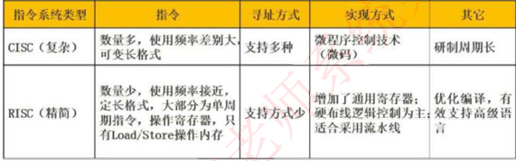
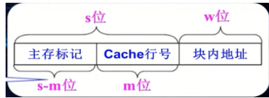

## 基础

- 磁盘调度

  1. 先来先服务

  2. 最短寻找优先（最短移臂调度算法）：优先访问当前磁头最近柱面

  3. 电梯调度：优先访问当前磁头最近一侧柱面

  4. 单向扫描：只向一侧扫描柱面

- RAID磁盘阵列

  1. RAID0：磁盘利用率100%，速度最快，无数据冗余，无数据修复
2. RAID1：磁盘利用率50%，完全镜像，数据安全强
  3. RAID5：至少3块以上奇数硬盘，允许单盘故障，**磁盘利用率 (N-1) / N**

- 磁盘调度时间

  1. 寻道时间 $Ts = s + m \times n$ ，s：启动磁头臂时间，m单个磁道时间，横跨n条磁道
  2. 延迟时间（转动磁盘时间，从磁头定位到目标扇区时间）$Tr = 1/2r$   r：磁盘转速
  3. 传输时间 $Tt = \frac{b}{rN}$， b：每次读写字节数，N：每个磁道字节数，r： 磁盘转速
  4. 磁盘读取时间 $Ta = Ts + Tr + Tb = Ts + \frac{1}{2r} + \frac{b}{rN}$

- 串行，并行，同步，异步

  1. 串行：单个比特位传输，速率低，可靠性高，适合远距离，可控制速率。
  2. 并行：数据同时传输多个位，速度快，费用高，适合近距离。
  3. 同步，异步：收发方保持时钟同步，以确保数据的传输准确性

- CPU

  1. CPU外频（系统总线频率）$\times $ 倍频 = 主频 

  2. 运算器：ALU：算术逻辑单元，AC：累加寄存器（运算结果或源操作数据的存放区域)，DR：数据缓冲寄存器（内存指令或数据），PSW：状态条件寄存器（程序中断时数据）

  3. 控制器：IR：指令寄存器，PC：程序计数器（存放指令执行地址），AR：地址寄存器（CPU访问的内存地址），ID：指令译码器

  4. 体系架构

     - 冯·诺依曼（X86，X64）：指令和数据统一编址，共享同一个存储器，CPU取址与操作无法叠加

       > 同时传输数据和指令，导致存储器和处理器之间的效率低下
       >
       > 指令和数据被混合存储，程序可以动态地修改自身代码，容易受到恶意程序攻击
       >
       > 指令和数据必须具有相同的位宽

     - 哈佛结构（DSP，ARM）：指令与数据分开编址，使用不同的存储器，CPU取址与操作叠加

       > 应用于嵌入式系统或数字信号处理器，有较高的可靠性、运算速度和较大的吞吐量

- CRC循环冗余校验码

  1. 多项式$G(x) = X^5+X^3+X+1$  表示二进制 101011 （首尾必须为1 ）
  2. FCS = 数据 % 多项式 
  3. 发送数据 = 数据 + FCS 

- 流水线指令计算

  1. 流水线周期：其中最长执行时间为该流水线周期

  2. 流水线执行时间：步骤总执行时间 + (总指令条数 -1 ) * 流水线周期

  3. 流水线吞吐率（单位时间执行指令条数）： 指令条数 /  流水线执行时间

  4. 流水线加速比 = $\frac{不使用流水线时间}{流水线执行时间}$

- RISC与CISC

   

- 宏内核与微内核

  1. 宏内核：拥有硬件的所有控制权，高性能，代码庞大，结构混乱，难以维护，程序资源通过操作系统分配（内核调用），内核崩溃程序无法运行（必须重启）
  2. 微内核：内核功能少，结构清晰，方便维护，性能低（管态与目态上下文切换），用户程序可以调用内核API，无需经过操作系统

- 内存地址转换

  1. 全相联映像：块冲突低最低，空间利用率最高，块表容量过大，转换速度慢，适合容量小的Cache

     主存地址 = 块号 + 块内地址

     Cache地址 = 行号 + 行内地址

     块表容量 = Cache行号 * 主存块号位数

  2. 直接映像：块冲突高，直接映射方式一般用于大容量的cache中

      

     - 主存块号 j，与Cache行号`i`映射关系为  i = j mod $2^m$  
     - $2^m$ 为Cache块数，s-m为主存标记位长度
     - 块表长度为 $2^m$ ， 块表容量 $2^m \times (s-m)$

  3. 组相联映像：减少块冲突概率

      

     - 主存块号`j`与Cache组号`q`映射关系为  q = j mod $2^d$  

- 锁资源分配

  1. PV操作：P申请资源，V释放资源 ，当S > 0 时，P，V操作可执行

  2. 前趋图：执行前申请资源（入度），执行后释放资源（出度）

  3. 死锁

     - 死锁预防：破坏死锁产生的条件
     - 死锁避免：合理分配进程资源
     - 死锁检测
     - 死锁解除
     - **死锁资源计算：发生死锁最大资源为 n*（R-1），不发发生死锁最小资源 n * (R-1)+1**

- 文件

  1. 无结构文件（流式文件）

     - 以字节为单位，管理简单，适合源程序文件、目标代码文件

  2. 有结构文件（记录文件）

     - 顺序排列，存在链表或索引记录

     - 不适合经常需要查找、修改或删除单个记录的场合

     - 索引文件 （字 > 字节(Byte) > 位(B)）

       > 直接索引表单个文件最大长度 = 个数 * 数据块大小
       >
       > 一级索引地址页表项 = 数据块 / 地址项大小
       >
       > 一级索引地址长度 = 页表项（个数） * 数据块大小
       >
       > 二级索引索引页表项 = $页表项^2$ 
       >
       > 二级索引地址长度 = 页表项（个数） * 数据块大小

- 数据库三级模式

  1. 概念模式：描述数据与现实实体关联，约束（一个数据库只有一个概念模式）

  2. 外模式（用户模式）：描述用户看到或使用的数据的逻辑结构（一个数据库可以有多个外模式。一个应用程序只能使用一个外模式）

  3. 内模式：存储记录类型，存储域，索引，存储路径模式（个数据库只有一个内模式）

- 关系模式 R(U，F)

  1. R表示关系全局，U表示关系元素，F表示关系函数
  2. 自反性$<x,x> \in R (xRx)$，对称性 <x,y> & <y,x> $\in$ R，传递性<x,y> & <y,z> & <x,z> $\in$ R
  3. 蕴含： $P \to Q$ 为永真时（因果逻辑），P蕴含Q 记作 P$\Rightarrow$Q
     - $Y \sube X \sube U，X \to Y ,则为F的逻辑蕴含 $ 
     - ...

- 数据库二阶段提交

  1. 第一阶段（表决）：所有参与事务的节点向事务管理器发送当前数据状态消息
  2. 提交阶段：事务管理器根据收到的状态消息决定回滚或提交

- 数据库3NF

  1.  1NF：无重复的列，且每一列不可分割的原子属性

  2.  2NF：实体的其他属性完全依赖主键（单表中不存在两个有联系的主体字段，消除数据冗余）

  3.  3NF：不包含其它关系已包含的非主键信息（单表中不存在其他表中非主键的字段，消除数据冗余）

  4.   反规范化技术：

     - 增加冗余列
     - 增加派生列

     - 重新组表
     - 水平分割表
     - 垂直分割表

- 芯片

  1. Soc：系统级芯片（微处理器，包含硬件与嵌入式软件）

  2. MCU：微控制单元（单片机）

  3. BSP：硬件抽象层（HAL）与硬件，操作系统相关（操作系统引导程序）

  4. DSP：信号处理技术（实现数字信号处理技术的芯片）

  5. AI芯片：新型计算范式（矩阵乘法和加法），信号处理，低精度设计，专用开发工具

     > AI芯片技术架构
     >
     > - GPU：价格，功耗过高
     > - FPGA：可编程门阵列
     > - ASIC：专用集成电路

- 系统

  1. RTOS：实时操作系统：系统能及时响应外部事件的要求，在规定时间内调度一切可利用资源完成任务
  2. BPOS：批处理系统：资源利用率高，系统吞吐量大，但缺乏交互能力
  3. TSOS：分时系统：以时间片方式服务（Linux，Window，Mac）
  4. 嵌入式操作系统：内核小，专用性强，系统精简，高实时性，多任务操作

- 常见网络应用协议及端口

  | 协议      | 服务                             | 端口                             |
  | --------- | -------------------------------- | -------------------------------- |
  | FTP       | 文件传输协议（数据）（控制）     | 20/21                            |
  | Telnet    | Telnet终端仿真                   | 23                               |
  | DHCP      | 动态主机配置协议 C/S             | 67/68                            |
  | SMTP      | 简单邮件发送协议                 | 25                               |
  | POP3/IMAP | 邮件接收协议（POP3本地操作可见） | POP3：110/995 IMAP：143/993 |
  | DNS       | 域名服务                         | 53                               |
  | SSL/TLS   | 安全套接层/传输层安全性          | 443                              |
  | SSH       | 安全外壳协议                     | 22                               |

- 无线传输加密算法

  1. WEP：RC4算法 + CRC-32 传输
  2. WPA：
  3. WPA2

- DNS请求过程

  1. 查询本机DNS缓存，获取主机对应IP地址

  2. 发起DNS请求，获取主机对应IP地址

     > 递归查询：由根域名服务递归子服务器返回IP（影响性能）
     >
     > 迭代查询：由客户端依次迭代查询子域名服务器
  
  3. 使用IP地址向目标服务器建立TCP连接
  
- DHCP请求过程

  1. **入网主机广播方式**(255.255.255.255)发送discover报文，寻找DHCP服务器
  2. DHCP服务器收到discover报文，选出一个可用地址包装成 offer报文返回入网主机
  3. 入网主机只接收第一个收达offer报文，并再次以广播方式发送request确定当前使用IP
  4. DHCP服务器接收到request，再返回ACK报文确定该IP已分配入网主机
  
- IPV6

  1. 地址长度128位，16位一段，分为8段，每段使用16进制表示（IPv4 32位）

  2. **灵活，简化报文头部IP报文头部格式**

  3. 单播，组播，泛播（广播到所有子网）

- 网络分层设计

  1. 核心：冗余能力、可靠性和高速的传输（链路聚合、IP路由，IP组播）
  2. 汇聚：交换速率，高性能，低接入（路由选择、分组过滤、组播管理、QoS服务质量、负载均衡）
  3. 接入：低成本，高端口密度（接入与认证、QoS、MAC地址过滤
  
- 霍尔三维结构

  1. 逻辑，时间，知识

- 测试方法

  1. 静态（代码走查，代码评审，桌查）

  2. 动态（白盒，黑盒，性能）

     > 单元测试
     >
     > 冒烟测试：选择基础用例进行验证，确保全流程没有严重，阻塞性问题
     >
     > 集成测试：依据概要设计文档，依次测试各个模块功能
     >
     > 回归测试：软件变更后，对变更相关的内容进行测试
     >
     > 确认测试：验证软件是否符合用户需求（黑盒测试）
     >
     > - 等价类划分：输入条件划分为有效范围和无效范围
     > - 边界值分析：边界参数进行测试
     > - 因果图与判定表：输入条件的等价类组合关系，写出判定表
     > - 错误推测：根据经验或直觉推测程序中可能存在的各种错误
     >
     > 白盒测试：程序每条语句都执行一次进行测试
     >
     > 验收测试：包含项目资料文档，功能，性能，安装，用户培训测试
     >
     > a&b测试：Alpha：模拟环境下测试，Beta：实际环境下进行测试

- 系统指标测试方法

  1. 常用方法：通过计算机指标判断（CPU时钟，指令执行速度，综合理论性能等），评估性能差异较大
  2. BMT基准测试：最常用，最核心的功能进行测试作为整体性能指标（浮点，整数，SPEC，TPC测试）
  3. 负载测试：测试超负荷环境中程序运行情况
  4. 强度测试：系统资源低情况下软件运行情况
  5. 容量测试：系统能容量用户数量

- 测试脚本

  1. 线性脚本：手工测试用例时得到脚本
  2. 结构化脚本：具有逻辑结构和函数调用功能
  3. 共享脚本：可以被多个测试用例使用
  4. 数据驱动脚本：存储在独立的数据文件中

- 企业数据化转型发展

  1. 数字化技术：人工智能、大数据、云计算实现业务流程的自动化和优化，提高效率和准确性
  2. 创新业务模式：共享经济、平台经济等，来拓展市场和增加收入来源
  3. 数据管理：数据分析能力提高决策的准确性和速度
  4. 数字化文化

- 电子政务

  1. G2G：政府机构之间信息系统（人口采集等）
  2. G2B：政府与企业之间的信息系统（政策，法规，行政规定，营业执照，许可证，质量认证）
  3. G2C：政府与居民之间的信息系统（户口，个人证件，医院，学校，图书馆，公园）
  4. B2G：企业税收系统
  5. C2G：个人税收系统（报警，罚款）

- 电子商务（不包含政府）

  1. 客户，商户，银行，认证中心

- 系统应用集成

  1. 保证应用独立情况下，通过接口实现共享数据和功能
  2. 集成技术：页面集成（表示集成），控制集成（API集成），数据集成（数据共享，数据仓库），**业务流程集成（过程集成）**，平台集成

- 管理信息系统规划方法

  1. CSF：关键成功因素（关键信息集合，确定优先次序）
  2. SST：战略目标集转化（战略目标集合，确定运作需求）
  3. BSP：企业系统规划（自上而下分析系统，直下和上设计系统）
  
- ERP企业资源计划

  1. 以物料，资金链，信息流全面集成管理的信息系统

- 商业报表（数据仓库，联机分析，数据挖掘）

- Kerberos统一认证授权系统

  1. KDC：密钥分发中心，存储用户信息，管理发放票据（包含AS，TGS）

  2. TGP：认证票据

  3. Realm：命名空间，不同的环境可以通过Realm区分；

  4. Principal：Kerberos认证账号；

  5. keytab：Kerberos认证密钥

  6. AS：认证服务器（校验Principal，keytab或密码正确性），返回TGP

  7. 客户端携带TGP请求TGS服务器

  8. TGS：授权服务器（校验TGP正确性，并返回HttpTicket，Session Key（包含客户信息和时间戳））

  9. 客户端携带 HttpTicket，Session Key 访问认证服务器

       

- 软件过程模型

  1. 瀑布模型：等待上一阶产出的结果作为输入，需求明确，有严格时间管控，适合大型项目

  2. 原型模型：产品以原型方式展示客户（需求不确定，功能复杂），根据客户反馈进行更改原型，根据原型开发产品

  3. 螺旋模型：原型与瀑布模式结合，并加入风险分析

  4. 增量模型：将需求拆分多个子项（适用于需求稳定、功能较少的项目），优先迭代核心功能。成本比低

  5. 敏捷模式：应付需求快速变化的软件开发方法，适合小项目迭代（**适应性强**，**以人为本**，迭代增量的方式）

     > XP：注重用户体验、强调团队协作、强调测试驱动开发，快速响应变化和持续改进提示开发效率与质量
     >
     > 水晶球：不同的项目都需要一套不同的策略、约定和方法论
     >
     > Scrum：迭代增量方式迭代开发
     >
     > FDD特征驱动：以用户需求和期望为驱动力开发，通过迭代开发、持续集成和简单设计等方式，以提高软件开发效率和质量

  6. 构建CBSD模型（快速应用开发）：构件复用，速度快，要求系统模块化程度高

  7. 统一建模RUP：用例驱动，以架构为中心，增量和迭代（初始，细化，构建，交付）使其项目管理、业务建模、分析与设计等统一起来，贯穿整个开发过程

     > 核心工作流：业务建模，需求，分析与设计，实现，测试，部署，配置与变更管理，项目管理，环境

  8. 逆向工程：重构（改变抽象实现方式），再工程（分析已有的项目，再生成一个新的项目）

- 软件过程

  1. 软件周期：定义，开发，运行，维护
  2. 软件设计活动：数据，结构，人机界面，过程（需求获取，设计，实现，测试，发布，维护）
  3. 软件结构化设计：架构，接口，数据，过程
  4. 软件描述：定于软件功能和使用限制
  5. 软件开发：软件设计和实现
  6. 需求分析阶段：数据流图
  7. 概要设计阶段：模块结构图，层次图，HIPO图
  8. 详细设计阶段：程序流程图，伪代码，盒图
  
- 需求获取方法

  1. 用户访谈，问卷调查，JRP联合需求计划，情节串联，参与业务实践，抽样调查

- JRP：联合需求计划

  1.   

- UML：统一建模语言

  1. 结构：构造块、规则和公共机制
  
- 4+1视图模型

  1. 逻辑：功能性需求支持
  2. 开发：软件结构之间划分。
  3. 过程：非功能性需求（并发，分布式，容错）
  4. 物理：部署视图（系统拓扑结构、系统安装图）
  5. 统一场景

- CMMI：能力成熟度模型，衡量软件开发过程成熟度

  1. 初始级：缺乏管控，过程不可预测
  2. 可预测（已管理）：过程为项目服务（已建立基本项目管理）
  3. 已定级（高级，优化）：过程为组织服务（已提高开发效率，具备变化和挑战能力）

- DCMM：数据管理能力成熟平谷模型

  1. 战略
  2. 治理
  3. 架构
  4. 应用
  5. 安全
  6. 质量
  7. 标准
  8. 生存周期

- 遗留系统评估（改造 > 继承 > 集成 > 淘汰）

  1.  

- 管理活动

  1. 需求管理：变更控制，版本控制，需求跟综，需求状态跟踪

  2. 项目管理：进度管理，项目配置管理，质量管理，风险管控

     > 软件文档：系统文档，用户文档

- 系统设计原则（抽象化，自顶向下，逐步求精，信息屏蔽，模块之间高内聚，低耦合）

  1. 内聚

     >  

  2. 耦合

     >  
  
  3. 结构化分析：**自顶向下，逐步分解，面向数据**
  
- 架构风格

  1. 数据流

     > 批处理序列：按顺序逐步执行，**保持数据完整**
     >
     > 管道-过滤器：前一个构件输出作为后一个构件输入，**过滤器为构件，连接件为管道**

  2. 调用返回

     > 主程序/子程序：调用作为交互机制，连接构件
     >
     > 面对对象
     >
     > 层次结构：只允许相邻层次通信（低耦合），越底层抽象越高。难以分层

  3. 独立构件（构件之间不存在显示调用关系，通过时间触发，异步方式执行）

     > 事件系统：触发或广播方式通知多个构件（匿名调用，并发执行，放弃系统计算控制）

  4. 虚拟机（定义一套规则供使用者使用，基于规则开发构件）

  5. 仓库：以数据为中心，所有操作都围绕数据进行（数据库，超文本）

- 软件架构质量属性

  1. 性能：系统响应能力（响应时间，吞吐量）。通过增加计算资源，减少计算开销，引入并发机制，采用资源淘汰、调度策略提升
  2. 可靠性：意外或使用错误情况下维持系统功能特性（MTTR：平均维修时间，MTBF：平均故障间隔时间，MTTF：平均故障时间，MTTA：平均确认时间）。检测策略：心跳，Ping/Echo，冗余，选举
  3. 可用性：系统能够正常运行时间比例
  4. 安全性：阻止非授权用户使用系统。设计策略：入侵检测，用户日志，用户授权，追踪审计
  5. 可修改：系统变更能力强。设计策略：接口-实现类，抽象，内部信息封装
  6. 互操作性：与其他系统，架构集成能力

- 软件架构分析

  1. 风险：设计中潜在，存在问题的架构决策带来的隐患
  2. 敏感：实现某种特定质量属性具有的特性
  3. 均衡：响多个质量属性的特性（多个质量属性的敏感点）

- ATAM架构权衡分析法

  1. 质量属性 > 属性分类 > 质量属性场景

- SAAM软件架构评估

  1. 问题描述，需求说明，架构描述
  2. 分析过程：场景开发，框架描述，单个场景评估，场景交互，总体评估（多个相互作用）

- SDN网络架构：业务，控制，转发

- ABSDM基于架构软件开发模型

  1. 架构需求，设计，文档话，复审，实现，演化

- SOA关键技术

  1. 发现服务：UDDI，DISCO

  2. 描述服务： WSDL，XML Schema

  3. 消息格式：SOAP，REST

  4. 编码格式：XML，JSON

  5. 传输协议：HTTP，TCP/IP，SMTP
  6. UDDI：统一描述，发现和集成（用于服务注册和查找）
  7. WSDL：服务描述语言，描述Web服务的接口与查操作功能
  8. SOAP：对象访问协议，建立Web服务和服务请求之间的通信
  9. ESB：企业服务总线（连接服务节点，具有消息转化，解释，路由功能，使不同的访问相互连通）
  
- 软件可靠性指标

  1. 平均失效时间MTTF
  2. 平均恢复前时间MTTR
  3. 平均故障间隔时间MTBF = MTTF + MTTR
  4. 系统可用性 MTTF / （MTTF + MTTR）

- 可靠性设计

  1. 容错设计（冗余，恢复块技术）
  2. 检错设计
  3. 减低复杂度

- 云计算服务体系

  1. SaaS软件即服务：应用上云，通过标准浏览器向客户提供应用服务
  2. PaaS平台即服务：提供分布式开发环境
  3. IaaS基础实施服务：提供云内存，云I/O设备，云存储和云计算能力

- 软件著作权

  1. 自动取得/登记取得：软件开发完成之日起即自动产生软件著作权
  2. 保护期限：著作人终身及死亡后50年
  3. 发表权：指著作权人决定是否将作品公开展示和发表的权利（行使一次，作者享有）
  4. 修改权：指著作权人对其作品进行修订、修改、完善的权利（不受时间限制）
  5. 署名权：不受时间限制
  6. 复制权：指著作权人对其作品进行复制、印刷、制作副本等权利
  7. 发行权：指著作权人对其作品进行发行、销售、出租、出借等权利
  
- 

  

  

​     

  

  

​     

  

​       

  

​     

  

