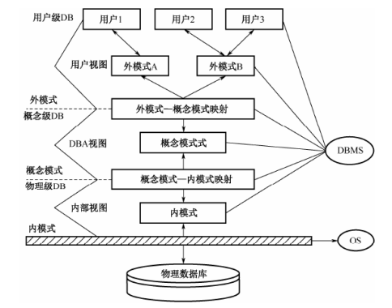
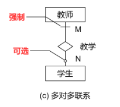
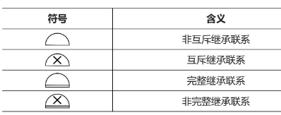
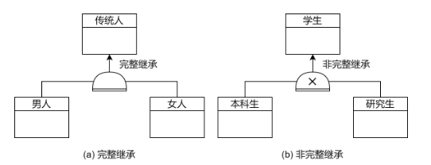
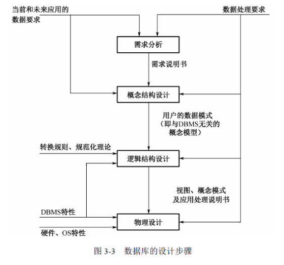
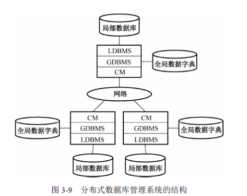

## 数据库系统

> DBMS：数据库管理系统
>
> 数据模型划分：
>
> 1. 关系
> 2. 时序
> 3. 文档
> 4. 键值
> 5. 对象
>
> 
>
> **数据库系统结构模式**
>
>  
>
> - 用户数据库：用户级数据库主要由外部记录组成，不同的用 户视图可以互相重叠，用户的所有操作都是针对用户视图
>
> - 概念级数据库：数据库管理员可看到和使用的数据库，又称DBA（DataBase  Administrator，数据库管理员）视图
>
> - 内部视图：数据库的低层表示，它描述数据 的实际存储组织，是最接近于物理存储的级
>
> - 用户的应用程序与存储在磁盘上的数据库中的数据是相互独立的
>
> - 逻辑独立性是指用户的应用程序与数据库中的逻辑结构是相互独立的。当数据的逻辑结构改变时，应用程序不需要改变
>
> 
>
> **数据模型**
>
> - **概念数据模型/逻辑数据模型**：按照用户的观点对数据和信息建模
>
>   > E-R模型：实体、属性、关系和参照实体
>   >
>   > 实体：客观事物在逻辑层面的数据抽象，采用矩形表示
>   >
>   > 属性：描述实体的特征
>   >
>   > 标识符：特殊属性，标识符与主键的区别：标识符是一个逻辑概念，而主键是一个物理概念
>   >
>   > **关系：实体之间的联系，关联实体数目为联系度数。采用菱形表示**
>   >
>   > - 二元实体联系类型：1对1，1对多，多对多
>   >
>   > - 可选和强制：实体之间依赖必要关系（学生与教师关系，存在学生必定存在教师）
>   >
>   >    
>   >
>   > - 继承联系
>   >
>   >    
>   >
>   >   - 非互斥继承：继承实体之间存在关联关系
>   >   - 互斥继承：继承实体之间不存在关联关系
>   >   - 完整继承：继承实体实例等于父类实例
>   >   - 非完整继承：父类实例大于子类实体之和
>   >
>   >    
>
> - **关系代数**
>
>   > 笛卡尔积：$R \times S = \{ t | t= <t_r,t_s>  \ \ t_r \in R, t_s \in S \}$
>
> 
>
> **关系范式**（提高数据的完整性、一致性和可维护性，降低数据冗余和成本，提高数据库性能和可扩展性）
>
> - 1NF：每个属性都是不可再分的原子值，不允许属性有重复值
>
> - 2NF：每个非主属性都必须完全依赖于主属性（所有非主属性必须依赖主属性）
>
> - 3NF：每个非主属性不能依赖于其他非主属性（非主属性之间不能有关联）
>
> - BCNF：非空子集的主属性都**部分依赖于其父属性**（子主属性包含父属性部分数据）
>
> - 4NF（完全范式）：非冗余属性设计（要求**所有非主属性都完全依赖主键**）
>
> **反规范化**（主要提高程序性能）
>
> - 增加冗余列
>
> - 增加派生列（由其他数据计算生成）
>
> - 重新组表（将满足特定关系的实体设计成一张表）
>
> - 分割表
>
>   - 水平分割：根据一列或多列数据的值把数据行放到两个独立的表中（表字段多，拆分列数据具有独立性，数据切片）
>   - 垂直分割：将表数据安装某个字段分组存入不同的表
>
>   
>
> **数据库设计**
>
>  
>
> 1. **需求分析**：制定需求说明书：包含数据库所涉及的数据、数据的特征、使用频率和数据量的估计，如数据名、属性及其 类型、主关键字属性、保密要求、完整性约束条件、更改要求、使用频率、数据量估计。
>
>    > - 确定需求，确定设计模板
>    > - **分析和收集数据**（要收集数据 的名称、类型、长度、数据量、对数据的约束及数据间联系的类型等信息）
>    > - 需求说明文档
>
> 2. **概念结构设计**：用户的数据模型或企业数据模型。（ER模型）
>
> 3. **逻辑结构设计**：用 DBMS 所提供的数据定义语言（DDL） 写成的数据模式。逻辑设计的具体方法与 DBMS 的逻辑数据模型有关
>
> 4. **物理设计**：根据 DBMS 提供的各种手段，设计数据的存储形式和存取路径， 如文件结构、索引设计等。
>
>    
>
> **事务管理**
>
> 1. 原子
> 2. 一致
> 3. 隔离
> 4. 持久
>
> **并发控制**
>
> - 排它封锁（X锁）：事务 T 对数据 A（可以是数据项、记录、数 据集，乃至整个数据库）实现了 X 封锁，那么只允许事务 T 读取和修改数据 A，其他事 务要等事务 T 解除 X 封锁以后，才能对数据 A 实现任何类型的封锁
> - 共享封锁（S锁）：事务 T 对数据 A 实现了 S 封锁，那么允许其他事务读取数据 A，但不能修改数据 A，在所有S封锁解除之前绝不允许任何事务对数据 A 实现 X 封锁
> - **锁分析**：封锁粒度小则并发性高，但开销大；封锁粒度大则并发性低，但开销小
> - 数据库避免死锁：
>   1. 预防：顺序加锁，或一次性申请它所需要的所有封锁
>   2. 死锁解除：死锁检测程序，
>
>  
>
> 故障与恢复
>
> - 事务故障：事务未运行至正常终止点就被撤销
> - 系统故障：事务在执行过程中以非正常方式终止，这时内存中的信息丢失， 但存储在外存储设备上的数据不会受影响
> - 介质故障：磁盘损坏磁头碰撞或由于操作系统的某种潜在的错误、瞬时强磁场干扰，使存储在外存上的数据部分损失或全部损 失，
> - 计算机病毒
>
>  
>
> **备份与恢复**
>
> - 备份原则
>   1. 保证数据丢失的情况尽量少或完全不丢失
>   2. 备份和恢复时间尽量短，保证系统最大的可用性
>
>  
>
> **分布式数据库**（DDB）
>
>  
>
>  
>
> 