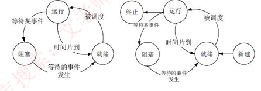
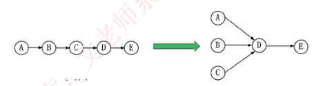
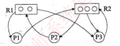
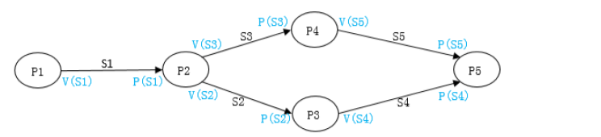
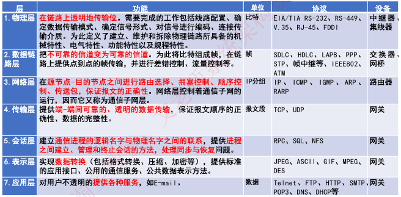
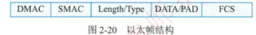
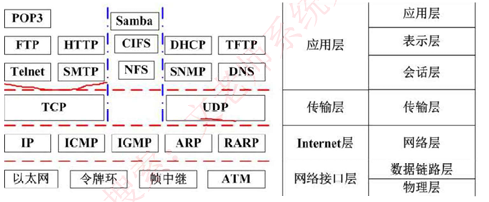
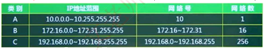
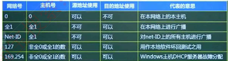
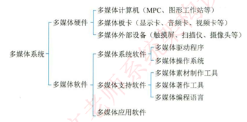

## 计算机基础

> CPU组成：
>
> - 运算器：ALU算术逻辑单元，AC累加寄存器（运算结果或源操作数据的存放区域)，**DR数据缓冲寄存器（内存的指令或数据）**PSW状态条件寄存器(程序中断后的状态标志）组成
> - 控制器：IR指令寄存器，**PC程序计数器（存放指令执行地址）**，AR地址寄存器（CPU访问的内存地址），ID指令译码器
>
> **校验码**
>
> - 奇偶校验码
>
> - **CRC循环冗余校验码**：
>
>   FCS：数据 % 多项式 
>
>   CRC：数据 + FCS
>
>    
>
> **指令系统**
>
> -  
> - 流水线时间
>   1. **流水线周期：其中最长执行时间为该流水线周期**
>   2. **流水线执行时间：一条指令总执行时间 + (总指令条数 -1 ) * 流水线周期**
>   3. **流水线吞吐率（单位时间执行指令条数）： 指令条数 /  流水线执行时间**
>   4. **流水线加速比：**
>
> 
>
> **存储系统**
>
> - **局部性原理**：CPU在运行时访问的数据趋向于一个较小的局部空间地址内
>
>   1. 时间局部性：在相邻的时间里会访问同一个数据项
>   2. 空间局部性：在相邻的空间地址会被连续访问
>
> - 高速缓存Cache：解决CPU与主存之间速度问题，存储当前最活跃的指令和数据
>
>   **Cache与主存地址映射**
>
>   1. 直接映像：主存块与Cache块编号（固定）转换。**地址转换简单，块冲突高**
>   2. 全相联映像：主存块与Cache全相联，**块冲突低最低，空间利用率最高，映像表容量过大，转换速度慢**
>   3. 组相联映像：Cache与内存分块分组，组之间采用直接映像，组内块采用全相联映像（组号必须相同，块号可以按规则任意调换）
>
> - 替换算法：使Cache尽可能提高命中率
>
>   1. 随机算法RAND：  命中率最低
>   2. 先进先出 FIFO：
>   3. 近期最少使用算法LRU
>   4. 优化替换算法OPT：命中率最高
>
> - 磁盘结构与参数
>
>   1. 磁道：硬盘上同心圆
>
>   2. 扇区：磁道等单位划分
>
>   3. 存取时间= 寻道时间 + 等待时间（平均定位时间 + 转动延迟）
>
>   4. **磁盘调度算法**：
>
>      - FCFS：先来先服务
>
>      - SSTF：请求访问磁道与当前磁道最近的进程优先调度
>
>      - SCAN：电梯算法
>   
> - 输入输出
>
>   1. 独立编址方法：接口指令太少，功能弱
>   2. 统一编址方法：导致内存不连续（硬件占用主存空间）
>   3. 外设与计算机数据交互
>      - 程序控制查询方式：CPU主动查询外设是否完成数据传输，效率低
>      - 程序中断方式
>      - DMA直接主存存取
>      - 总线
>
> - 总线：计算机设备之间传输数据公共通道
>

#### **操作系统**

> 操作系统：能有效组织和管理系统中软硬件资源，合理组织计算机系统工作，控制程序执行，并提供用户接口
>
> **操作系统特征**：并发，共享，虚拟和不确定
>
> 操作系统分类
>
> 1. 批处理：主机与外设可以并行执行
>
> 2. 分时
>
> 3. 实时
>
> 4. 网络
>
> 5. 分布式
>
> 6. 微型：微机操作系统（Windows，Mac OS，Linux）
>
> 7. 嵌入式：微型化，可定制，实时性强，可靠性，易移植（自低向上，从硬件到软件）
>
> 
>
> 操作系统功能
>
> - 进程管理
>
>   1. PCB：进程控制块（唯一标志），程序，数据
>
>   2. 进程状态转换图
>
>       
>
>   3. 前趋图
>
>       
>
>   4. 进程资源图
>
>       
>
>      R：资源
>
>      P：进程
>
>      R$\to$ P：资源R以被进程P占用
>
>      P $\to$ R：进程P申请/等待资源R
>
>      进程资源图简化（判断是否会死锁）：逐步释放不阻塞线程资源，判断是否存在孤立点
>
>   5. **PV操作（进程同步与互斥）**
>
>      P：申请资源，S  = S - 1 ，当 S > 0 ，P操作的进程可执行
>
>      V：释放资源， S  = S + 1 ，当 S> 0，执行V操作的进程可以继续执行
>
>      **PV与前趋图**：执行前申请资源（入度），执行后释放资源（出度）
>
>       
>   
>   7. CPU调度算法
>   
>      FCFS：先到优先调度
>   
>      时间片
>   
>      优先级调度
>   
>      多级反馈调度
>   
>   8. 死锁：资源互斥，每个进程占有资源并等待其他资源释放，系统不能主动释放进程资源
>   
>      - 死锁预防：破坏死锁产生的条件
>      - 死锁避免：合理分配进程资源
>      - 死锁检测
>      - 死锁解除
>      - **死锁资源计算：发生死锁最大资源为 n*（R-1），不发发生死锁最小资源 n * (R-1)+1**
>   
>   9. 线程：可独立调度和分配的最小单位共享同一进程内资源，进程：可拥有资源的独立单位
>
> - 存储管理
>   1. 分页存储：逻辑页分为页号与页内地址（页号与逻辑号存在映射关系），利用率高，碎片小，分配简单，可能导致内存抖动，真假系统开销
>   2. 分段存储
>   3. 页段式存储
> - 设备管理
>   1. 设备分类：
>      - 字符设备：以字符为单位进行数据输入和输出的设备（无缓存，逐个字符读写，顺序访问）
>      - 块设备：随机访问固定大小数据片
>      - SPOOLING：建立数据缓存区，实现物理外设共享
> - 文件管理
>   1. 文件：具有符号名，在逻辑上具有完整应用的信息项集合
>   2. 文件逻辑结构：有结构的记录文件，无结构的流式文件

#### **计算机网络**

> 计算机网络功能
>
> - 数据通信
> - 资源共享
> - 管理集中化
> - 分布式处理
> - 负载均衡
>
> 网络拓扑结构与分布范围
>
> - LAN、MAN，WAN
> - 总线，树型（利用率低，干扰大，价格低）
> - 星型（中央单元负载大）
> - 环型（效率低，难扩展）
> - 网络（分布式）：管理成本高
>
> 
>
> **OSI七层模型**
>
>  
>
> 
>
> IEEE 802.3 以太网规范 (**局域网协议**)
>
>   	 
>
> - DMAC：目的MAC地址
>
> - SMAC：源MAC地址
>
> - Length/Type：长度，类型
>
> - DATA/PAD：数据填充
>
> - FCS：差错校验
>
> 
>
> **TCP/IP协议**
>
> 语法：规定数据传输格式
>
> 语义：规定完成功能
>
> 时序：规定操作条件，顺序
>
>  
>
> IP：源地址和目的地址之间数据传输，无连接，不可靠
>
> ICMP：控制报文协议（判断网络是否可达，路由信息可用）
>
> ARP，RARP：地址解析协议，将IP地址转为局域网内MAC地址
>
> IGMP：网络组管理协议（相邻路由信息转发协议，支持组播）
>
> SNMP：管理管理协议，判断是否有新设备加入网络（网络邻居）
>
> DHCP：动态地址分配协议（UDP）
>
> DNS：域名解析
>
> 
>
> 交换技术
>
> - 集线：提供大量端口供线缆连接（星状或总线方式部署）
>
> - 中继
>
> - 桥接：通过设备把其他子网连接起来（链路层包装转发）
>
> - 交换方式
>
>   1. 电路：面向连接，实时性高，链路利用率低
>
>   2. 报文：存储转发模式，有延迟，可靠性高，面向无连接
>
>   3. 分组交换：报文分组打包传输
>
>      - 数据报：携带各分组地址信息，自由选择不同的路由路径传输
>      - 虚电路：固定路由传输（面向连接）
>      - 信元交换：固定路由和报文长度（面向连接，可靠）
>
> 
>
> 传输介质
>
> 1. 双交线：100m通信范围
> 2. 同轴电缆
> 3. 光纤：MMF多模光纤（传输多种不同的信号），SMF单模光纤（激光信号传播，传播远，可靠）
> 4. 无线信道
> 5. 通信方式
>    - 同步：以数据块为单位进行传输，需要同步帧与结束帧确认，效率高
>    - 异步：以字符为单位传输，约定起止位置
>    - 串行：1bit单通道逐个传输，速率低，适合远距离传输
>    - 并行：多个数据线并行传输
>
> 
>
> **IP地址**
>
> 计算机中4字节（32bit）容量表示$2^{32}$种不同的值，每八位转换为10进制则范围0~255
>
> - **IP分类**：网络号+主机号（根据网络号不同分类）
>
> - **无分类编址：** 通过子网掩码 + IP 计算网络号  128.168.0.11/20
>
> - **特殊IP地址（私有IP，不能联网）**
>
>    
>   
> - **指定功能IP地址**
>
>    
>
> - **子网划分** ：网络号 + 子网号 + 主机号
>
>   
>
> **网络规划与设计**
>
> - 核心：不同区域之间最佳路由和高数数据传输
> - 汇聚：网络业务连接到接入层，并实现安全，流量，负载，路由策略
> - 接入：在本地网段提供通信问题（IP地址，MAC地址，日志，访问，用户认证，计费）
>
> 
>
>  **RAID磁盘冗余阵列**
>
> 将数据分散在不同的磁盘中，可以并行读取，提供磁盘访问数据，保证数据安全
>
> - RAID0：**磁盘利用率100%，访问数据最快**，无冗余和错误修复技术（磁盘损坏数据丢失）
> - RAID1：相互备份，磁盘利用率50%
> - RAID2：海明码校验
> - RAID3：奇偶校验
> - **RAID5**：交叉奇偶校验（利用剩下的数据和相应的奇偶校验信息去恢复被损坏的数据）
>
> 
>
> **网络存储技术**
>
> - DAS：直接附加存储（依赖服务器，不存在存储操作系统，传输记录，数量，数率收到限制）
> - NAS：网络附加存储
> - SAN：存储区网络

#### **多媒体**

> 信息表表现形式（文字，声音，图像，动画，视频）
>
> 多媒体特征
>
> - 媒体多样化
> - 集成
> - 交互
> - 实时
>
>  
>
> **多媒体技术**
>
> - 视音频技术：视频编码，音频技术，语音处理，语音识别
>
> - 数据压缩技术
>
> - VR虚拟实现与AR增强实现
>
> - 计算机图形图像OpenCV
>
> - 空间定位
>
> - 人文智能
>
>   