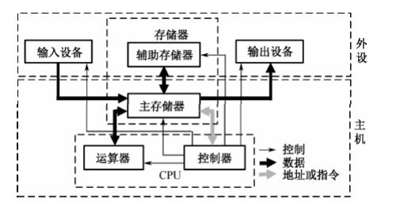
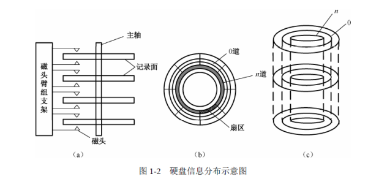

## 计算机系统组成

>  
>
> 1. 控制器：分析和执行指令部件（协调并指挥各部件）
>
>    - 程序计数器PC：存储下一条执行指令地址
>    - 指令寄存器IR：存储即将执行的指令
>    - 指令译码ID：对指令中操作码进行分析解释
>
> 2. 运算器（逻辑算术运算单元ALU）
>    - 算术逻辑运算ALU
>    - 累加寄存器AC
>    - 数据缓冲寄存器DR
>    - 条件状态寄存器PSW
> 3. 存储器
> 4. 辅助存储器
> 5. 输入输出设备
>
> **计算机系统结构分类**
>
> - 冯诺依曼计算机
>
>   > 1. 计算机（指硬件）应由运算器、存储器、控制器、输入设备和输出设备
>   >
>   > 2. 计算机内部采用二进制来表示指令和数据
>   >
>   > 3. **存储程序控制**
>
> - 非冯诺依曼计算机
>
>   > 1. 数据驱动的数据流计算机
>   >
>   > 2. 需求驱动的归约计算机和模式匹配驱动的智能计算机
>
> - Flynn（以指令，数据流并发性分类）
>
>   > MISD：单指令单数据流
>   >
>   > SIMD：单指令多数据流
>   >
>   > MISD：多指令单数据流（流水线计算机）
>   >
>   > MIMD：多指令多数据流（多核处理器计算机）
>
> - 以指令系统分类
>
>   > RISC：精简指令系统（指令系统简化，操作在单周期内完成，指令格式力求一致，寻址方式尽可能 减少，并提高编译的效率，最终达到加快机器处理速度的目的）
>   >
>   > 1. 指令数量少
>   > 2. 指令的寻址方式少（只支持寄存器寻址）
>   > 3. 指令固长
>   > 4. 以硬布线逻辑控制为主
>   > 5. 优化的编译器
>   > 6. CPU 中的通用寄存器数量多‘
>   > 7. C采用了 Cache 方案
>   >
>   > ---
>   >
>   > CISC：复杂指令系统
>   >
>   > 1. 指令数量众多
>   > 2. 指令使用频率相差悬殊、
>   > 3. 支持很多种寻址方式
>   > 4. 变长的指令
>   > 5. 指令系统复杂，采用微程序控制
>   
> - **流水线**
>
>   > [标量处理机](../../../计算机系统结构/5.标量处理机/标量处理机.md)
>
> 
>
> **计算机总线**（部件共享消息的传输线路）
>
> - 内部总线：CPU内部寄存器与ALU传输信息线路
>
> - 外部总线：CPU与其他部件通信线路
>
> 
>
> **存储器系统**：采用多层级的存储体系之所以能用低投入换来较高的存取速率
>
> - 程序局部性原理
>
>   1. 空间局部性：程序在执行时呈现出局部性规律，即在一较短的时间内，程序的执行仅局限于某个部分。相应地，它所访问的存储空间也仅局限于某个区域
>
>   2. 时间局部性：程序中的某条指令一旦执行，不久以后该指令可能再次执行。产 生时间局部性的典型原因是由于程序中存在着大量的循环操作
>
> - 存储器存取方式：
>
>   1. 顺序：磁带
>   2. 直接：数据块具有唯一地址标识（磁盘）
>   3. 随机：系统可以在相同的时间内对任意一个存储单元的数据进行访问，而与先前的访问序列无关。**主存储器**采用随机存取的方式
>   4. 相联：Cache
>
> - 主存：存放计算机运行期间所需要的程序和数据
>
>   1. RAM：随机存取存储器（无法持久化保存）
>
>      - DRAM：动态随机存取器：利用电容内存储电荷来代表一个二进制比特，信息会随时间逐渐消失，需要高频率定时刷新（速度更快、成本更低，但功耗更高）
>      - SRAM：静态随机存储器：功耗低，不需要定期刷新，速度慢（应用于需要高速缓存和高速数据交换的场景）
>
>   2. ROM：固定存储器
>
> 
>
> **辅助存储器**
>
> 1. 磁带
>
> 2. 硬盘
>
>    >  
>    >
>    > - 磁盘结构：记录面，圆柱面，磁道，扇区
>    > - 磁盘访问时间（存取时间） = 寻道时间+旋转延迟时间
>
> 3. Cache（提高 CPU 数据输入输出的速率）
>
>    > [存储体系](../../../计算机系统结构/4.存储体系/存储体系.md)
>
>    
>