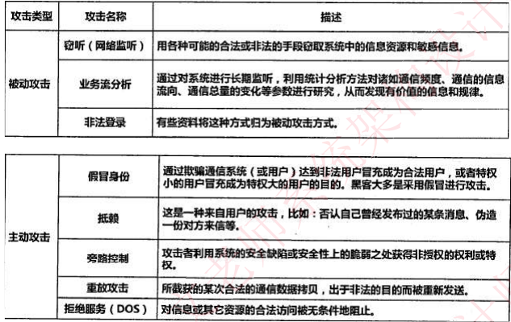
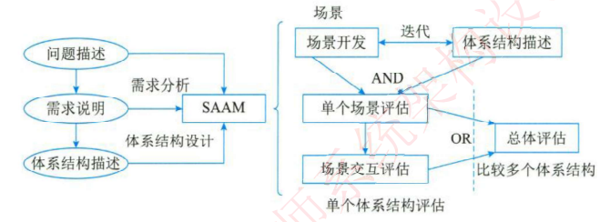

## 系统工程

> 系统工程：利用计算机作为工具，对系统结构，元素，信息和反馈进行分析，已达到最优规划，最优设计，最优管理，控制的目的
>
> 系统工程法：
>
> - 霍尔三维结构
>   1. 时间维度：规划，拟定方案，研制，生产，安装，运行，更新
>   2. 逻辑维度：明确问题，确定目标，系统综合，分析，优化，决策，实施
>   3. 知识维度：工程，医学，建筑，商业，法律，管理，社会科学，艺术
> - 切克兰德法：（比较与探寻）
>   1. 认识问题
>   2. 根底定义
>   3. 建立概念模型
>   4. 比较探寻
>   5. 选择
>   6. 设计与实施
>   7. 评估与反馈
> - 并行工程：提高质量，降低成本，缩短产品开发周期和上市时间
> - 综合集成法（钱学森）
>
> **系统工程生命周期**
>
> 1. 探索与研究：识别用户需求，探索创意和技术
> 2. 概念：细化用户需求，探索可行性，提出实现解决方案
> 3. 开发：细化系统，创建解决方案描述，构建系统，验证并确认系统
> 4. 生产：检验与验证
> 5. 使用：满足用户需求
> 6. 保障：提供持续性的系统能力
> 7. 退役：存储，归档或退出系统
>
> **系统开发方法**
>
> 1. 计划驱动
> 2. 渐进迭代式开发
> 3. 精益开发
> 4. 敏捷开发

#### **系统配置与性能评价**

> 系统指标：
>
> - **计算机指标：**主频，运算速度，运算精度,内存容量,存储器存取周期,数据处理速率PDR：,吞吐率,响应时间,部件利用率,RASIS特性：可靠，可用，可维护，完整，安全
>
> - 路由器指标：设备吞吐量，端口吞吐量，全双工线速转发，路由表能力，丢包率，延时，时延抖动，VPN支持
>
> - 交换机指标：最大ATM端口数，支持网络类型，最大SONET端口数，最大MAC地址表
>
> - **操作系统指标**：可靠性，系统吞吐率，响应时间，资源利用率，可移植
>
> - **数据库系统指标**：数据库大小，表数量，单表大小，允许记入数量，单行记入大小，索引数量，最大并发事务处理能力，负载均衡能力，最大连接数
>
> - **WEB服务器**：最大并发连接数，响应延迟，吞吐量
>
> 
>
> **性能评价方法**
>
> - 常用方法
>
>   > 时钟频率
>   >
>   > 指令执行速度（KIPS，MIPS）
>   >
>   > 等效指令速度法：各类指令在程序中所占比例，并行折算评估
>   >
>   > 数据处理数率PDR：采用PDR值计算衡量机器性能
>
> - **基准程序法：程序中最大，最频繁核心部分作为计算机性能的标准程序**
>
>   > 整数测试
>   >
>   > 浮动测试
>   >
>   > SPEC基准测试
>   >
>   > TPC基准测试：测试事务处理，数据库处理
>
> **Amdahl定理**：对性能瓶颈部件采取高速度后系统性能改进程度
>
>  

#### **系统安全**

> **信息安全要素**
>
> - 机密：确保消息不暴露未授权的实体或进程
> - 完整：只有允许的人才能修改数据，并能识别数据是否以被篡改
> - 可用：授权后的实体才能访问数据
> - 可控：授权范围及允许的数据行文和流向
> - 可审查：对于安全问题提供调查依据
>
> 信息安全范围
>
> - 设备：
> - 数据：
> - 内容：政治健康，符合法规，符合道德
> - 行为：
>
> 
>
> **网络安全措施目标：访问控制，认证，完整性，审计，保密**
>
> **信息存储安全：**使用安全，系统安全监控，计算机病毒，数据加密与防止非法攻击
>
> **信息安全系统框架**
>
> - **信息安全技术**
>
>   - 摘要信息（固定长度，不同的数据都会产生不同的摘要信息，校验数据是否被篡改）
>
>     1. MD5
>     2. SHA-1（安全性高于MD5）
>     3. 数字签名：唯一标识发送方
>
>   - 双向加密
>
>     - **对称加密技术**：**加密数据与解密数据的秘钥一致（不公开密钥加密算法），加密强度不高，密钥分发困难**
>       1. DES/3DES密钥加密块算法：分组打乱，通过多次异或操作完成加密解密。56位密钥，64位数据块，速度快，密钥易产生，**容易暴力破解**
>       2. AES（高级加密标准）：
>          - 支持128,192,256位密钥加解密
>          - Padding填充方式
>            - NoPadding：明文必须16字节整数
>            - PKCS5Padding：使用缺少数量字符进行填充
>            - ISO10126Padding：使用随机字符填充
>       3. RC-5：
>       4. IDEA：比DES加密性好，对计算机功能要求低
>     - **非对称加密**：加密数据慢（公钥作为加密密钥，私钥作为解密密钥）
>       1. RSA512/1024
>       2. ECC
>       3. 背包算法
>       4. D-H
>     - 数字证书：一种数据结构（版本号，序列号，签名算法，认证机构，有效时间，主题信息，数字签名，公钥信息）**确定公钥与用户关系**（标识用户合法持有的公钥信息）
>     - 签字机构CA：负责签发，管理，撤销证书
>
> - **信息安全控制**
>
>   - 访问控制矩阵ACM：确定用户拥有的权限
>   - 控制访问表ACL
>   - 能力表
>   - 授权关系表
>
>   
>
> 
>
> **信息安全抗攻击技术**
>
> - **拒绝服务攻击/分布式拒绝服务DDos**：消耗计算机资源，破坏或更改配置信息，使服务器失效
>   1. 加强数据包特征识别，通过特征字符串确定攻击服务器和攻击者位置
>   2. 设置防火墙监视本地端口使用情况，判断是否存在外部主机主动扫描端口情况
>   3. 对通信数据进行ip统计
>   4. 修复已发现的问题和系统漏洞
>   
> - ARP欺骗：欺骗MAC地址，收到的数据被其他主机监听
>
>   1. 固化arp表，阻止arp欺骗
>   2. 使用ARP服务器，通过服务器分发MAC地址
>   3. 采用双向绑定分发防止ARP
>   4. ARP防护软件
>   
> - DNS欺骗：冒充域名服务器，将查询的Ip地址转为攻击者IP地址，使用户访问到攻击者页面，导致用户信息泄漏
>
>   1. 被动监听检测：捕获所有DNS请求和应答包，在一定时间间隔内，同一个请求返回不同的应答则可能收到DNS欺骗攻击
>   2. 虚假报文探测：发送一个非正常DNS请求包，如果有应答则收到DNS攻击
>   3. 交叉检查
>   
> - IP欺骗
>
> - 端口扫描
>
> 
>
> **网络安全技术**
>
> - 防火墙
>
> - 入侵检测系统IDS：检测外网请求行为是否合法（通过历史行为，特定模式操作匹配）
>
> - 入侵防御IPS 实时检测入侵行为，并直接阻断
>
> - 杀毒软件
>
> - 蜜罐系统：伪造一个蜜罐引诱黑客工具，了解黑客攻击手段和原理
>
> -  
>
> - **网络安全协议**
>
>   - SSL：安全套接字协议，作用在传输层，使用对称加密内容，非对称加密密钥
>
>   - SSH：安全外壳协议：确保ID，口令，会话保密
>
>   - SET：安全电子交易协议（B2C模式）保障支付信息安全，采用PKI框架实现
>
>   - Kerberos：网络身份认证协议，基于信任第三方身份认证
>
>   - PGP协议：使用RSA身份认证，IDEA对称加密，MD5校验数据完整性
>
>     
>
> 
>
> **信息安全保证体系与评估方法** 
>
> GB17859-99：计算机系统安全保护能力等级
>
> 1. 用户自主保护：隔离用户与数据
> 2. 系统审计保护：定义控制访问权限
> 3. 安全标记保护：提供安全策略模型
> 4. 结构化保护
> 5. 访问验证保护

#### **系统架构设计**

> **目的：解决软件构件复用，质量，维护问题**
>
> 架构设计概述：为软件提供一个结构，行为和属性的高级抽象，有构件描述，构件的相互作用，指导构件集成的模式（指定系统的组织结构和拓扑结构，**并显示需求和构件之间对应的关系**，提供一些设计决策原理）
>
> **软件架构**：**软件结构，行为和属性的高级抽象**。由构件描述，构件相互作用，指导构件集成模式以及这些模式的预算组成
>
> 
>
> **软件架构设计与周期**
>
> 1. 需求分析：根据需求模型构建分析模型（SA系统分析师），保证模型转换可追踪性
> 2. 设计阶段：根据SA描述模型产出构件功能及约束限制
> 3. 实现阶段
> 4. 构件组装：支持可复用构件，监测并消除系统结构失配问题
> 5. 部署阶段：提供系统体系结构图（描述软硬件功能分配模型），基于SA模型可以分析部署方案质量
> 6. 后开发阶段：维护，演化，复用
>
> 
>
> **构件**：独立可交互的功能并能部署的单元，外界通过接口访问并提供服务
>
> 构件接口标准化： 消息格式，模式，协议标准化
>
> 
>
>  **面向构件编程COP**
>
> - 多态
> - 模块化封装（高层次消息隐藏）
> - 后期绑定与装载（部署独立性）
> - 安全性
> - 构件技术：将细节封装，对业务逻辑实现
>   1. EJB：Session Bean，Entity Bean，Message-driven Bean
>   2. componet组件：与语言，平台无关，为应用程序，操作系统提供组件服务
>   3. COBRA：对象请求代理，执行不同语言之间对象通信
>
> 
>
> **软件架构风格**
>
> - 数据流：按照一定顺序先后执行 
>
>   > 批处理序列：按顺序逐步执行，保持数据完整
>   >
>   > 管道-过滤器：前一个构件输出作为后一个构件输入，过滤器为构件，连接件为管道
>
> - 调用/返回：将问题划分多个步骤调用处理
>
>   > 主程序/子程序：调用作为交互机制，连接构件
>   >
>   > 面对对象：对象之间通过程或函数进行交互
>   >
>   > 层次结构：只允许相邻层次通信（低耦合），越底层抽象越高。难以分层，正确抽象层次功能
>
> - 独立构件：构件之间不存在显示调用关系，通过时间触发，异步方式执行
>
>   > 事件系统：触发或广播方式通知多个构件（匿名调用，并发执行，放弃系统计算控制）
>
> - 虚拟机：定义一套规则供使用者使用，基于规则开发构件
>
> - 仓库：以数据为中心，所有操作都围绕数据进行（数据库，超文本） 
>
> 
>
> **层次架构风格**
>
> - C2架构：构件之间通过中间件通信（构件之间不允许直接连接）
>
> - 两层C/S架构：客户端，数据库服务（已不用）
>
> - 三层C/S架构：表现层，处理层，数据层（瓶颈在于各层通信效率）
>
> - B/S架构（0客户端架构）：浏览器与WEB服务器（数据处理能力差，安全性难以控制，数据查询等响应速度上低于C/S架构，数据交互性不强）
>
> - **RIA应用架构**：数据能够缓存在客户端，由客户端进行计算发送给服务器（小程序）
>
> - MVC：View（接收用户输入操作）Controller（业务逻辑处理）Model（数据持久化）View（结果返回给View）
>
> - MVP：Controller中替换Persenter，完全切View和Model之间联系（脱离页面进行单元测试）
>
> - MVVM：数据模型数据双向绑定
>
> 
>
> **面向服务的SOA架构**
>
> **目标：关键目标是企业IT资产重用最大化**
>
> SOA：所有的功能都被定义成了独立的服务，服务分级，松散耦合，可以随时供企业内外部访问
>
> **SOA中关键技术**
>
> - 发现服务：UDDI，DISCO
> - 描述服务： WSDL，XML Schema
> - 消息格式：SOAP，REST
> - 编码格式：XML，JSON
> - 传输协议：HTTP，TCP/IP，SMTP
>
>  **Web Service：功能**
>
> - 服务注册
> - 服务位置：服务使用者查询服务
> - 服务绑定
>
> **企业服务总线ESB：**
>
> 1. 提供透明性消息路由和寻址服务
> 2. 提供服务注册和命名管理
> 3. 提供多消息传递
> 4. 提供多种传输协议
> 5. 提供多种数据格式及相互装换
> 6. 提供日志和监控功能
>
> 
>
> **驱动架构ABSD：**侧重于业务，质量和功能需求的组合驱动架构设计
>
> - ABSD方法：设计活动可以从项目总体功能框架明确开始
> - ABSD基础：基础功能分解，选择架构风格实现质量和业务需求，软件模板使用
>
> **基于架构软件开发**
>
> 1. 架构需求
> 2. 架构设计
> 3. 架构文档化
> 4. 架构复审
> 5. 架构实现
> 6. 架构演化

#### **系统质量属性与架构评估**

> 系统质量开发阶段属性：易理解，可扩展，可重用，可测试，可维护，可移植
>
> 系统质量运行阶段属性：性能，安全，可伸缩，互操作性，可靠，可用，鲁棒
>
> 
>
> **软件架构质量属性**
>
> - 性能：系统响应能力（响应时间，吞吐量）。通过增加计算资源，减少计算开销，引入并发机制，采用资源淘汰、调度策略提升
>
> - 可靠性：意外或使用错误情况下维持系统功能特性（MTTR：平均维修时间，MTBF：平均故障间隔时间，MTTF：平均故障时间，MTTA：平均确认时间）。检测策略：心跳，Ping/Echo，冗余，选举
>
> - 可用性：系统能够正常运行时间比例
>
> - 安全性：阻止非授权用户使用系统。设计策略：入侵检测，用户日志，用户授权，追踪审计
>
> - 可修改：系统变更能力强。设计策略：接口-实现类，抽象，内部信息封装
>
> - 功能
>
> - 互操作性：与其他系统，架构集成能力
>
>   
>
>   
>
> **系统架构评估**
>
> 评估方式
>
> 1. 问卷调查（检查表）
>
> 2. 基于度量方式：设定一些性能指标
>
> 3. 基于场景方式：根据现场系统进行测试评估
>
>    
>
> - SAMM：输出问题描述，需求声明和架构描述
>
>    
>
> - **ATAM架构权衡分析**
>
>   1. 质量属性
>   2. 性能
>   3. 安全性
>   4. 可修改和可用性
>
> - CBAM成本效益分析

#### **中间件技术**

> 中间件：在分布式系统环境下操作系统与应用程序之间软件（侧重于网络通信功能）、其目的时使其开发应用程序更容易，提供一些列程序抽象，解耦程序依赖
>
> **中间件分类**
>
> 1. 数据库访问中间件：JDBC，ODBC
> 2. 远程过程调用：RPC
> 3. 面向消息中间件MOM：利用高效可靠的消息传递机制进行与平台无关的数据通信
> 4. 事务中间件TPM
>
> **典型应用架构**
>
> - J2EE：采用多层分布式应用程序模型
>   1. 客户端层
>   2. web层/服务层：Java Servlet或JSP技术，处理与响应客户端请求
>   3. EJB层：业务代码逻辑
>   4. 信息系统层：数据库系统，文件系统
> - .NET

