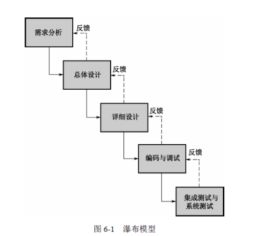
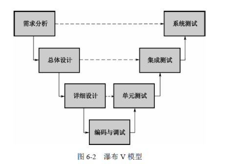
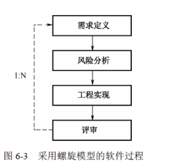
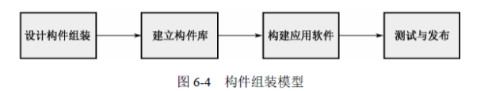
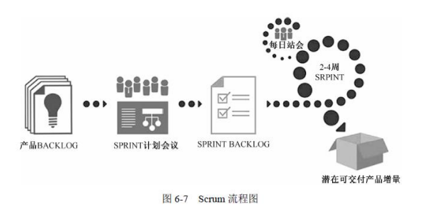

## 开发管理

> **软件生命周期**
>
> 1. 可行性研究与计划：确定软件的目标、 范围、风险、开发成本，产出《可行性研究报告》和《软件开发计划》
> 2. 需求分析：根据可行性研究材料对软件的需求进行细致的分析
> 3. 概要设计：确定整个软件的技术蓝图，**负责将需求分析的结果转化为技术层面的设计方案**
> 4. 详细设计：在概要设计的基础上，进行细化
> 5. 实现：编码和单元测试
> 6. 集成测试：功能性测试
> 7. 确认测试：需要验证软件是否同需求一致，是否达到了预期目标
> 8. 使用和维护
>
> **软件开发模型**
>
> - 瀑布模型（适用于需求明确，稳定环境）
>
>    
>
>   - 软件开发的阶段划分明确，每个阶段完成后产出文档或源码流向下一阶段
>
> - 瀑布V模型（侧重测试）
>
>    
>
>   - 需求分析的结果将作为系统测试的准则，即需求分析阶段也将产生同软件需求一致的系统测试
>
>   - 软件产品是否符合最初的需求将在系统测试阶段得到验证
>
>   **瀑布模型缺点**
>
>   1. 需求分析阶段是一切活动的基础
>   2. 每一阶段都紧密依赖于上一阶段的结果。需求变动需要重新开始
>   3. 开发时间长
>   4. 开发过程中产生大量文档
>
> - **螺旋模型**（侧重风险分析）
>
>    
>
>   每一个开发阶段前，引入一个非常严格的风险识别、风险分析和风险控制。它把软件项目分解成一个个小项目，每个小项目都标识一个或多个主要风险，直到所有的主要风险因素都被确定
>
>   螺旋模型：需要相当丰富的风险评估经验和专业知识，过多的迭代次数会增加开发成本，延迟提交时间
>
> 
>
> - **增量模型**（系统划分为若干不同的版本，每一个版本都是一个完整的系统）
>
>   1. 确保每个版本完整，可以用
>   2. 确保每个版本时间增量均衡
>
> 
>
> - **构件组装模型**（将需求拆分组件进行开发）
>
>    
>
>   1. **确保组件独立，自包容**，构件之间通过接口相互协作
>   2. 允许重用，降低开发成本
>   3. 构件的粒度较整个系统更小
>
>   缺点：
>
>   1. 构件设计需要经验丰富的架构设计师，设计不良的构件难以实现构件的优点， 降低构件组装模型的重用度
>   2. 构件开发组装程序时，需要学习成本
>   3. 第三方构件库的质量会最终影响到软件的质量
>
> **敏捷开发**
>
> - XP模式（沟通，简单，反馈，勇气）
>
>   1. 更短的周期内，更早地提供具体、持续的反馈信息
>
>   2. 在迭代的进行计划编制（不评估未来的迭代计划）
>
>   3. 依赖于自动测试程序来监控开发进度，并及早地捕获缺陷
>
>   4. 依赖于口头交流、测试和源程序进行沟通
>
>   5. 倡导持续的演化式设计
>
>   6. 依赖于开发团队内部的紧密协作
>
>   7. 尽可能达到程序员短期利益和项目长期利益的平衡
>
> 
>
> - 特征驱动开发模式（FDD）：强调质量，不断地交付可运行的软件，并以很小的开发提供精确的项目进度报告和状态信息
>
>   1. 角色定义：项目经理（努力为团队提供一个适宜的开发环境），首席架构师，开发经理（开发经理负责团队日常的开发，解决开发中出现的技术问题与资源冲突），主程序员，程序员，领域专家（对业务领域精通的人，一般由客户、系统分析员等担当）
>
>   2. 核心过程：构造特征列表（一个小的，对客户有价值的功能，一般可以在两周内实现），计划特征开发列表，特征设计（由主程序员带领小组设计分析），特征开发
>
> 
>
> - **Scrum模式：敏捷开发框架**
>
>    
>
>   1. Sprint：短期迭代周期（1到2周完成）
>
>   2. Backlog：商业价值排序的需求列表（需求/用户故事）
>
>   3. Sprintbacklog：Backlog中挑选商业价值高的需求通过会议进行讨论，分析，估算产出开发任务列表
>   
>   **Scrum活动**
>   
>   1. 产品待办事项列表梳理：保持待办事项列表优先级顺序、不再重要的事项移除或者降级、增加或提升涌现出来的或变得更重要的事项，将事项分解成更小的事项、将事项归并为更大的事项、对事项进行估算。
>   2. Sprint计划会议：Scrum成员讨论每个事项，并对该事项达成共识
>   3. Scrum站会：回答当前完成情况，计划当天工作，阻碍进展
>   4. Sprint评审会议：通过Sprint完成情况制定或调整Backlog
>   5. Sprint回顾会议：探讨当前开发环境有利或不利因素
>
> 
>