## 系统评估与规划

> - **计算机性能指标**
>
>   1. 时钟频率（主频）：决定了计算机的运算速度
>
>   2. 高速缓存：Cache容量（L1，L2，L3）
>
>   3. 指令运算速度：MIPS（百万条指令/秒）和 MFLOPS（百万次浮点运算/秒）
>
>   4. 主存容量频率，存储器存取周期（总线速度）
>
>   5. 数据处理率：PDR = L / R ，度量CPU和主存储器的速度，它没有涉及高速缓存和多功能
>
>      > L = 0.85G + 0.15H + 0.4J + 0.15K
>      >
>      > R = 0.85M + 0.09N + 0.06P
>      >
>      > G： 每条定点指令的位数
>      >
>      > M：平均定点加法时间
>      >
>      > H：每条浮点指令的位数； 
>      > N：平均浮点加法时间；
>      > J：定点操作数的位数；
>      > P：平均浮点乘法时间；
>      >
>      > K：浮点操作数的位数
>
>   6. 响应时间
>
>   7. RASIS特性
>
>      > - 可靠
>      > - 可用
>      > - 可维护
>      > - 完整
>      > - 安全
>
>   8. TAT：平均故障响应时间 
>
>   9. 兼容性
>
>   ---
>
> - **网络性能指标**
>
>   1. 设备级性能指标：计算机网络设备（主要指路由器）的标准性能指标主要包括吞吐量（信道的最大吞吐量 为“信道容量”）、延迟、丢包率和转发速度
>   2. 网络级性能指标：可达性、网络系统的吞吐量、传输速率、信道利用率、信道容 量、带宽利用率、丢包率、平均传输延迟、平均延迟抖动、延迟/吞吐量的关系、延迟抖动/  吞吐量的关系、丢包率/吞吐量
>   3. 应用性能指标：QOS，网络对语言应用的支持程度、网络对视频应用的支持程 度、延迟/服务质量的关系、丢包率/服务质量的关系、延迟抖动/服务质量
>   4. 用户级性能指标
>   5. 吞吐量：没有帧丢失的情况下，设备能够接受的最大速率
>
>   ---
>
> - **操作系统**
>
>   1. 可靠性
>   1. 吞吐量（单位时间内处理的信息量，以每小时或每天所处理 的各类作业的数量来度量）
>   1. 系统响应时间
>   1. 系统资源利用率
>   1. 可移植
>   
>   ---
>   
> - **数据库管理系统**
>
>   1. 数据库的大小、单个数据库文件的大小
>   2. 数据库中表的数量、单个表的大小、表中允许的记录（行）数量、单个记录（行）的大小、表上 所允许的索引数量
>   3. 数据库所允许的索引数量
>   4. 最大并发事务处理能力、负载均衡能力、最大连接数
>
>   ---
>
> - **Web服务器**
>
>   1. 最大并发连接数
>   2. 响应延迟
>   3. 吞吐量（每秒处理的请求数）
>   4. 成功请求数、失败请求数
>   5. 每秒点击次数、每秒成功点击次数、每秒失败点击次数
>   6. 尝试连接数、用户连接数等。
>
> **性能评估**
>
> - 基准测试：用得最多、最频繁的那部分核心程序作为评价计算机性能的标准程序
>
>   1. 整数测试
>   2. 浮点测试（测试CPU运算）
>   3. SPEC基准测试（测试计算机整体性能）
>   4. TPC基准查询（测试事务，数据库处理）
>   5. Linpack：测试高性能计算机系统浮点性能
>
> - Web服务器性能评估
>
>   - 基准测试
>   - 压力测试（模拟足够数量的并发操作）
>   - 可靠性测试
>
>   
>
> #### **性能计算**
>
> - 性能计算方法：定义法，公式法，查询检测，仪器检测
>
> - **MIPS计算**：单字长定点指令平均执行速度
>   $$
>   MIPS = \frac{指令条数}{执行时间 \times 10 ^6} = \frac{Fz}{CPI} = IPC \times Fz \\
>    Fz:处理机工作主频 \\ CPI：每条指令所需的平均时钟周期数 \\ IPC 每个时钟周期平均执行的指令条数
>   $$
>
> - 峰值计算：计算机每秒钟能完成的浮点计算最大次数（由CPU主频决定）
>
> - 等效指令速度：使用其他指令代替原先指令
>
> - **Amdahl 定理（改进后加速比）**
>   $$
>   f_{new}~~~ 性能可改进比（系统在该功能上花费的时间）~~~~0\le f_{new} \le 1  \\
>   r_{new} ~~~ 部件加速比(部件改进前与改进后花费时间比)~~~~~~~~~ r_{new} > 1   \\ 
>   S_p~~~~ 系统加速比(原执行时间与改进后执行时间之比)\\
>                                   
>   S_p = \frac{T_{old}}{T_{new}} = \frac{1}{(1-f_{new})+f_{new}/ r_{new}}
>   $$
>
> **负载均衡**
>
>  集群：多个服务器同时执行某一个任务时
>
> 负载均衡技术类型：
>
> - 请求重定向：服务器回送location指令，由客户端重新请求
> - 基于DNS负载均衡：为多个不同的地址配置同一个域名（不能保证DNS即时刷新）
> - 反向代理：通过Web服务器将请求代理到其他集群
> - 网络地址转换（NAT）：将 IP 数据报文头中的 IP 地址转换为另一个 IP 地址，并通过转换端口号达到地址重用的目的
> - 半中心负载均衡：中心负载均衡器只负责接受并转发请求
>

#### **系统规划**

> 描述从项目提出、选择到确立的过程，包括系统项目的提出与可行性分析，系统方案的制订、评价和改进，新旧系统的分析和比较，以及现有软件、硬件和数据资源的有效利用等问题
>
> **项目的提出与选择**
>
> 基于各种动机提出系统项目的建设，有关人员要根据这些动机，提出和确定信息系统的工作范围，确定项目立项，提出系统选择方案，给出选择结果
>
> 1. 基础研究并获取技术
> 2. 进行应用研发并获得产品
> 3. 提供技术服务
> 4. 信息技术产品的使用者
>
> **项目的选择和确定**
>
> 1. 选择有核心价值的产品/项目或开发方向
> 2. 评估项目风险、收益和代价
> 3. 评估项目的多种实施方式
> 4. 平衡地选择适合的方案
>
> **项目提出和选择的结果**
>
>   产出产品/项目建议书
>
> - 用户单位、项目或产品的立项背景、需求来源和目标性的介绍
> - 用户的内外部环境、组织机构、现有的 IT 设施情况
> - 用户的业务模型和业务规划
> - 预期要建设的技术系统在用户业务中的位置和作用
> - 信息化后的用户业务模型、软件应用方式、相关的部署环境、运行规则、管理规范等； 为实现信息化业务模型，技术系统的产品需求定义（功能、性能、约束）和部署方式等
> - 产品或项目的技术框架
> - 项目的要点、技术难点、主要实施障碍
> - 项目或产品的可行性研究结果
> - 项目可选择的实施方式、组织方式、沟通和协调机制等
> - 项目的资源范围和预算（人、财、物、时间等）
> - 项目的成本/收益分析
> - 项目风险及影响评估
> - 项目进度计划
> -  项目质量计划
> - 项目过渡期资金的获得方式、财务计划
> - 产品或项目的商务模式、盈利模式论述
> - 同类产品或公司的市场调查结果，以及竞争性比较
> - 企业成功案例、资质等
> - 商务条款或供应商/客户合同
>
> **可行性研究与效益分析**（项目估算，产品开发的范围、投入和回报、项目风险、作用和意义）
>
> - 可行性研究范围
>   1. 经济可行性（评估项目的开发成本及项目成功后可能获得的经济收益）
>   2. 技术可行性（软件系统需要实现的功能和性能）
>      - 技术（现有的技术能力和 IT 技术的发展）
>      - 资源（掌握技术的职员、公司的技术积累、构件库、软硬件条件）
>      - 目标（技术障碍，设定为必须实现的系统目标）
>   3. 法律可行性
>   4. 执行可行性
>   5. 方案选择
>
> **成本效益分析**
>
> - 项目成本
>
>   基础建设支出：房屋和设施，办公设备，平台软件，必需的工具软件等购置费用
>
>   一次性支出：研究咨询费用、调研费、管理费用、培训费、差旅费、其他一次性杂费
>
>   运行维护费用：设备租金和定期维护费用、定期消耗品支出、通信费、人员工资奖金、房屋租金、公共设施维护
>
> - 项目收益
>
>   一次性收益：开支缩减，价值增值
>
>   非一次性收益：系统生命期内由于运行所建议系统而导致的时间收益（包含开支减少）
>
>   不可定量收益：系统使用过程中带来利好
>
> **可行性分析报告**
>
> - 项目背景：包括问题描述、实现环境和限制条件；
> - 管理概要和建议：包括重要的研究结果、说明、建议和影响；
> - 候选方案：包括候选系统的配置和最终方案的选择标准；
> - 系统描述：包括系统工作范围的简要说明和被分配系统元素的可行性；
> - 经济可行性（成本/效益分析）：包括经费概算和预期的经济效益；
> - 技术可行性（技术风险评价）：包括技术实力、已有工作基础和设备条件；
> - 法律可行性：包括系统开发可能导致的侵权，违法和责任等； 
> - 用户使用可行性：包括用户单位的行政管理，工作制度和使用人员的素质； 其他与项目有关的问题：例如，其他方案介绍和未来可能的变化。
>
> **方案制定和改进**
>
> - 确定软件架构（项目模型，案例）
> - 确定各种关键性要素（操作系统、数据库、Web 服务器、中间件平台，开发语言）
> - 归结目标到最适合的计算体系（关键要素的组合逻辑，预期标准）
>
> **新旧系统分析比较**
>
> - 遗留系统特征
>
>   1. 系统能完成企业中许多重要的业务管理工作，但已经不能完全满足要求
>   2. 系统在性能上已经落后，采用的技术已经过时
>   3. 无文档支持，无法进行有效扩展开发
>
> - 遗留系统评价方法
>
>   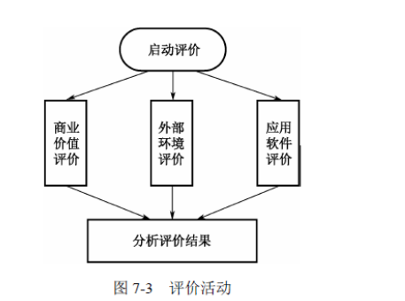 
>
>   - 启动评价
>
>     1. 遗留系统是否是至关重要的
>     2. 企业的商业目标
>     3. 演化需求是什么
>     4. 所期望的系统寿命多长，系统使用期限多久
>     5. 系统的技术状态如何
>     6. 企业是否愿意改变
>     7. 企业是否有能力承受演化
>
>   - 商业价值评价
>
>     1. 咨询使用人员
>
>   - 外部环境评价
>
>     1. 硬件（维护费用、失效率、功能、性能，使用年限）
>
>     2. 软件（操作系统、数据库、 事务处理程序、编译器、网络软件、应用软件）
>
>        > $$
>        > OR = (P1ORH + P2ORS + P3OAF + P4ORA) / 4 \\
>        > ORH:硬件评价值 \\
>        > ORS：支撑软件评价值 \\
>        > ORF:企业基础设施平均值 \\
>        > ORA：应用软件评价值 \\
>        > Pi(1-i-4)：权系数
>        > $$
>        >
>        > 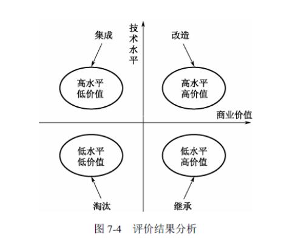  
>        >
>        > 1. 淘汰策略：具有较低的商业价值（全面重新开发新的系统以代替遗留系统）
>        > 2. 继承策略：系统的技术含量较低，可满足企业运作的功能 或性能要求，但具有较高的商业价值（新老系统必须并行运行一段时间，再逐渐切换到新系统上运行）
>        > 3. 改造策略：具有较高的商业价值，基本上能够满足企业业务运作和决策支持的要求（系统功能的增强是指在原有 系统的基础上增加新的应用要求，对遗留系统本身不做改变。数据模型的改造是指将遗留系 统的旧的数据模型向新的数据模型转化的过程）
>        > 4. 集成策略：高水平、低价值区，即遗留系统的技术含量较高，但其商业价值较低
>
>     3. 企业基础设施（开发组织的技术成熟度，企业的培训过程，系统支持人员的技术水平）
>

#### **系统分析与设计**

> - 问题定义
>
>   1. 目标（最高层次的用户要求）
>   2. 需求功能（系统必须做的事情）
>   3. 非功能需求（外观，易用性，性能，可操作性，可维护和扩展性，安全，文化政策法律需求）
>
> - 问题分析
>
>   1. 问题定义达成共识（影响，结果，方案）
>
>   2. 问题本质
>
>      - 因果鱼骨图
>
>      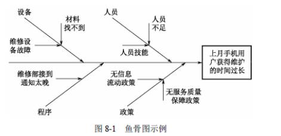 
>
>      - 帕累托图（排列图，主次图）：按照发生频率大小顺序绘制的直方图，表示有多少结果是由已确认类型或范畴的原因所造成**（百分之八十的问题是百分之二十的原因所造成）**
>
>        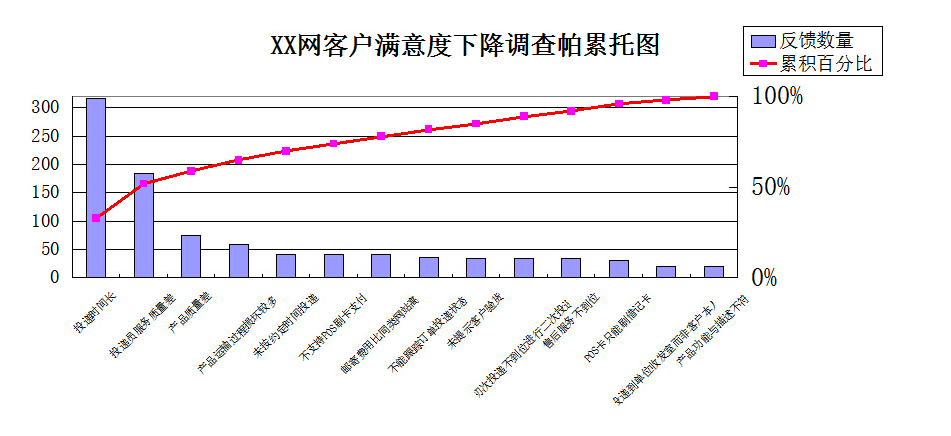  
>
> - 确定项目干系人与用户
>
> - 定义系统边界（信息输入与输出的形式）
>
>   1. 上下文范围图（显示系统工作职责和相邻系统关联）
>
>      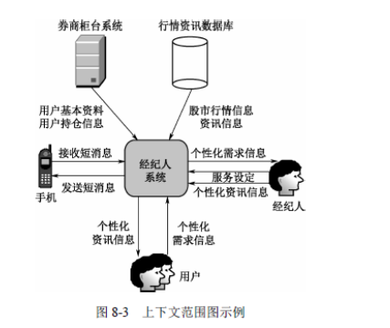  
>
>   2. 用例模型（描述用户与系统交互的事务，通过参与者的功能需求，识别系统功能）
>
> - 确定系统约束
>
>   1. 项目进度
>   2. 投资收益
>   3. 人员
>   4. 设备预算
>   5. 环境
>   6. 操作系统，数据库
>   7. 技术，行政
>   8. 软件，公司总体战略
>   9. 工具与开发语言
>
> 
>
> **需求分析**
>
> - 问题识别：功能需求、性能需求、环境需求、 可靠性需求、安全保密需求、用户界面需求、资源使用需求、软件成本消耗与开发进度需求
> - 分析与综合
> - 产出需求分许文档（需求规格说明书）
> - 需求分析与评审
>
> 
>
> **结构化分析**：自顶向下逐层分解（把系统看做一个过程集合体）
>
> - 结构化分析描述
>
>   1. 产出系统输入，输出数据流，及经历处理过程（物理模型）
>   2. 建立系统逻辑模型（画出与真实环境等价逻辑数据流图）
>   3. 划清人机界限（确定系统逻辑模型中流程采用系统还是手工操作）
>
>   **DFD：图形化系统模型（可视化系统中信息流动的图形方式）**
>
>   - 过程：完成输入到输出装换
>   - 外部实体：系统之外的数据源或目的
>   - 数据存储
>   - 数据流
>   - 实时连接：过程执行时，外部实体与过程之间通信
>   - 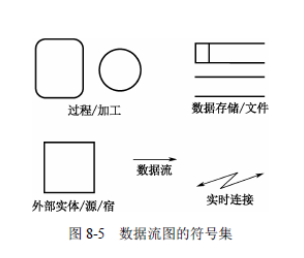 
>
>   Context：系统上下文范围关系图（是描述系统最高层结 构的 DFD 图）
>
>   - 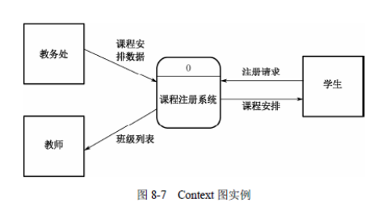 
>
>   - 逐级分解
>
>        
>
>   - 细化DFD部件
>
>     1. 数据字典（系统相关的数据元素的一个有组织的列表和精确严格的定义，包含数据名称，内容结构，使用描述）
>
>        {}n：n次重复
>
>        ()：可选择的数据项（可以不选）
>
>        [ | ]：或，两者中选其中一个
>
>        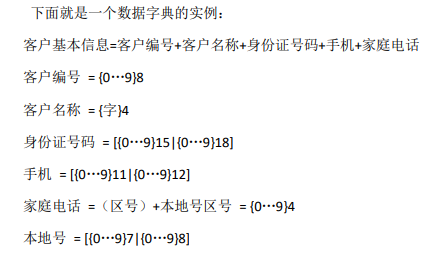  
>
>     2. 结构化语言
>
>     3. 决策树，决策表达方法
>
> **结构化设计**
>
> 1. 概要设计（设计软件的结构、确定系统是由哪些模块组成，以及每个模块之间的关系。它采用结构图（包括模块、调用、数据）来描述程序的结构）
>
> 2. 详细设计（包括程序流程图、盒图、PAD（Problem Analysis Diagram，问题分析图）、PDL（Program  Design Language，程序设计语言）
>
> 3. **结构图**(包含模块、调用模块之间的调用关系和数据模块间传递及处理数据信息，在DFD基础上进一步设计)
>
>    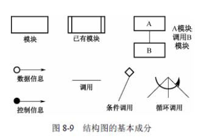 
>
>    - 变换流：信息经过输入通道进入系统，并转为内部表示，在沿着输出转为外部形式
>    - 事务流：事务中心根据输入信息的类型在若干个动作序列 （活动流）中选择一个执行
>
> 4. 程序流程图
>
> 5. 盒图（功能域明确、无法任意转移控制、容易确定全局数据和局部数据的作用域、容易表示嵌套关系）
>
>    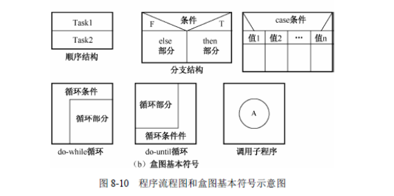 
>
> 6. PDL：伪代码，PAD：问题分析图
>
> 
>
> **模块设计**（使程序的结构清晰、易于测试与修改）
>
> - 外部特性：接口和功能
>
> - 内部特性：代码和数据
>
>   1. 信息隐蔽（并且尽可能少地暴露其内部的处理）
>
>   2. 模块独立完成一个特定子功能（高内聚、低耦合）
>
>      - 模块内聚度：功能，顺序，通信，过程，瞬时，逻辑，偶然
>      - 模块耦合度：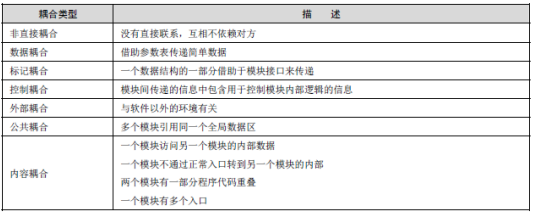 
>
> 
>
> **面向对象分析**
>
> 概念：
>
> - 对象与类
>   1. 实体类（一般使用名称命名，必须存在属性，不一定有操作）
>   2. 控制类（一般使用动词+名词命名，将特有的行为进行建模）
>   3. 边界类（与外部信息交流的约束，通常使用接口定义）
> - 继承与泛化（泛化：父类则是子类的泛化，继承：父类的继承是子类）
> - 多态与重载
> - 模板（通过参数实现类的多态性，使用变元来表示与具体类型有关的数据）
> - 消息与消息通信
>
> **分析：**
>
> - OOA/OOD：
>
>   1. OOA模型：主题，类，结构，属性和服务（继承，聚合，组合，实例化）
>   2. OOD模型：人机交互部件，问题域部件，任务管理，数据管理
>      - 人机交互部件：人机交互的设计和交互的细节
>      - 任务管理：识别事件驱动任务，识别时钟驱动任务，识别优先任务和 关键任务
>
> - Booch：
>
>   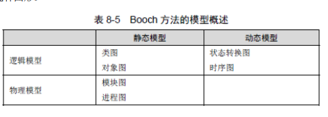 
>
> - OMT：
>
>   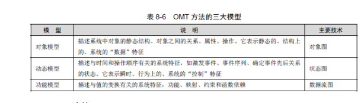 
>
> **UML** 统一建模语言（构造块，公共机制和架构组成）
>
> - 用例图
>
>   >  
>   >
>   > 参与者：代表某一种特定功能的角色
>   >
>   > 用例：对系统行为的动态描述（划分系统与外部实体的界限）
>   >
>   > 包含关系：可以从两个或两个以上的原始用例中提取公共行（抽象用例）
>   >
>   > 扩展关系：混合了两种或两种以上的不同场景(拆分一个主用例和一个或多个辅用例)
>
> - 类图和对象图
>
>   > 1. 依赖关系：参数关系，成员关系，使用箭头+虚线表示（X的定义改变影响Y，则Y依赖X）
>   > 2. 关联关系：表示类之间数量关系（一对多，多对多关系，特殊的依赖）使用实线表示
>   > 3. 泛化关系：子类是从父类中继承，使用空心箭头+实线表示，箭头指向父类
>   > 4. 聚合关系：表示has-a关联，聚合实体生命周期不同，使用空心菱形的实线表示
>   > 5. 组合关系：表示has-a关联，组合实体生命周期一致，不能单独存在，使用实心菱形的实线
>
> - 顺序图：体现对象间消息传递的时间顺序
>
>   > 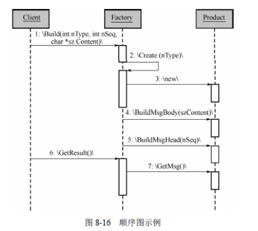 
>
> - 通信图：描述相互合作的对象间的交互关系和链接关系
>
>   > 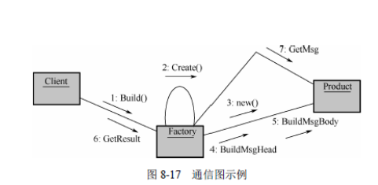 
>
> -  定时图：交互具有很强的时间特性
>
>   > 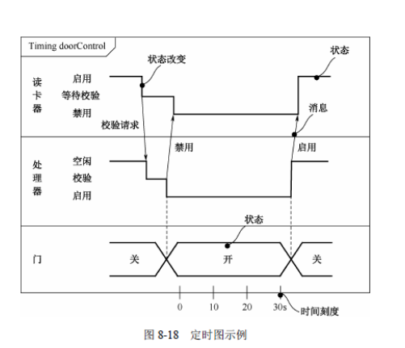  
>
> - 状态图：描述不同用例之间的对象行为（通常表示业务流程，控制对象，用户页面设计使用）
>
>   > 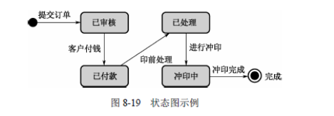 
>
> - 活动图：描述用例或对象内部工作过程，由状态图变化
>
>   > 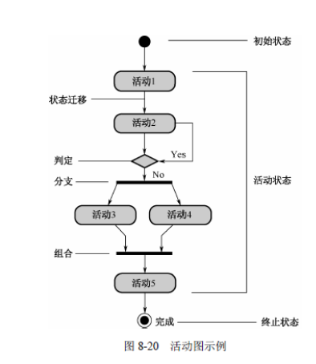 
>   >
>   > 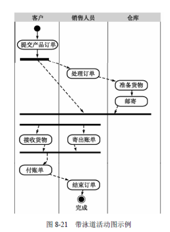 
>
> - 构件图（显示构件之间的依赖关系）
>
>   > 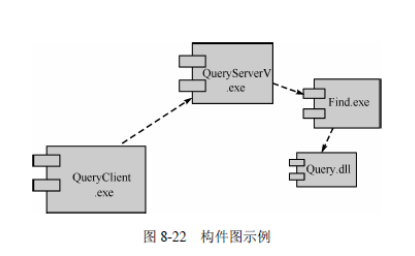 
>
> - 部署图
>
> **用户界面设计原则** 
>
> - 置于用户控制之下：不强迫设计不不要的交互，允许用户交互过程中断，撤销
>
> - 减少用户记忆负担：建立有意义的默认、定义直觉 性的捷径、界面的视觉布局应该基于对真实世界的隐喻、以不断进展的方式提示信息
>
> - 保持界面一致：允许用户将当前任务放入有意义的语境、在应用系列内保持一致性，如果过去的交互模型已经建立了用户期望，除非有不得已的理由，否则不要改变它
>
> 
>
> **工作流设计**（工作流是一类能够完全或部分完成自动执行经营的过程）
>
> 要素：
>
> 1. 流程定义：过程运行中的活动 和所涉及的各种信息
>
> 2. 流程实例
>
> 3. 工作流管理系统：工作流引擎，程序存储流程的定义
>
> 4. 参与者
>
> 5. 活动：流程的元素，可以改变数据内容，流程状态，并推送到下一个活动，活动可以由人或系统处理
>
> 6. 活动参与者
>
> 
>
> **系统运行环境集成与设计**
>
> - 集中式系统
>
>   1. 单计算机结构(结构简单，容易维护，处理能力限制）
>   2. 集群
>   3. 多计算机结构：系统可以分解成多个不同的子系统
>
> - 分布式系统
>
> - C/S结构（C/S多层结构的扩展）
>
> - Internet，Intranet，Extranet
>

