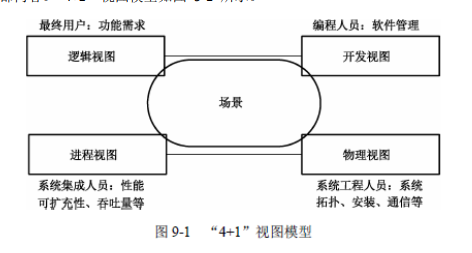
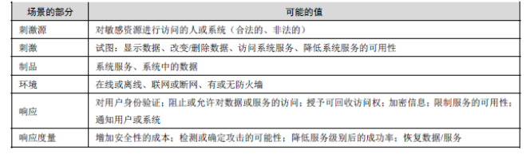
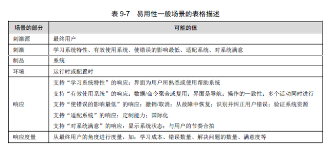
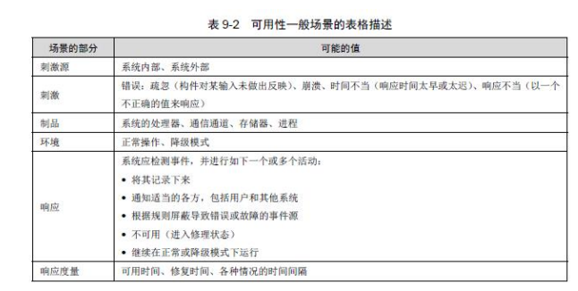
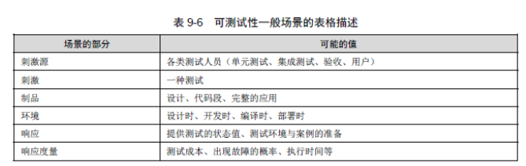
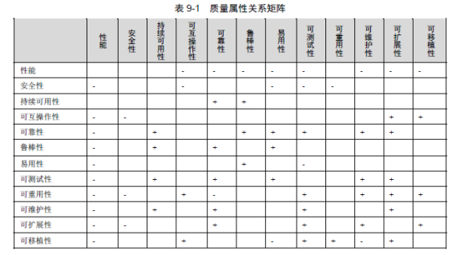

## **软件架构设计**

> **架构模型**
>
> 1. 结构模式：通过结构来反映系统的重要语义，内容研究结构模型的核心是架构描述语言
>
> 2. 框架模式：以一些特殊的问题为目标建立只针对和适应该问题的结构
>
> 3. 动态模型
>
> 4. 过程模型：过程模型研究构造系统的步骤和过程。因而结构是遵循某些过程脚本 的结果
>
> 5. 功能模型：为架构由一组功能构件按层次组成，且下层向上层提供服务
>
> 6. 4+1模型：
>
>     
>
>    逻辑视图：支持系统功能需求，系统分解成一系列的功能抽象（保持单一，内聚的对象模型贯彻系统）
>
>    开发视图：要侧重于软件模块的组织和管理（需要考虑软件的容易性、软件的重用和软件的通用性）
>
>    进程视图：侧重于系统运行特征（系统可用性，性能，分布，容错，集成）
>
>    物理视图：软件适配硬件（解决系统拓扑结 构、系统安装、通信等问题）
>
>    场景：重要系统活动的抽象
>
> **软件属性**
>
> - 质量特性
>
>   1. 安全
>
>      >  
>      >
>      > 抵抗攻击：用户身份验证，授权，数据脱敏，校验。限制暴露信息，限制访问，使用防火墙，DMZ策略（隔离区，类似于外网与内网之间缓存环境）
>      >
>      > 检测攻击：比较通信模式与历史访问基线
>
>   2. 易用
>
>      >  
>
>   3. 可伸缩
>
>   4. 与其他系统交换和相互调度难度
>
>   5. 性能
>
>      > 资源需求：提高算法效率，减少计算开销（可修改性与性能之间权衡，减少不必要代理构件）
>      >
>      > 资源管理：引入并发。维持数据或计算的多个副本，减少服务器计算压力。增加服务器资源
>      >
>      > 资源仲裁：使用合适的调度策略（FIFO，固定优先调度，动态优先调度）
>
>   6. 可靠（持续可用）
>
>      >  
>      >
>      > 可用性技术：阻止错误发展成故障，把错误影响限制在一定范围内
>      >
>      > - 错误检测：心跳消息
>      > - 错误恢复：表决器（选举），主动冗余（热重启，热备份），被动冗余（备用构件从最新同步点接替主 构件的工作）
>      > - 错误预防：重启，事务控制
>
>   7. 容错性（鲁棒）：非正常环境下运行能力
>
>   8. 易理解
>
>   9. 可扩展
>
>   10. 可重用
>
>   11. 可测试
>
>       >  
>
>   12. 可维护
>
>       > 局部化修改：预期的变更限制在一定的范围，维持语义一致性
>       >
>       > **防止连锁反应**：信息隐藏（设置公有，私有接口），维持现有接口（不在原接口上更改），限制通信路径，使用仲裁者方式把服务间语义隔离
>       >
>       > 热部署：系统具备在运行时进行绑定并允许非开发人员进行修改
>       >
>       > 配置文件：在启动时设置参数
>       >
>       > 多态
>       >
>       > 构件更换：运行载入时绑定
>
>   13. 可移植
>
>        
>
> 

