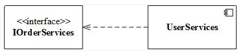
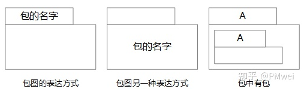
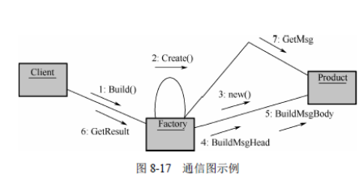
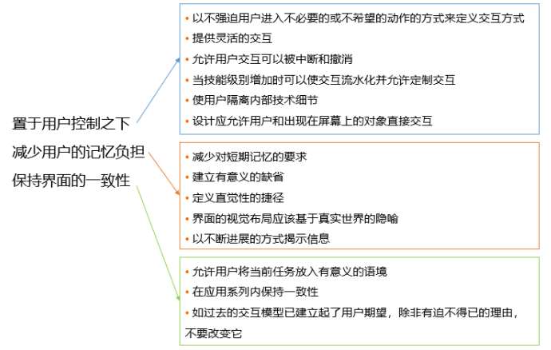
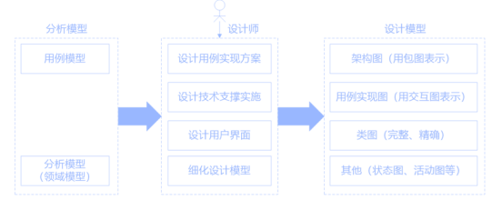
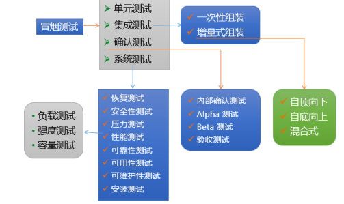

## 软件工程

> 软件开发方法
>
> - 结构开发：用户至上，自顶向下，逐步分解（求解），严格区分工作阶段，每阶段有任务与成果，强调系统开发过程的整体性和全局性，系统开发过程工程化，文档资料标准化
>
>   > 优点：用户需求在系统建立之前就能被充分了解和理解，重开发过程的整体性和全局性
>   >
>   > 缺点：开发周期长，文档、设计说明繁琐，工作效率低；在开发之初全面认识系统的信息需求，充分预料各种可能发生的变化；需要用户参与系统开发。
>
> - 原型开发：适用于需求不明确的开发，按功能分-水平原型（界面）、垂直原型（复杂算法），按最终结果分-抛弃式原型、演化式原型。
>
>   > 优点：对用户的需求是动态响应、逐步纳入的，系统分析、设计与实现都是随着原型的不断修改而同时完成的。开发方法更宜被用户接受；但如果用户配合不好，盲目修改，就会拖延开发过程
>
> - 面对对象开发：系统的描述及信息模型的表示与客观实体相对应，具有更好的复用性，需要对象模型（描述系统数据结构）、动态模型（描述系统控制结构）、功能模型（描述系统功能）
>
>   > 对象模型：静态数据模型，模拟客观世界对象之间关系映射
>   >
>   > 动态模型：规定对象模型合法变化（对象产生的行为），使用通常状态图表示
>   >
>   > 功能模型：直接反映了用户对目标系统的需求。功能模型也通常由一组数据流程图表示
>
> - 面向服务开发：以粗粒度、松散耦合的系统功能为核心，强调系统功能的标准化和构件化，加强了系统的灵活性、可复用性和可演化性。
>
>   > 操作：代表单个逻辑工作单元（LUW）的事务
>   >
>   > 服务：操作的逻辑分组，
>   >
>   > 服务建模：分为服务发现、服务规约和服务实现三个阶段
>   >
>   > 业务流程：实现特定业务目标而执行的一组长期运行的动作或活动
>   >
>   > SOAD：基础设计层（底层服务构件）、应用结构层（服务之间的接口和服务级协定）和业务组织层（业务流程建模和服务流程编排），
>
>  
>
> 
>
> **软件开发模型**
>
> 1. **原型：适用于需求不明确场景，帮助用户明确需求（根据原型完成产品）**
>
> 2. **瀑布**：根据软件各种周期活动（需求分析，设计，编码，运行，维护）线性连接模型
>
>    > 容易理解，管理成本低，每个阶段都有对应的成果产物，各个阶段有明显的界限划分和顺序要求，一旦发生错误，整个项目推倒重新开始，**适用于需求明确的项目**，一般表述为需求明确、或二次开发，或者对于数据处理类型的项目
>
> 3. 增量：融合瀑布和原型迭代特点，优先开发核心功能，在核心功能基础上进行新的增量发布（每一个增量发布都为可操作的产品）
>
> 4. 螺旋：在瀑布模型基础上引入风险分析，面向对象开发模型
>
> 5. V模型：以测试结果作为系统准则贯穿项目始终。而不是集中在测试阶段
>
> 6. 喷泉：面向对象模型，特点是迭代、无间隙。会将软件开发划分为多个阶段，但各个阶段无明显界限， 并且可以迭代交叉
>
> 7. **构件组装：**
>
>    >  
>    >
>    > - 确保组件独立，自包容，构件之间通过接口相互协作
>    > - 允许重用，降低开发成本
>    > - 构件的粒度小，适配性强
>
> 8. **RAD快速响应开发**：基于瀑布模型，**强调极短的开发周期**，**通常使用基于构件的开发方法获得快速开发**
>
>    > 过程：业务建模，数据建模，过程建模，应用生成，测试与交付
>    >
>    > 适用性：对模块化要求比较高，要求开发者和客户必须在短的时间完成一系列的需求分析，**RAD只能用于管理信息系统的开发，不适合技术风险很高的情况**
>
> 9. **统一过程（RUP，UP）：以用例驱动，以架构为中心，迭代和增量** 
>
>    > 构思：与用户沟通，**强调定义和细化用例，并将其作为主要模型**
>    >
>    > 细化：用户沟通和建模活动，重点是创建分析和设计模型，**强调类的定义和体系结构的表示**
>    >
>    > 构建：将设计转化为实现，并进行集成和测试
>    >
>    > 移交：产品发布给用户进行测试评价，并收集用户的意见，之后再次进行迭代修改产品使之完善
>
> 10. **敏捷开发：用来应付需求快速变化的软件开发方法，适合小项目迭代**
>
>     > **敏捷开发特点：**
>     >
>     > 1. 简单设计，避免重复迭代，减少不必要文档
>     >
>     > 2. 商业价值高的功能优先实现，要求客户有时间对每次迭代成果确认，提出改进意见
>     >
>     > 3. 理解一致，加强团队与客户之间沟通
>     >
>     > 4. **TDD测试驱动开发**（需求分析，设计，质量控制量化的过程。TDD首先考虑使用需求（对象、功能、过程、接口等），编写测试用例框架对功能的过程和接口进行设计，而测试框架可以持续进行验证）
>     >
>     > 5. 需要更强的个人和团队能力
>     >
>     >    
>     >
>     > **敏捷开发方法**
>     >
>     > - **XP：极限编程**
>     >
>     >   价值：沟通、简单、反馈、勇气
>     >
>     >   原则：快速反馈、简单性假设、逐步修改、提倡更改、优质工作。
>     >
>     >   实践：隐喻、小型发布、 简单设计、测试先行、重构、结对编程、集体代码所有制、持续集成、每周工作 40 小时、现场客户和编码标准
>     >
>     > - 水晶：强调经常交付，每一种不同的项目都需要一套不同的策略、约定和方法论
>     >
>     > - ASD自适应软件开发
>     >
>     > - **DSDM动态系统开发：倡导以业务为核心，快速而有效地进行系统开发**
>     >
>     > - **FDD特性驱动开发：短时的迭代阶段和可见可用的功能**
>     >
>     > - 开发源码式：查错排障(debug)的高度并行性，任何人发现了错误都可将改正源码的补丁文件发给维护者
>     >
>     > - **Scrum并列争球：核心是迭代、增量交付，按照 30 天进行迭代开发交付可实际运行的软件**
>     >
>     >   1. Sprint：短期迭代周期（1到2周完成）
>     >   2. Backlog：商业价值排序的需求列表（需求/用户故事）
>     >   3. Sprintbacklog：Backlog中挑选商业价值高的需求通过会议进行讨论，分析，估算产出开发任务列表
>     >   4. Scrum活动
>     >      - Sprint Planning（计划会议）：Scrum成员讨论每个事项，并对该事项达成共识
>     >      - Daily StandUp（每日站会）：汇报当前完成情况，计划当天工作，及遇到问题
>     >      - Spring Review（评审会议）：通过完成情况制定或调整Backlog
>     >      - Sprint Retrospective（回顾会议）：探讨当前开发环境有利或不利因素
>     >
>
> **传统开发与敏捷开发对比**
>
> - 敏捷开发优点：拥抱变化，制定并完成短时间的计划。能快速响应市场（快速占领市场，向时间要效益），在资源条件有限下，做最有价值的事
> - 敏捷开发缺点：项目人数不能太多，不适合大型项目工程，缺少过程资产累积，项目维护成本增加。**并不能带来开发效率提升**
>
>  
>
> **逆向工程**
>
>  
>
>  

#### **需求工程**：

> 软件需求是指用户对系统在功能、行为、性能、设计约束等方面的期望。
>
> 需求开发流程：
>
>  
>
> 需求分类：
>
> - 业务
> - 系统：功能需求、非功能需求和设计约束
> - 性能
> - QFD质量功能部署：用户要求转化成软件需求的技术，其目的是提升软件工程过程中用户的满意度
>   1. 基本需求：用户认为系统应该做到的功能或性能，实现越多用户会越满意
>   2. 期望需求：用户认为系统应具备的功能或性能，但并不能正确描述自己想要得到的这些功能或性能需求。如果期望需求没有得到实现，会让用户感到不满意
>   3. 意外需求：用户要求范围外的功能或性能，实现这些需求用户会更高兴
>
> 需求获取方法：
>
> 1. 用户访谈
> 2. 问卷调查
> 3. 现场观摩
> 4. 联合需求计划：群体会议来分析企业内的问题并获取需求的过程
> 5. 情节串联
> 6. 收集资料，约定历史文档
> 7. 参与业务实践
> 8. 抽样调查
>
> 
>
> **需求分析**
>
> - **结构化分析**
>
>   >  
>   >
>   > 1. 产出系统输入，输出数据流，及经历处理过程（物理模型）
>   > 2. 建立系统逻辑模型（画出与真实环境等价逻辑数据流图）
>   > 3. 划清人机界限（确定系统逻辑模型中流程采用系统还是手工操作）
>   >
>   > **DFD：图形化系统模型（可视化系统中信息流动的图形方式）**
>   >
>   >  
>   >
>   >  
>   >
>   >   细化DFD部件
>   >
>   > 1. 数据字典（系统相关的数据元素的一个有组织的列表和精确严格的定义，包含数据名称，内容结构，使用描述）
>   >
>   >    {}n：n次重复
>   >
>   >    ()：可选择的数据项（可以不选）
>   >
>   >    [ | ]：或，两者中选其中一个
>   >
>   >       
>   >
>   > 2. 结构化语言
>   >
>   > 3. 决策树，决策表达方法
>
> - **面向对象需求分析**
>
>   > 概念：
>   >
>   > - 对象与类
>   >
>   >   1. 实体类（一般使用名称命名，必须存在属性，不一定有操作）
>   >   2. 控制类（一般使用动词+名词命名，将特有的行为进行建模）
>   >   3. 边界类（与外部信息交流的约束，通常使用接口定义）
>   >
>   > - 继承与泛化（泛化：父类则是子类的泛化，继承：父类的继承是子类）
>   >
>   > - 多态与重载
>   >
>   > - 模板（通过参数实现类的多态性，使用变元来表示与具体类型有关的数据）
>   >
>   > - 消息与消息通信
>   >
>   > - 接口
>   >
>   > 
>   >
>   > **UML图**
>   >
>   > - 静态图（结构图）
>   >
>   >   1. **类图与对象图**：类图：描述一组类、接口、协作和它们之间的关系，对象图：描述具体对象之间依赖及数量关系
>   >
>   >      - 依赖关系：参数关系，成员关系，使用箭头+虚线表示（X的定义改变影响Y，则Y依赖X）
>   >
>   >      - 关联关系：表示类之间数量关系（一对多，多对多关系，特殊的依赖）使用实线表示
>   >
>   >      - 泛化关系：子类是从父类中继承，使用空心箭头+实线表示，箭头指向父类
>   >
>   >      - 聚合关系：表示has-a关联，聚合实体生命周期不同，使用空心菱形的实线表示
>   >
>   >      - 组合关系：表示has-a关联，组合实体生命周期一致，不能单独存在，使用实心菱形的实线
>   >
>   >   2. **构件（组件）：**用来描述构成系统的各个组件、组件提供的接口与需求的接口、端口以及它们之间关系的图
>   >
>   >      -  实现关系 
>   >      -  依赖关系
>   >
>   >   3. **部署**：同拓扑图，描述对运行时的处理节点及在其中生存的构件的配置
>   >
>   >      -   
>   >
>   >   4. 包：模型本身分解而成的组织单元，以及他们之间的依赖关系
>   >
>   >      -   
>   >
>   > 
>   >
>   > - 动态图（行为图）
>   >
>   >   1. **用例**：
>   >
>   >      -   
>   >
>   >      - 参与者：代表某一种特定功能的角色
>   >
>   >        用例：对系统行为的动态描述（划分系统与外部实体的界限）
>   >
>   >        包含关系：可以从两个或两个以上的原始用例中提取公共行（抽象用例）
>   >
>   >        扩展关系：混合了两种或两种以上的不同场景(拆分一个主用例和一个或多个辅用例)
>   >
>   >   2. **顺序（序列）**强调对象之间消息 发送的顺序
>   >
>   >      -  
>   >
>   >   3. **通信**：描述相互合作的对象间的交互关系和链接关系
>   >
>   >      -  
>   >
>   >   4. 状态：描述不同用例之间的对象行为（通常表示业务流程，控制对象）
>   >
>   >      -  
>   >
>   >   5. **活动图**：强调对象间的控制流程。 类似程序流程图。
>   >
>   >      -  
>   >
>   >   6. 定时
>   >
>   >      -  
>   >   
>   >   7. 4+1视图模型
>   >   
>   >      -   
>   >        - 逻辑视图：以问题域的语汇组成的类和对象集合
>   >        - 进程视图：可执行线程和进程作为活动类的建模
>   >        - 实现视图：对组成基于系统的物理代码的文件和组件进行建模
>   >        - 部署视图：把构件部署到一组物理的、可计算的节点上，表示软件到硬件的映射及分布结构
>   >
>
> - **OOA需求建模**
>
>   >  
>
> 
>
> 需求定义
>
>  
>
> 需求验证：
>
>  
>
> 
>
> **需求管理**
>
> - 需求状态
>
>    
>
> - 需求跟踪
>
>    

#### **系统设计**

> 概要设计
>
> - 总体设计
> -  总体布局设计
> -  网络拓扑结构设计 
> - 资源配置设计 
> - 模块化结构设计 
> - 划分功能模块
> -  模块功能和职责
> -  模块间的调用关系
> -  模块间的信息传递
>
> 详细设计
>
> - 代码设计：信息分类和编码的工作，是将系统中有某些共同属性或特征的信息归并在一起
> - 数据库设计
> - 输入，输出设计：记录为单位的各种输入输出报表格式的描述，
> - 用户界面设计
> - 处理过程设计：定义每个模块的内部执行过程
>
> 人机界面设计
>
> -   
>
> **面向对象设计**
>
>  
>
>   
>
> **设计模式**：主要关注软件系统的设计，与具体的实现语言无关
>
> - 创建型模式
> - 结构型模式
> - 行为型模式

#### **软件测试**

> **测试原则**
>
> 1. 应尽早并不断地进行测试
> 2. 程序员避免测试自己设计的程序（除单元测试外）
> 3. 包含合理，不合理输入条件
> 4. 检测是否做了不该做的事
> 5. 修改后进行回归测试
> 6. 尚未发现的错误数量与已发现的数量成正比
> 7. 重视测试中的群集现象
> 8. 所有的测试都应追溯到用户需求
> 9. 穷举测试是不可能的
> 10. 严格按照测试计划来进行，避免随意性
> 11. 妥善保存测试计划、测试用例、作为软件
>
> 基本测试活动
>
> 1. 制定测试计划（测试的内容、进度安排、测试所需的环境和条件，测试培训安排）
> 2. 编制测试大纲（规定测试功能或特性通过准则，和测试完成准则）
> 3. 设计和生成测试用例（被测项目、输入数据、测试过程、预期输出结果）
> 4. 实施测试
> 5. 缺陷管理与改错，生成测试报告
>
> 
>
> **测试阶段和分类**
>
>   
>
> - **冒烟测试**：转测前选择一部分基础测试用例进行验证，确保全流程没有严重，阻塞性问题
> - 单元测试：最小的软件模块进行测试（由开发人员执行）
> - 集成测试：验证组成软件系统的各模块的接口和交换作用
>   - 一次性组装：所有模块组装起来进行测试
>   - 自顶向下/上增值组装
>   - 混合增值
> - **确认测试：**验证软件是否符合用户需求，采用黑盒测试方法（从用户角度针对产品特定的功能和特性进行验证活动）
>   - **验收测试：产品上线最后一项测试**，包含文档资料的审查验收、软件系统的功能测试、性能测试、强化测试、性能降级执行方式测试、检查系统的余量要求、安装测试以及用户操作测试
>   - a与b测试
>     - Alpha测试：内用人员模拟实际操作环境测试，检测软件功能、可使用性、可靠性、性能和支持，**注重产品界面和特色**。
>     - Beta测试：用户在实际环境下进行测试
>   - 回归测试：测试软件变更后，对变更的内容进行测试
> - **系统测试**：**在真实环境下验证软件配置项能否和系统正确连接，保证软件能在系统上可靠运行**（包含功能，性能，恢复。安全，强度测试）
>
> 
>
> **测试方法**
>
> - 白盒测试（结构性测试）：根据内部结构和逻辑来设计测试用例，对程序路径和过程进行测试
>   1. SC语句覆盖：确保被测试程序中每条语句至少执行一次
>   2. DC判定覆盖：分支覆盖，确保每个判断至少执行一次
>   3. CC条件判断：确保每个逻辑判断至少执行一次
>   4. CDC：条件判定组合覆盖
>   5. MCC：多条件覆盖
>   6. MCDC：修正判定条件覆盖，每一程序模块的入口和出口点都要考虑至少被调用一次
>   7. 路径覆盖：被测试程序中的所有可能路径至少被执行一次
> - 黑盒测试（功能测试）：基于产品功能规格说明书，从用户角度针对产品特定的功能和特性进行测试
>   1. **等价类划分**：对每一个输入条件划分为有效范围和无效范围，测试用例确保覆盖每一个有效/无效等价范围
>   2. **边界值分析**：对等价分类的边界参数进行测试
>   3. **因果图与判定表（组合关系图）** ：根据输入条件的等价类组合关系，写出判定表。
>      - 输入条件约束：E（互斥），I（包含），O（唯一），R（要求），M（强制屏蔽）。
>      - 输入与输出依赖关系：恒等，非，或，与
>   4. **错误推测**：根据经验或直觉推测程序中可能存在的各种错误
>   5. 判断驱动
>   6. 正交试验
>   7. 功能图法
> - **静态测试：不运行软件进行测试（采用人工检测，计算机辅助分析检测）**
>   1. 桌前检测：对源程序代码进行分析和检验，补充相关文档（包含变量交叉引用检测，常量检测，代码规范，逻辑判断）
>   2. 代码审查：将设计规格书，控制流程图，程序规范作为评审依据提交给审查人员，由开发人员逐句讲解程序逻辑，审查任意可以提出问题展开讨论是否存在错误。
>
> **调试**
>
> - 原始类：通过计算机找错，凭借大量的现场信息，从中找到出错误的线索
> - 回溯类：地用于程序的排错，人工 地沿控制流程往回追踪，直至发现出错的根源
> - 排除类：先分析与错误出 现有关的所有数据

#### **系统运行与软件维护**

> **系统转换计划**
>
>   
>
> - 淘汰策略：对企业资源造成浪费的系统（需要重新设计并替换旧系统）
> - 继承策略：满足企业运作的功能或性能要求（新系统需要全面兼容遗留系统功能及数据）
> - 改造策略：主要对当前系统功能的增强和数据模型的改造
> - 集成策略：将系统与其他系统集成使用
>
> **新旧系统转换策略**
>
> - 直接转换：旧系统停止运行，新系统立即投入使用（人力和费用最省，风险高）
> - 并行转换：新旧系统并行使用一段时间，试运行后在正式弃用旧系统（风险小，人力和费用消耗大，难以控制两套系统中数据变化）
> - 分段转换：分期分批、逐步转换
>
> **数据迁移与转换**（ETL）
>
> - 抽取
> - 转换
> - 装载
>
> 
>
>  **系统维护**
>
> - 运行前：运行的计划和维护计划
> - 运行后：软件修改、培训、帮助资料

