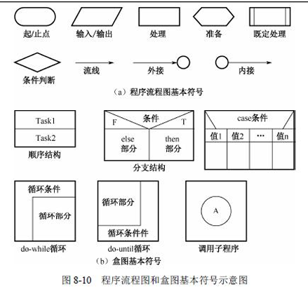
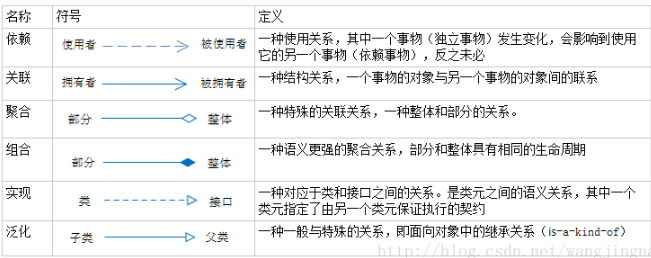
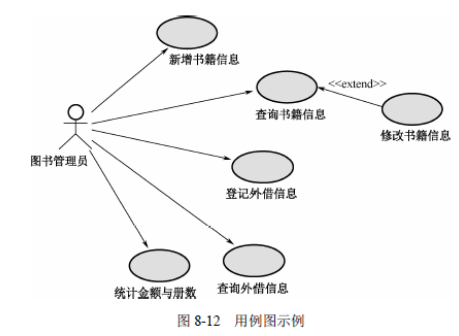

## 软件工程

> 软件工程：
>
> - 软件规格说明：规定软件的功能及运行时的限制
> - 软件开发
> - 软件确认：确认开发软件能满足用户需求
> - 软件演进：软件运行过程中不断改进面子客户新需求
>
> 软件开发周期
>
> - 软件定义：可行性研究和详细需求分析过程
> - 软件开发：软件的设计与实现
> - 软件运行与维护
>
> 软件文档
>
> - 用户文档：描述系统功能和使用方法
> - 系统文档：系统设计，实现和测试文档
>
> 
>
> **软件设计活动**
>
> 1. 数据设计
> 2. 架构设计（体系结构）
> 3. 人机界面设计
> 4. 过程设计
>
> **能力成熟度模型CMMI**
>
> - 初始：过程不可预测缺乏控制
> - 已管理：**过程为项目服务**（需求管理，项目计划，配置管理，过程监督，质量保证，供应商合同管理）
> - 已定义级：**过程为组织服务**（需求开发，技术解决方案，产品集成，验证，组织级过程定义，集成项目管理，风险管理，集成化团队，决策分析和解决方案制定）
> - 定量管理：过程已度量和控制
> - 优化机：组织改革与实施，因果分析与解决方案分析
>
> **软件过程模型**
>
> - **瀑布模型SDLC：** 
>
>   > 将软件开发分为：可行性分析（计划），需求分析，软件设计（概要，详细设计），编码，测试，运行维护阶段。
>   >
>   > **瀑布模型特点：**
>   >
>   > 1. 等待上一阶产出的结果作为输入
>   > 2. 确保完成本阶段的工作内容
>   > 3. 对该项活动的结果进行评审
>   > 4. 需求明确，有严格时间管控
>
> - **原型化模型：**创建快速原型，能满若干需求，在此基础上进行变更，**最终完全满足用户需求**
>
>   > **原型特点：**
>   >
>   > 1. 对用户的需求动态响应，逐步纳入
>   > 2. 具有最终系统基本特征
>   > 3. 实施可行
>
> - 螺旋模型：将原型实现的迭代特征与线性瀑布模型控制和系统化方面结合**（增量发布）**
>
>   > 开发阶段分为：定制计划，**风险分析**，实施工程，客户评估
>   
> - 增量模型：优先开发核心功能，后面以增量（每个增量是一个完整功能）形式逐步迭代**（不适于模块划分）**
>
> - 喷泉模型：以用户需求为动力，以对象作为驱动（面对对象开发）
>
> - 基于构件CBSD模型：利用预先包装的构件来构造应用系统**（主要增强构建复用性）**
>
> - **敏捷模型：**用来应付需求快速变化的软件开发方法，**适合小项目迭代**
>
>   > 敏捷模式特点：**适应性强，以人为本，迭代增量的方式**
>   >
>   > **敏捷方法**
>   >
>   > - **XP：极限编程**（类似于螺旋式开发模式）
>   >
>   >   价值：沟通、简单、反馈、勇气
>   >
>   >   改善：加强交流，简单做起，寻求反馈，实事求是
>   >
>   >   提倡：测试先行
>   >
>   > - 水晶：每一种不同的项目都需要一套不同的策略、约定和方法论
>   >
>   > - **Scrum**：核心是迭代、增量交付，按照 30 天进行迭代开发交付可实际运行的软件
>   >
>   >   1. Sprint：短期迭代周期（1到2周完成）
>   >   2. Backlog：商业价值排序的需求列表（需求/用户故事）
>   >   3. Sprintbacklog：Backlog中挑选商业价值高的需求通过会议进行讨论，分析，估算产出开发任务列表
>   >   4. Scrum活动
>   >      - Sprint Planning（计划会议）：Scrum成员讨论每个事项，并对该事项达成共识
>   >      - Daily StandUp（每日站会）：汇报当前完成情况，计划当天工作，及遇到问题
>   >      - Spring Review（评审会议）：通过完成情况制定或调整Backlog
>   >      - Sprint Retrospective（回顾会议）：探讨当前开发环境有利或不利因素
>   >
>   > - **FDD特性驱动开发：** 迭代开发模型
>   >
>   >   - 软件开发要素：人，过程，技术
>   >   - 核心过程：开发整体对象模型，构造特征列表，计划特征开发，特征设计和特征构建
>   >
>   > - 开发源码方式：查错排障(debug)的高度并行性，任何人发现了错误都可将改正源码的补丁文件发给维护者
>
> - **统一过程建模RUP：** 快速有效为开发人员提供指导方针，模版及实例支持
>
>   > 核心工作流程：业务建模，需求，分析设计，实现，测试，部署，配置与变更管理，项目管理，环境
>   >
>   > 核心概念：角色，结构师，活动，制品，工作流
>   >
>   > **RUP特点**
>   >
>   > 1. 用例驱动：需求分析，设计，实现和测试活动
>   > 2. 4+1模型的体系中心：逻辑，实现，进程，部署
>   > 3. 迭代增量
>
> - **逆向工程**
>
>   > **重构：在抽象级别是那个转换系统描述形式（改变抽象实现方式）**
>   >
>   > 设计恢复：从已有程序抽象出有关数据设计，总体设计结构和过程设计信息
>   >
>   > **再工程：**在逆向工程的基础上，修改或重构已有的系统，生成一个新的版本（抄袭其他工程）
>   >
>   > 正向工程：从已有项目质量基础上，修改或重构现有工程
>
> **传统开发与敏捷开发对比**
>
> - 敏捷开发优点：拥抱变化，制定并完成短时间的计划。能快速响应市场（快速占领市场，向时间要效益），在资源条件有限下，做最有价值的事
> - 敏捷开发缺点：项目人数不能太多，不适合大型项目工程，缺少过程资产累积，项目维护成本增加。**并不能带来开发效率提升**
>

#### **需求工程**：

> 软件需求是指用户对系统在功能、行为、性能、设计约束等方面的期望。
>
> 需求开发流程：
>
>  
>
> 需求分类： 系统 > 用户 > 功能 > 业务
>
> - 业务：企业或客户对系统高层次目标要求
> - 用户：用户的具体目标，或用户要求系统必须完成的任务
> - 系统：功能需求、非功能需求和设计约束
> - 性能
> - QFD质量功能部署：用户要求转化成软件需求的技术，其目的是提升软件工程过程中用户的满意度
>   1. 基本需求：用户认为系统应该做到的功能或性能，实现越多用户会越满意
>   2. 期望需求：用户认为系统应具备的功能或性能，但并不能正确描述自己想要得到的这些功能或性能需求。如果期望需求没有得到实现，会让用户感到不满意
>   3. 意外需求：用户要求范围外的功能或性能，实现这些需求用户会更高兴
>
> 需求获取方法：
>
> 1. 用户访谈（灵活性高，不适合信息量大，记录困难的需求）
> 2. 问卷调查
> 4. JRP联合需求计划：联合关键代表通过有组织的会议讨论需求
> 5. 情节串联：一系列相关素材描述用户故事
> 7. 参与业务实践
> 8. 抽样调查
>
> 
>
> **需求分析**：把杂乱无章的用户需求和期望转为用户需求
>
> **系统设计原则：抽象化，自顶向下，逐步求精，信息屏蔽，模块独立（高内聚，低耦合）**
>
> **内聚程度**
>
> 1. 偶然：无直接关系
> 2. 逻辑：逻辑类似，参数决定（重载）
> 3. 时间：同时执行（多个动作组合同时运行形成的功能模块）
> 4. 过程：指定过程顺序执行
> 5. 通讯：相同数据结构，相同输入输出（处理的元素都在同一数据结构上保存或执行，产生相同结构的数据）
> 6. 顺序：顺序执行，输入为输出
> 7. 功能：模块中所有元素共同完成一个功能，缺一不可
>
> **耦合程度**
>
> 1. 无直接耦合：无直接关系
> 2. 数据耦合：存在调用关系（传递数据调用）
> 3. 标记耦合：传递数据结构
> 4. 控制耦合：控制变量选择性调用模块功能
> 5. 外部耦合：模块之间环境联合（相同的协议，数据格式，操作系统，或特定的设备）
> 6. 内容耦合：模块内部之间强关联
>
> 
>
> **结构化分析：自顶向下，逐步分解，面向数据**
>
> -  
>
> -  
>
> - **DFD：图形化系统模型（可视化系统中信息流动的图形方式）** 
>
>    
>
> - 数据字典（系统相关的数据元素的一个有组织的列表和精确严格的定义，包含数据名称，内容结构，使用描述）
>
>   {}n：n次重复
>
>   ()：可选择的数据项（可以不选）
>
>   [ | ]：或，两者中选其中一个
>
>   **加工逻辑：结构化语言，决策树，决策表达方法**
>
> - **流程图**
>
>    
>
> 
>
> **面向对象需求分析**
>
> - 概念
>
>   1. 类：实体类，控制类，边界类（抽象类）
>   2. 类关系：继承与泛化，接口，模板，调用，参数传递
>
> - **UML**
>
>   1. 类图与对象图
>
>       
>
>   2. 构件图
>
>       
>
>       
>
>   3. 部署图（拓扑图）：
>
>       
>
>   4. 包
>
>       
>
>   5. **用例图：对系统行为的动态描述（划分系统与外部实体的界限）**
>
>       
>
>      - 包含关系：可以从两个或两个以上的原始用例中提取公共行（抽象用例）
>      - 扩展关系：混合了两种或两种以上的不同场景(拆分一个主用例和一个或多个辅用例)
>
>   6. **顺序（序列）图**：强调对象之间消息 发送的顺序
>
>       
>
>   7. 通信图：描述相互合作的对象间的交互关系和链接关系
>
>       
>
>   8. 状态图：描述不同用例之间的对象行为（通常表示业务流程，控制对象）
>
>       
>
>   9. **活动图**：强调对象间的控制流程。 类似程序流程图。
>
>       
>
>   10. 定时图
>
>       
>
>   11. 4+1视图模型(非UML特有)
>
>        
>
>       - 逻辑：问题领域问题对象集合
>
>       - 进程：活动类的建模，逻辑视图的实例
>
> 
>
> **用户界面设计**
>
> - 置用户控制下
> - 减少用户记忆负担
> - 保证界面一致
>
> 
>
> **需求管理**
>
> - 需求状态
>
>    
>
>   风险：
>
>   1. 无用户参与
>
>   2. 忽略用户分类
>
>   3. 用户需求增加和不确定
>
>   4. 不必要的特性
>
>   5. 过于精简SRS
>
>   6. 不准确的估算
>
>   变更：
>
>   1. 外部环境变化
>   2. 需求和设计不够完整
>   3. 新技术出现
>   4. 公司机构重组造成业务流程变化
>
>   **CCB变更控制委员会**：对项目变更做出评价，审批，监督，批准
>
> - 需求跟踪
>
>    
>
>   正向跟踪：用户原始需求是否实现
>
>   反向跟踪：软件实现是否都是用户要求的
>
> **流程设计**
>
> 流程设计工具
>
> - PFD程序流程图
> - IPO流程描述工具：描述模块输入，输出，数据加工
> -  N-S：描述嵌套和层次关系
> - PAD问题分析图
>
> **BPR业务流程重组**
>
> - **对企业的业务流程进行根本性的再思考和彻底的再设计**，从而获得成本，质量，服务和速度上**带来的业绩显著提升**
>
> **BPM业务流程管理**
>
> - 以规范化业务流程为中心，提供组织业务绩效为目的（规范流程，优化流程，再造流程）

#### **软件测试**

> **测试原则**
>
> 1. 应尽早并不断地进行测试
> 2. 程序员避免测试自己设计的程序（除单元测试外）
> 3. 包含合理，不合理输入条件
> 4. 检测是否做了不该做的事
> 5. 修改后进行回归测试
> 6. 重视测试中的群集现象
> 7. 所有的测试都应追溯到用户需求
> 8. 穷举测试是不可能的
> 9. 严格按照测试计划来进行，避免随意性
> 10. 妥善保存测试计划、测试用例、作为软件
>
> **测试方法**
>
> - 静态测试：不在机器上运行，采用人工检测和计算机辅助静态分析手段
>   1. 代码走查
>   2. 代码评审
>   3. 桌前检查
> - 动态测试：实际运行程序进程测试
>   - 白盒测试：结构性测试，明确代码流程，根据代码逻辑设计用例，进行用例覆盖
>   - 黑盒测试：功能测试
>
> 
>
> **测试阶段和分类**
>
>   
>
> - **冒烟测试**：转测前选择一部分基础测试用例进行验证，确保全流程没有严重，阻塞性问题
> - 单元测试：最小的软件模块进行测试（由开发人员执行）
> - **集成测试**：验证组成软件系统的各模块的接口和交换作用**（依据软件概要设计文档）**
>   - 一次性组装：所有模块组装起来进行测试
>   - 自顶向下/上增值组装
>   - 混合增值
> - **确认测试：**验证软件是否符合用户需求，采用黑盒测试方法（从用户角度针对产品特定的功能和特性进行验证活动）
>   - **验收测试：产品上线最后一项测试**，包含文档资料的审查验收、软件系统的功能测试、性能测试、强化测试、性能降级执行方式测试、检查系统的余量要求、安装测试以及用户操作测试
>   - a与b测试
>     - Alpha测试：内用人员模拟实际操作环境测试，检测软件功能、可使用性、可靠性、性能和支持，**注重产品界面和特色**。
>     - Beta测试：用户在实际环境下进行测试
>   - 回归测试：测试软件变更后，对变更的内容进行测试
> - **系统测试**：**在真实环境下验证软件配置项能否和系统正确连接，保证软件能在系统上可靠运行**（包含功能，性能，恢复。安全，强度测试）
> - **回归测试：** 软件变更之后，变更部分的正确性和对需求变更符合性，与之相关联的功能进行重新测试
>
> 
>
> **测试方法**
>
> - 白盒测试（结构性测试）：根据内部结构和逻辑来设计测试用例，对程序路径和过程进行测试
>   1. SC语句覆盖：确保被测试程序中每条语句至少执行一次
>   2. DC判定覆盖：分支覆盖，确保每个判断至少执行一次
>   3. CC条件判断：确保每个逻辑判断至少执行一次
>   4. CDC：条件判定组合覆盖
>   5. MCC：多条件覆盖
>   6. MCDC：修正判定条件覆盖，每一程序模块的入口和出口点都要考虑至少被调用一次
>   7. 路径覆盖：被测试程序中的所有可能路径至少被执行一次
> - 黑盒测试（功能测试）：基于产品功能规格说明书，从用户角度针对产品特定的功能和特性进行测试
>   1. **等价类划分**：对每一个输入条件划分为有效范围和无效范围，测试用例确保覆盖每一个有效/无效等价范围
>   2. **边界值分析**：对等价分类的边界参数进行测试
>   3. **因果图与判定表（组合关系图）** ：根据输入条件的等价类组合关系，写出判定表。
>      - 输入条件约束：E（互斥），I（包含），O（唯一），R（要求），M（强制屏蔽）。
>      - 输入与输出依赖关系：恒等，非，或，与
>   4. **错误推测**：根据经验或直觉推测程序中可能存在的各种错误
>   5. 判断驱动
>   6. 正交试验
>   7. 功能图法
> - **静态测试：不运行软件进行测试（采用人工检测，计算机辅助分析检测）**
>   1. 桌前检测：对源程序代码进行分析和检验，补充相关文档（包含变量交叉引用检测，常量检测，代码规范，逻辑判断）
>   2. 代码审查：将设计规格书，控制流程图，程序规范作为评审依据提交给审查人员，由开发人员逐句讲解程序逻辑，审查任意可以提出问题展开讨论是否存在错误。
>
> **调试**
>
> - 原始类：通过计算机找错，凭借大量的现场信息，从中找到出错误的线索
> - 回溯类：地用于程序的排错，人工 地沿控制流程往回追踪，直至发现出错的根源
> - 排除类：先分析与错误出 现有关的所有数据
>
> **软件度量**
>
> - McCabe：有向边数为m，节点数为n，则有向图复杂度为 m-n + 2
> - 针对流程图：每一个分支边就是有向边，每一条语句就是顶点

#### **项目管理**

> **进度管理：**
>
> - 活动定义：确定完成项目各项可交付成果展开的活动
> - 活动排序：识别和记录各项活动之间先后关系和逻辑
> - 资源估算：完成活动所需要的资源类型和效益
> - 历时估算
> - 进度计划编制
> - **进度控制**
>   - WBS：工作分解结构
>     1. WBS工作包可控，可管理，不能过于复杂
>     2. WBS树形结构不超过6层
>     3. 每个工作包需要有交付成果
>     4. 每个任务必须有明确定义完成标准
>     5. WBS有利于责任分配
>
> 进度安排：甘特图
>
>  
>
> **关键路径法**：推算项目最短工期
>
> -  
>
> - 顺推：最早开始时间等于前一个活动最早完成时间，最早完成时间 = 最早开始时间+持续时间
>
> - 逆推：最晚完成时间等于后续活动最晚开始时间的最小值，最晚开始时间 = 最晚完成时间 - 持续时间
>
>   
>
>   **项目配置管理：**
>
> - 项目配置包含：软件产品和数据，用于创建或支持软件产品的工具，供应商提供的软件硬件设备，项目计划书，需求文档，设计文档，源代码，可执行代码，测试用例，运行软件所需数据
>
> - 配置项目权限：由CMO（配置管理员）严格管控，允许基线配置项向开发人员开放读取权限，非基线配置项PM，CCB相关人员开放
>
>   - 基线配置：设计文档，源程序
>  - 非基线配置：项目计划，项目报告
> 
> - 配置项状态：草稿，正式，修改状态（需要通过评审）
>
> 
>
>   **质量管理：**
>
> - 质量规划：识别产品的质量要求和标准，并以书面描述项目如何达到这些要求
>- 质量保证：每个一段时间对系统进行审查和过程分析确保项目质量
> - 质量控制：实时监测项目的具体结果
> - **软件质量保证SQA：**确保一开始就避免缺陷产生，SQA审计，SQA报告，缺陷处理
>   1. 事前预防
>   2. 引入缺陷时将其捕获
>   3. 作用域过程而不是最终产品
>   4. 贯彻所有活动
> 
> 
>
>  **风险管控：**避开不利条件，减少损失，取得预计结果并实现项目目标
>
> - 风险识别：确定风险来源，产生条件，描述风险特征
>
> - 风险定性：确定风险可能性，优先级，风险类型
>
> - 风险定量分析：使用图表模型进一步分析风险（灵敏度分析，期望货币值分析，决策树，蒙特卡罗模拟）
>
> - 应对计划：避免，转移策略，减轻策略
>
> - 风险分类：
>
>   1. 项目：预算，进度，投入资源，用户需求带来对项目的影响
>  2. 技术：设计，实现，接口，测试和维护对项目影响
>   3. 商业
>      - 市场：不是市场真正所所需要的（没市场）
>      - 策略：开发系统不符合企业信息系统战略
>      - 销售：销售部门无法向市场推销系统
>      - 管理：重点人员转移，失去上级部门支持
>      - 预算：开发过程中预算无法保证
> 

#### **软件可靠性基础**

> **在规定的条件下和规定的时间区间完成功能的能力**
>
> 软件可靠性与硬件可靠性对比
>
> 1. 复杂性：软件复杂性比硬件高（大部份失效来自于软件）
> 2. 物理退化：硬件特有
> 3. 唯一性：软件唯一性
> 4. 版本周期
>
> **软件定量描述**
>
> - 规定时间：执行，运行时间
> - 失效概率：运行初始为0，逐步递增趋向为1
> - 失效强度
> - 平均失效时间MTTF
> - 平均恢复前时间MTTR
> - 平均故障间隔时间MTBF = MTTF + MTTR
> - 系统可用性 MTTF / （MTTF + MTTR）
>
> **软件可靠性设计**：满足软件质量要求下，以提高和保障软件可靠性为最终目标
>
> - **容错设计**
>   1. 冗余：在正常系统运行所需基础上在加一定数量资源（冗余是容错的技术基础）
>   2. 恢复块技术：主动冗余（热备份，冷备份）
> - **检错设计**
> - **降低复杂度设计**

