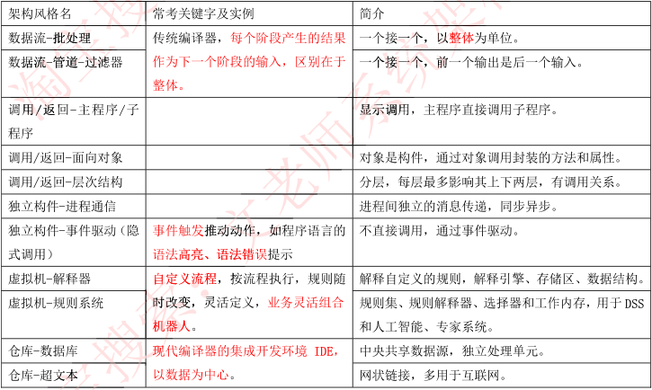
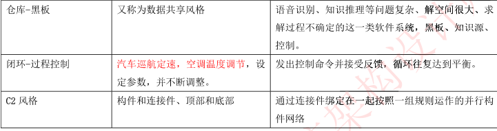
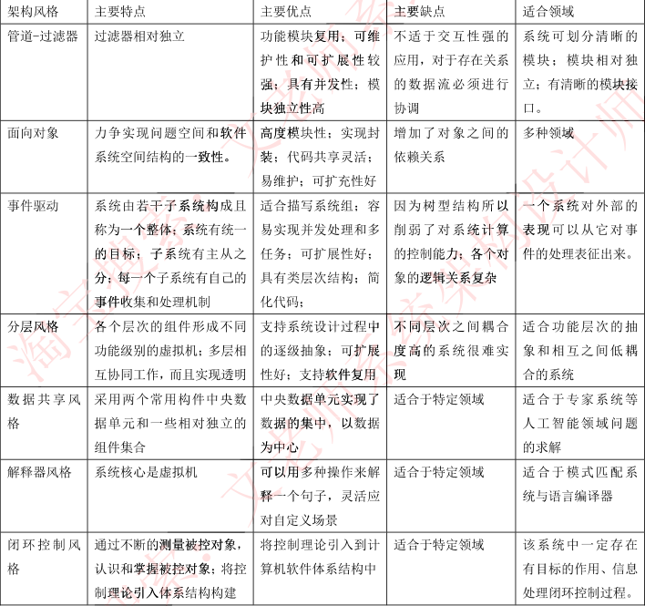
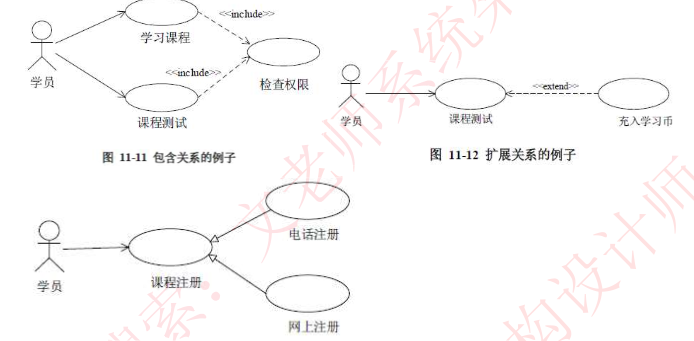
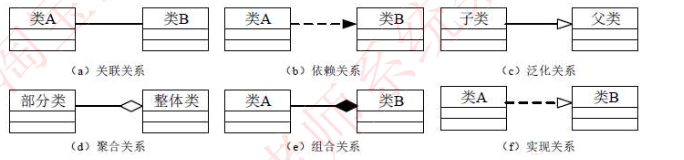

## 案例分析

- **软件质量属性及名称** （系统质量属性与架构评估）

  > 软件质量属性：
  >
  > - 开发阶段属性：易理解，可扩展，可重用，可测试，可维护，可移植
  > - 运行阶段属性：性能，安全，可伸缩，互操作性，可靠，可用，鲁棒
  >
  > **性能：系统响应能力**（响应时间，吞吐量）。通过增加计算资源，减少计算开销，引入并发机制，采用资源淘汰、调度策略提升
  >
  > 可用性：系统能够正常运行的时间比例
  >
  > 可靠性：在意外或错误使用的情况下维持软件系统功能特性的基本能力
  >
  > 健壮性：系统能够承受压力或变更的能力
  > 安全性：系统向合法用户提供服务的同时能够阻止非授权用户使用的企图或拒绝服务的能力
  >
  > 可修改性：能够快速地以较高的性能价格比对系统进行变更的能力
  >
  > 可变性：体系结构经扩充或变更成为新体系结构的能力。
  >
  > 可测试性：指软件发现故障并隔离、定位其故障的能力特性，以及在一定的时间和成本前提下，进行测试设计、测试执行的能力
  >
  > 功能性：系统所能完成所期望工作的能力
  >
  > 互操作性：系统与外界或系统与系统之间的相互作用能力
  >
  > 
  >
  > **软件属性提升能力：**
  >
  > 1. 性能：增加计算资源、改善资源需求、 资源管理和资源调度，引入并发机制
  > 2. 安全：抵御攻击、攻击检测、从攻击中恢复和信息审计，用户日志，用户授权
  > 3. 可用性：心跳、Ping/Echo、主动冗余、 被动冗余、选举
  > 4. 可修改性：，接口-实现分离、抽象、内部信息封装
  
- #### **软件架构风格**

  > 软件架构风格：描述特定软件系统组织方式的惯用模式。组织方式描述了系统的组成构 件和这些构件的组织方式，惯用模式则反映众多系统共有的结构和语义
  >
  > 面向对象风格：将数据表示和基本操作封装在对象中。这种模式的构件是对象，对象维护自身表示的完整性，对象之间通过消息机制进行通信，对象交互时需要知道彼 此的标识，通过对象之间的协作完成计算过程
  >
  >  
  >
  >  
  >
  >  
  >
  >  
  >
  > **MVC架构**：有助于管理复杂的应用程序。实现业务逻辑与界面设计分离，便于应用测试
  >
  > - 控制器：负责从视图中提取数据，控制用户输入，并向模型发生数据
  > - 模型：处理应用数据逻辑部分，表现业务数据和业务逻辑
  > - 视图：应用程序中数据展示部分，用户与系统的交互页面
  >
  >  
  >
  > **J2EE架构**：具有支持异构环境，可伸缩性（负载均衡），灵活性，易维护性特点
  >
  > - 客户端层
  > - 服务器组件层：JSP，Servlet
  > - EJB层：服务器端组件模型，包含 Session，Entity，Message-Driven
  > - 企业信息系统层：
  >
  > 
  >
  > **面向服务架构SOA**：将应用程序的不同功能单元（服务）通过这些服务之间定义良好的接口契约联系起来，独立于实现服务的硬件平台，操作系统和编程语言。
  >
  > 
  >
  > **企业服务总线 ESB**：通过消息转换，解释，以及路由实现连接各个服点节点之间通信
  >
  > - 描述服务元数据和服务注册管理
  > - 服务请求和服务提供者之间传输数据
  > - 发现，路由，匹配和选择能力，以支持服务之间的动态交互，解耦服务请求和服务提供
  >
  > 

- #### **需求工程**

  > **结构化：**
  >
  > - 自顶向下，逐步分解，面向数据
  > - 模型：数据流图，行为模型，数据模型（E-R），数据字典（数据元素，数据结构，数据流，数据存储，加工逻辑，外部实体）
  > -  
  > -  
  >
  > 
  >
  > 流程图：以图形化的方式展示应用程序从数据输入开始到获得输出为止的逻辑过程，描述 处理过程的控制流
  >
  > 数据流图：说明业务处理过程、系统边界内所包含的功能和系 统中的数据流
  >
  > 流程图与数据流图区别：
  >
  > 1. 数据流图中的处理过程可并行；流程图在某个时间点只能处于一个处理过程
  > 2. 数据流图展现系统的数据流；**流程图展现系统的控制流**。
  > 3. 数据流图展现全局的处理过程，过程之间遵循不同的计时标准；流程图中处理过程遵循一致的计时标准。
  > 4. 数据流图适用于系统分析中的逻辑建模阶段；流程图适用于系统设计中的物理模阶段
  >
  > 
  >
  >  高质量数据流图设计原则
  >
  > 1. 复杂性最小化原则：DFD分层架构，将消息划分小且独立的子集
  > 2. 接口最小化原则：各个元素之间的接口数或连接数最小化
  > 3. 数据流一致性原则：是否存在流出流入数据，是否存在**数据流入加工**（椭圆形表示数据加工处理）
  >
  
- #### **数据库系统**
  
  > ORM技术：关系数据库与对象之间映射
  >
  > 1. ORM降低开发和学习成本
  > 2. 不需要使用SQL进行操作数据库
  > 3. 减少程序代码量
  > 4. 降低由SQL代码质量带来影响
  > 5. 不太容易处理复杂查询语句
  > 6. 性能较比SQL差
  >
  > 
  >
  > **关系数据库与NoSQL数据库对比**
  >
  >  
  >
  >  
  >
  >  
  >
  > **封锁协议**
  >
  > - X锁（排他锁，写锁）：只允许锁的事务运行读取和修改，不允许再次加锁
  > - S锁（共享锁，读锁）：允许锁的事务进行读取，不允许修改（存在锁版本控制，读取不同状态数据）
  >
  >  
  >
  > **数据库范式**
  >
  > 1NF：无重复的列，且每一列不可分割的原子属性
  >
  > 2NF：实体的其他属性完全依赖主键（单表中不存在两个有联系的主体字段，消除数据冗余）
  >
  > 3NF：不包含其它关系已包含的非主键信息（单表中不存在其他表中非主键的字段，消除数据冗余）
  >
  > 
  >
  > **反规范化技术**：
  >
  > - 增加冗余列
  > - 增加派生列
  > - 重新组表
  > - 水平分割表
  > - 垂直分割表
  >
  
- **Web应用开发**
  
  > - 应用层负载技术：http从定向，反向代理服务器
  >
  > - 传输层负载技术：DNS域名解析（无法灵活配置），NAT负载均衡，将外部IP影射多个IP地址
  >
  > - CDN内容分发网络：通过分布式缓存服务器及全局负载技术，使其用户就近访问资源
  >
  > - 微服务：SOA技术延深，强调业务彻底组件化和服务化，微服务包含完整的业务功能，开放一种或多种接口为其他服务使用，并且可以包含一个自己私有的数据库
  >
  >    
  >
  >    
  >
  >  
  >
  >   

  