## 案例分析

#### **软件架构设计**

> 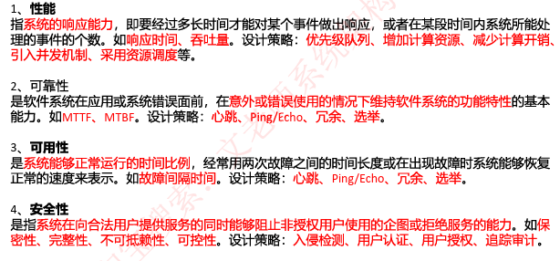 
>
> 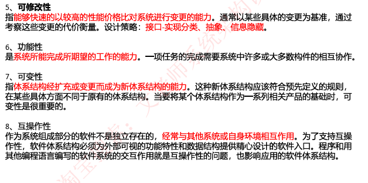 
>
> **软件属性提升能力：**
>
> 1. 性能：增加计算资源、改善资源需求、 资源管理和资源调度，引入并发机制
> 2. 安全：抵御攻击、攻击检测、从攻击中恢复和信息审计，用户日志，用户授权
> 3. 可用性：心跳、Ping/Echo、主动冗余、 被动冗余、选举
> 4. 可修改性：，接口-实现分离、抽象、内部信息封装
>
> **架构风格质量分析**
>
> - 软件架构风格：描述系统组成构件方式结构基本相同
> - 架构风险：设计中潜在，存在问题的架构决策带来的隐患
> - 风险点与非风险点：风险导致的问题
> - 敏感点：实现某种特定质量属性具有的特性
> - 均衡点：影响多个质量属性的特性（多个质量属性的敏感点）
>
> 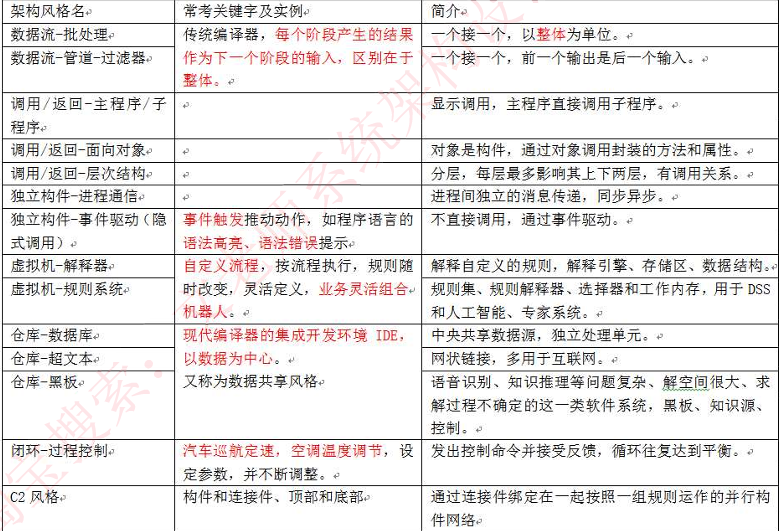 
>
> 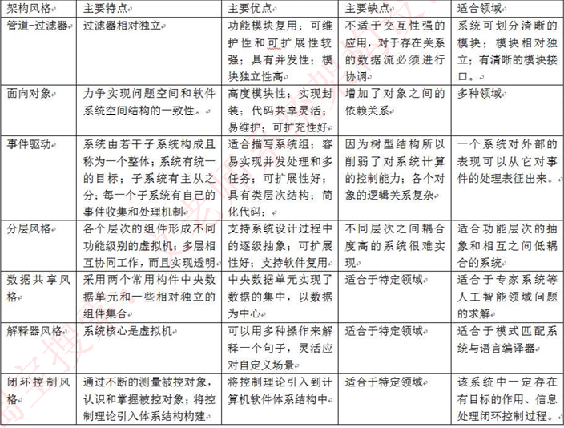 
>
> **典型架构脆弱分析（缺点）**
>
> - 分层架构
>
>   1. 依赖底层服务，底层错误，程序无法运行
>   2. 层级之间通信脆弱，层级之间通信需要层层传递，降低通信性能下降
> - C/S架构
>
>   1. 客户端需要下载专门应用使用
>
>   2. 客户端环境不同，部署困难，不易于扩展
>
>   3. 可修改性弱，当业务变更时，需要重写下载更新客户端
> - B/S架构（三层C/S架构）
>   1. 页面通用化，可操作性弱
>   2. 消耗网络资源，需要不停动态更新
>   3. 暴露在外网上，安全性降低，面对大量不可知用户
> - 事件驱动架构
>   1. 不能确定响应事件组件执行顺序
>   2. 组件之间交换数据弱，逻辑性复杂
>   3. 事件驱动容易进入死循环
>   4. 无法有效控制并发
> - 微服务架构
>   1. 分布式逻辑带来系统结构复杂
>   2. 服务之间通信机制是分布式架构瓶颈
>
> 
>
> **MVC分层**
>
> - 控制层：处理用户交互部分，通常负责从视图中读取数据，约束用户输入，并向模型发送数据
> - 模型：处理应用程序数据逻辑部分，通常在数据库中存取数据
> - 视图：处理数据显示部分，用户与系统交互的界面
> - MVC优点：**有助于管理复杂的应用程序，简化分组开发，不同的开发人员可以同时开发视图，控制器，业务逻辑**
> - MVC缺点：对于简单界面，增加结构的复杂性，并可能产生过多的更新操作，降低运行效率。视图对模型数据的低效率访问，**视图可能需要多次调用才能获得足够的显示数据**。**对未变化数据的不必要的频繁访问，也将损害操作性能**。**侧重于竖向即请求、处理、呈现之间的协调，而忽略了模块之间的协调**
>
> **J2EE四层结构**
>
> 1. 客户层
> 2. web组件层：JSP或Servlet
> 3. 业务层
> 4. 信息系统层：数据库和其他一些需要与之交互的独立系统
>
> 
>
> **面向服务架构SOA：** 将应用程序的不同功能单元（服务）通过这些服务之间定义良好的接口契约联系起来，**独立于实现服务的硬件平台**，操作系统和编程语言。关键目标是企业IT资产重用最大化
>
> - ESB（企业服务总线设计）：连接服务节点，具有消息转化，解释，路由功能，使不同的服务相互连通
>
>   ESB特点：描述元数据和服务注册，在服务请求者和提供者之间数据传输，提供服务发现，路由，匹配，选择能力
>   
>   ESB功能
>   
>   1. 服务位置透明性
>   2. 传输协议转换
>   3. 消息格式转换
>   4. 消息路由
>   5. 消息增强
>   6. 安全性
>   7. 监控与管理
>
> 

#### **系统开发基础**

> 结构化需求分析：自顶向下，逐步分解，面向数据
>
> 模型：数据流图，状态装换图，E-R图以及数据字典
>
> 数据字典：对DFD出现的元素加以定义，使其每个图形元素都有一个确定的解释
>
> - 数据元素
> - 数据流
> - 数据存储
> - 加工逻辑
> - 外部实体
>
> 
>
> 流程图：以图形化的方式展示**应用程序从数据输入开始到获得输出为止的逻辑过程，描述处理过程的控制流**
>
> 数据流图：**说明业务处理过程、系统边界内所包含的功能和系 统中的数据流**
>
> **流程图与数据流图区别：**
>
> 1. 数据流图中的处理过程可并行；流程图在某个时间点只能处于一个处理过程
> 2. 数据流图展现系统的数据流；**流程图展现系统的控制流**。
> 3. 数据流图展现全局的处理过程，过程之间遵循不同的计时标准；流程图中处理过程遵循一致的计时标准。
> 4. 数据流图适用于系统分析中的逻辑建模阶段；流程图适用于系统设计中的物理模阶段
>
>  **高质量数据流图设计原则**
>
> 1. 复杂性最小化原则：DFD分层架构，将消息划分小且独立的子集
> 2. 接口最小化原则：各个元素之间的接口数或连接数最小化
> 3. 数据流一致性原则：是否存在流出流入数据，是否存在**数据流入加工**（椭圆形表示数据加工处理）
>
> 
>
> 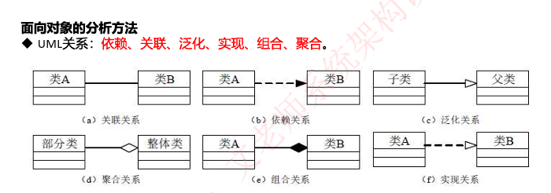 
>
> 甘特图：描述不同任务之间重叠关系
>
>  
>
> PERT：描述项目中任务关系（任务编号，名称，开始结束时间，持续时间，松弛时间）
>
> **关键路径法**：推算项目最短工期
>
> - 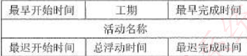  
>
> - 顺推：最早开始时间等于前一个活动最早完成时间，最早完成时间 = 最早开始时间+持续时间
>
> - 逆推：最晚完成时间等于后续活动最晚开始时间的最小值，最晚开始时间 = 最晚完成时间 - 持续时间
>
> 
>
>  **信息安全**
>
> - 加密技术应用：对称，非对称，信息摘要，数字签名，数字证书
>
> - 安全威胁种类
>
>   1. 信息泄漏
>   2. 破坏信息完整性
>   3. 拒绝服务：合法访问被无条件阻止
>   4. 非法使用
>   5. 窃听，窃取
>   6. 假冒：通过欺骗系统（或用户）成为合法用户
>   7. 授权侵犯（内部攻击）：将权限授权其他非法获取资源的人
>   8. 木马
>   9. 陷阱，业务欺骗：诱导用户提供系统关键数据
>   10. 抵赖：否认或伪造用户数据
>   11. 重放：截取用户通信数据，进行重新发送
>   12. 病毒
>   13. 人员渎职
>   14. 媒体废弃：信息从废弃的磁盘，文件中恢复获取
>   15. 物理入侵：绕过物理设备控制获得对系统访问
>
> - 安全架构设计
>   1. 预警，保护，检测，响应，恢复，反击
> - 安全保证体系
>   1. 定时审计评估，安装入侵检测系统，统一授权，认证
>   2. 统一配置和管理防病毒系统
>   3. 网络安全管理
>
> 
>
> **项目计划包含内容**
>
> 1. 项目背景
> 2. 项目成员
> 3. 项目总体技术解决方案
> 4. 项目管理过程
> 5. 过程工具，技术输入输出描述
> 6. 进度计划，最终目标，阶段性目标
> 7. 项目预算

#### **数据库系统**

>  ORM：关系数据库与对象之间映射，使用对象操作代替SQL语句操作数据
>
>  - 降低学习和开发成本
>  - 减少SQL进行数据库操作
>  - 减少程序代码量
>  - 降低SQL代码质量差带啦影响
>  - 不适合处理条件复杂的查询语句
>  - 性能较比SQL差
>
>  **数据库范式**
>
>  1NF：无重复的列，且每一列不可分割的原子属性
>
>  2NF：实体的其他属性完全依赖主键（单表中不存在两个有联系的主体字段，消除数据冗余）
>
>  3NF：不包含其它关系已包含的非主键信息（单表中不存在其他表中非主键的字段，消除数据冗余）
>
>  **反规范化技术**：
>
>  - 增加冗余列
>  - 增加派生列
>  - 重新组表
>  - 水平分割表
>  - 垂直分割表
>
>  **封锁协议**
>
>  - X锁（排他锁，写锁）：只允许锁的事务运行读取和修改，不允许再次加锁
>  - S锁（共享锁，读锁）：允许锁的事务进行读取，不允许修改（存在锁版本控制，读取不同状态数据）
>
>  
>
>  **数据仓库集成**
>
>  - 集成数据
>  - 面向主题
>  - 数据相对文档
>  - 包含历史信息
>
>  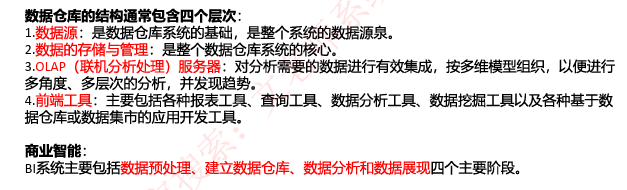 
>
>  **分布式数据库**
>
>  - 具有灵活的体系结构
>  - 适应分布式的管理和控制机构
>  - 系统的可靠性高、可用性好
>  - 局部应用的响应速度快
>  - 可扩展性好，易于集成现有系统。
>  - 系统开销大，需要良好通信
>  - 复杂的存取结构
>  - 数据安全性和保密性难以处理
>
>  
>
>  **数据库对比**
>
>  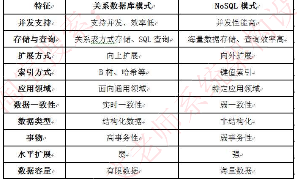 
>
>  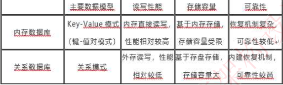 

#### **Web应用开发**

> **微服务架构**：SOA技术延深，强调业务彻底组件化和服务化，微服务包含完整的业务功能，开放一种或多种接口为其他服务使用，并且可以包含一个自己私有的数据库
>
> 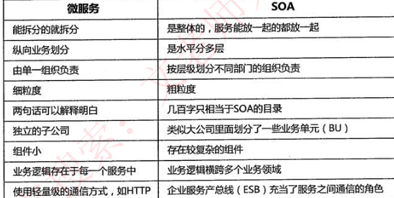 
>
> 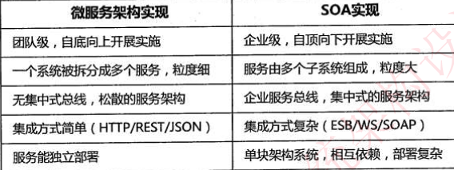 
>
> - 微服务优势
>
>   1. 将应用分解一系列访问，降低程序复杂性
>   2. 每个服务独立开发，统一约定API
>   3. 每个服务独立配置，独立调整
>   4. 性能带来影响
>   5. 数据一致性问题
>
> **负载均衡**：将请求分摊到多个执行单元上执行
>
> 1. http重定向（301，302状态码重定向）
> 2. 反向代理服务器
> 3. DNS域名解析（通过域名解析不同的IP，存在应用故障限制）
> 4. NAT（公网IP与内网IP转换协议）
> 5. CDN：内容分发网络（依靠部署各地的服务器实现用户就近访问资源，包含内容存储和分发）
>
> REST：表述性状态转移
>
> 1. 网络上所有事务都是资源
>
> 2. 每个资源拥有唯一标识ID
>
> 3. 所有操作无状态
>
> 4. 通过接口（方法）实现资源操作
>

> **大数据架构设计**
>
> 大数据特征：
>
> 1. 数据量大；
> 2. 要求快速响应；
> 3. 数据多样性；
> 4. 价值密度低
>
> **大数据架构**
>
> - Lambda架构（机器学习，物理网，流处理）
>
>   1. 批处理层
>   2. 速度处理层
>   3. 服务层（响应查询）
>   4. 优缺点：容错性好，查询灵活度高，易伸缩，易扩展，全场景覆盖带来编码开销，重新部署和迁移成本高 
>
>   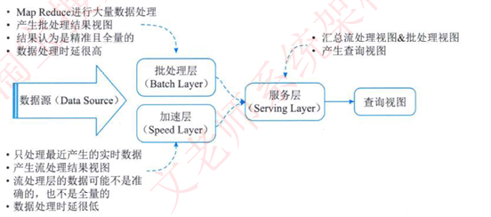 
>
> - Kappa架构：在Lambda基础上，删除BatchLayer架构，将数据通道以消息队列进行代替（数据存储在消息队列中，当进行离线分析或在计算时重新消费）
>
>   1. 消息中间件缓存的数据量和回溯数据性能有瓶颈
>   2. 依赖实时计算系统能力
>
> 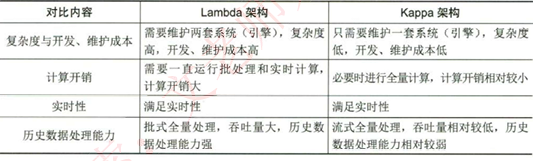 

#### **信息系统架构设计**

> 信息系统架构（ISA）：对某一特定内容的信息进行统筹，规划，设计，安排等一系列活动
>
> - 物理结构
>   1. 横向综合：将同一水平的业务综合在一起，使其业务一体化
>   2. 纵向综合：把职能相的业务综合在一起
>   3. 横纵综合：实现信息共享，程序模块化，建立公用数据库和统一的信息处理
>
> **建设企业信息系统因素**（战略> 业务与应用>信息基础设施）
>
> - 战略：对管理者的决策提供支持，信息系统建设的影响与要求
>
> - 业务与应用：信息化提高企业，流程，业务效率，使其成本质量，服务及速度提高
>
>   BRP：业务流程重组，BPM：业务流程管理
>
> - 信息基础设施：信息采集，处理，存储和流通需求（信息系统部门，管理方法，规章制度，及计算机软硬件设备）
>
> **信息化**：以培养，发展智能化工具为代表的新的生产力
>
> 实现信息化：开发和利用信息资源，建设国家信息网络，推进信息技术应用，发展信息技术产业，培养信息化人才，制定和完善信息化政策
>
> **信息化架构**
>
> - **价值驱动体系结构**
>   1. 价值期望；反作用力（期望高，实现难度大）；变革催化（环境导致期望价值变化）
>   2. 识别合适的价值背景环境，制定效用和优先化期望，识别背景中反作用力和变革带来影响
> - **层次式架构**，
>   
>   
>
> 
