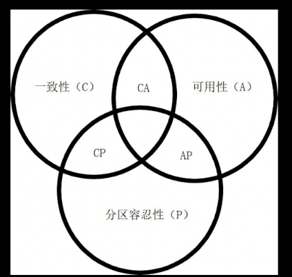

## 分布式系统概述

> *分布式系统由一组为了完成共同任务而协调工作的计算机节点组成，通过网络进行通信，满足互联网对大数据存储，高并发，快速响应的要求*
>
> - 高性能
> - 高可用
> - 可伸缩性
> - 可维护性
> - 灵活
>
> #### **分布式切分方法**
>
> - 按照业务、数据切分给不同节点的机器
>
>   1. 水平切分（每个节点具有相同的功能）
>
>      > 实现路由算法，将请求合理分配到各个节点（nginx，Netflix，Zuul和Spring Cloud Gateway），节点之间互不影响。
>      >
>      > ---
>      >
>      > 对业务升级影响大。维护不方便
>
>   2. 垂直切分（按业务维度拆分）
>
>      > 提高业务独立性（高内聚，低耦合，降低开发难度），灵活性高（维护相关系统，无需全部升级）
>      >
>      > ---
>      >
>      > 增加系统之间协作，系统之间相互依赖（RPC远程过程调用，SOA面向服务架构，Rest，消息机制）
>
>   3. 混合切分（集群）
>
> 
>
> #### **分布式系统问题**
>
> - 异构的机器与网络（不同配置的机器，架构，性能，通信协议带来影响）
> - 节点故障处理（节点故障保证系统可用）
> - 不可靠的网络与机器
>
>    **解决网络与机器的差异，让多节点保持一致，确保分布式系统下数据一致性**
>
> 
>
> #### **分布式系统设计原则**
>
> - CAP原则
>
>   1. 一致性（保持所有节点在同一时刻具有相同的，逻辑一致的数据)
>   2. 可用性（保证每个请求都有响应）
>   3. 分区容忍性（保证系统中无任何数据丢失，失败都不影响系统运行）
>
>    
>
>   CA：无法有效扩展
>
>   CP：系统性能不高
>
>   AP：性能高，对一致性要求低
>
>   *可用性为第一，其次是性能，保持在有效时间内数据一致性*
>
> - Base理论（最终一致性，基于CAP中AP模式）
>
>   1. 强一致性：数据完成更新操作后，任何节点都能访问到更新后的值
>   2. 弱一致性：数据完成更新后，其他节点不能保证访问到最新值
>
>   BA：基本可用
>
>   S：软状态（数据延迟）
>
>   E:最终一致性
>
> 
>
> #### **微服务结构**
>
> *单体应用：一般分为用户接口，服务端应用和数据源，当业务发生扩展时，都要对应用进行维护*
>
> *微服务：将一个单体应用进行拆分多个相对独立的服务。每个服务拥有独立的进程和数据，每个服务都是以轻量级的通信机制进行交互（Http Api），以业务模块进行拆分和部署*
>
> - 组件化和服务（component&service）
>
> - 对业务进行拆分
>
> - 强化终端弱化通道（弱化通信协议）
>
> - 分散治理（技术栈应用）
>
> - 分散数据管理（每个应用都拥有自己的数据源）
>
>   > ACID特性不存在（分布式数据库事务问题）
>   >
>   > 数据关联复杂
>
> - 基础设施自动化（同一部署与发布）
>
> - 容错性设计（监控，断路）
>
> *微服务是分布式系统设计和架构理念之一，追求高性能，高可用，简易性设计。微服务不能解决所有分布式系统带来的问题*
>
> 
>
> #### **SpringCloud**
>
> **常用的微服务组件**
>
> - 服务治理（Dubbo，Netflix，Eureka ，Consul）
>
> - 分布式配置管理（Diamond，Disconf，Archaius，Nacos）
>
> - Api网关（Nginx，Zuul，GateWay）
>
> 
>
>   
>
> 
>
> 