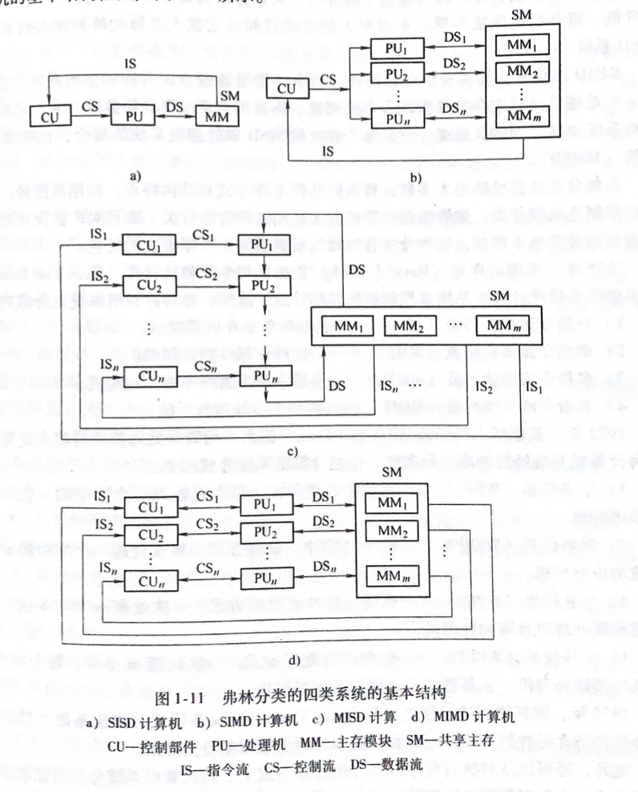

## 概述

- #### 计算机系统结构，组成，实现划分

  > 结构分层：
  >
  > 计算机系统  = 硬件/固件（Bios系统） + 软件 
  >
  > ---
  >
  > 语言分层：
  >
  > > 1. 微程序机器级（物理机器）
  > >
  > > 2. 机器语言级（物理机器）
  > > 3. 操作系统/虚拟机
  > > 4. 汇编
  > > 5. 高级
  > > 6. 应用（应用指令）
  > >
  > > 语言实现技术
  > >
  > > - 解释：将程序编译为可执行的机器语言
  > > - 翻译：将程序逐条翻译执行
  >
  > ---
  >
  > 计算机系统结构特性
  >
  > - 指令系统
  > - 数据表示
  > - 寻址规则
  > - 寄存器定义
  > - 中断系统
  > - 存储系统
  > - 信息保护
  >
  > **计算机系统结构：**
  >
  > *划分计算机软硬件功能划分，提供传统机器级所具有的全部属性，包含数据类型及格式表示，寻址方式，寄存器组织，中断系统，指令系统等*
  >
  > 
  >
  > **计算机组成：**
  >
  > *研究计算机系统结构的逻辑实现，控制流设计，架构，设计，包含数据通路宽度，专用部件设置，各操作对部件的共享程度，各部件的并行度，控制机构的组成方式，缓冲排队技术，预估技术，可靠性技术*
  >
  > 
  >
  > **计算机实现：**
  >
  > *计算机组成的物理实现，包活处理机，内存材料选择，模块，电源，信号规定*
  >
  >  
  >
  > **Amdahl定律：** 确定系统中性能瓶颈部件采取措施提高速度后对系统性能改进程度（系统加速比）
  > $$
  > f_{new}~~~ 性能可改进比（系统在该功能上花费的时间）~~~~0\le f_{new} \le 1  \\
  > r_{new} ~~~ 部件加速比(部件改进前与改进后花费时间比)~~~~~~~~~ r_{new} > 1   \\ 
  > S_p~~~~ 系统加速比(原执行时间与改进后执行时间之比)\\
  >  
  > S_p = \frac{T_{old}}{T_{new}} = \frac{1}{(1-f_{new})+f_{new}/ r_{new}}
  > $$
  > 
  
  
  
- #### 硬件，软件，应用的发展对系统结构影响

  > 软件：软件的可移植性（兼容）
  >
  > > **软件兼容性实现方案**
  > >
  > > 1. 系列机：相同的系统结构，不同的组成和实现的机算机
  > >
  > > 2. 模拟和仿真：软件在虚拟机上运行
  > >
  > > 3. 高级语言
  >
  > 兼容性：
  >
  > > - 向上兼容（前）：现在设计的软件需要考虑未来的兼容性
  > > - 向下兼容（后）：现在设计的软件需要考虑之前的格式能否使用
  > >
  > > **系列机软件应该做的向后(落后)兼容，力争向前兼容(超前)**
  >
  > 应用：计算机系统结构发展的动力
  >
  > > 多媒体：游戏，视频
  > >
  > > 网络应用：路由器，服务器
  > >
  > > 科学计算：医疗，气象计算
  >
  > 器件：计算机换代突出标志

- #### 计算机系统并行

  > *计算机系统在同一时刻或同一时间间隔内做相应的运算操作(时间上相互重叠就存在并行性)*
  >
  > 并行：两个以上的事件同一时刻发生
  >
  > 并发：两个以上的事件在单位时间内交替发生
  >
  > ---
  >
  >  **并行性开发途径：**
  >
  > 1. 时间重叠（处理过程在时间上相互错开，轮流重叠使用同一个系统资源）
  > 2. 资源重复（设置重复的硬件资源提高效率）
  > 3. 资源共享（按照时间顺序轮询使用系统资源）
  >
  > ---
  >
  > 按程序角度并行分类：
  >
  > - 指令并行执行
  > - 任务或进程
  > - 作业或程序
  > 
  >数据处理角度并行分类：
  > 
  >- WSBS 位串字串（单字节一位处理）
  > - WSBP 位并字串（单字节处理）
  > - WPSB 位片串字并（多字节中同位处理）
  > - WPBP 全并行（多字节处理）
  > 
  >计算机操作并行分类：
  > 
  >- 存储器操作（单周期内操作多字节）
  > - 处理器指令重叠处理（流水线处理）
  > - 处理器操作并行（多核，特殊处理单元）
  > - 指令，任务，作业并行
  
- #### 计算机系统分类

  > 佛林分类法：按指令流和数据流的多倍性特征对计算机系统进行分类
  >
  > - SISD（单指令流单数据）单处理计算机
  > - SIMD（单指令多流数据）多操作部件处理机
  > - MISD（多指令单流数据）指令级多道程序单处理机
  > - MIMD（多指令多流数据）多处理机系统
  >
  >  

  
  
  