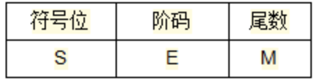
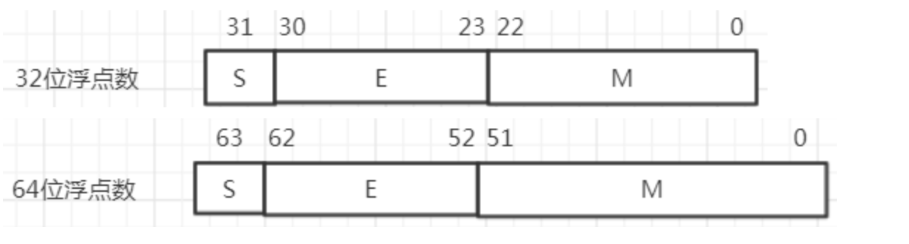

### 数据表示

> 数据结构：串，队列，栈，向量，阵列，链表，树，图
>
> 数据表示：**处理机硬件**能够辨认并进行存储、传送和处理的数据表示方法。
>
> **自定义数据表示**
>
> - 标志符数据表示（数据包含类型标志）
>
>   > 1. 简化指令系统和程序设计
>   > 2. 简化编译程序
>   > 3. 实现一致性校验
>   > 4. 硬件完成对数据类型转换
>   > 5. 程序可以直接操作数据
>   > 6. 软件调试和应用开发提供支持
>   >
>   > ---
>   >
>   > 1. 增加存储空间
>   > 2. 降低指令执行速度
>
> - 数据描述符（数组，堆栈）
>
>   > 数据描述符：描述一组数据的类型
>
> **引用数据表示原则**
>
> > 1. 系统效率是否提高
> > 2. 通用性和利用率
>
> **浮点数数据表示**
>
> >  
> >
> >  
> >
> > 浮点数据：符号位(数符)+指数位(阶码)+尾数
> > $$
> > 二进制科学计数法 \\
> > N=r^E \times (1+M) = (-1)^S \times 1.M \times r^e \\
> > 32位计算机中 e = E - 127 \\
> > 64位计算机中 e = E - 1023 \\
> > 0< M < 1 ,  \\
> > eg: 120.5 使用二进制表示为1111000.1 ，使用二进制科学计数法表示为 1.11110001 \times 2^6 \\
> > 其中M为二进制有效数字 E表示小数点右偏移位数(指数)
> > $$
> > S：符号位（表示正负）
> >
> > E：阶码(二进制科学计数法中小数点右移位数)
> >
> > M：表示浮点数(二进制有效数字)
> >
> > r ：基数（表示进制位）
> >
> > *二进制转十进制，整数部分$\sum_{1}^{n}2^{N-1} \times B,其中B表示二进制0,1$，小数部分$\sum_{1}^{n}2^{-(N-1)} \times B$*  
> >
> > ---
> >
> > 当计算机字长固定时   考虑基数r，尾数M对数的表示
> >
> > 1. 当r增大，可表示的数最小值$r_m^{-1}$将减小,可表示数的最大值为$r^{2p-1}\times (1-2^{-m})$  其中p表示最大指数，m表示尾数长度
> > 2. 可表示的数为 $2^{p+m} \times (1-r_m^{-1})$
> >
> > 尾数，基数取值大，会扩大浮点数的表示范围，增加可表示的个数，减少移位次数，降低精度损失提高运算速度。
>
> **浮点数尾数下溢处理方法**(下溢：尾数表示长度不够，上溢：阶数表示长度不够)
>
>  
>
> 1. 截断法(误差大，无法调节)
> 2. 舍入法(误差小,处理速度慢)
> 3. 恒加1法(误差最大,实现简单)
> 4. 查表舍入法(误差小,速度快,需要硬件支持)

### 寻址方式

### 指令系统