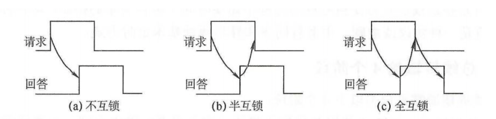

## **存储系统**

> 存储系统要求：大容量，高速度，低价格
>
> 存储容量$S_M = W \times l \times m$，W为字长（单位是位）l为存储字数，m存储体数
>
> **并行存储系统**
>
> - 主存最大频宽 $B_m= W / T_M$ (其中CPU访问字长与存储字长相等，$T_M$为连续启动一个存储的间隔时间)
> - 能并行读出多个CPU字的单体多字和多体多字的交叉访问主存系统

## **中断系统**

> *CPU中止当前执行的任务，转去处理其他任务，处理完成后在打断的程序中恢复执行*
>
> **中断分类：**
>
> - 程序错误中断（程序执行错误引发的中断，非法指令，主存访问异常）
> - 外部中断（硬件错误引发的中断。计时器，控制器信号异常）
> - I/O中断
>
> *中断与异常：中断是由CPU以外的事件引起的中断，异常**来自CPU内部事件或执行中的事件引起**的*

## **总线系统**

> *总线是用于连接CPU，存储器，IO设备及外围设备，远程通讯设备通路集合*
>
> **总线分类：**
>
> - 专用总线：连接专用设备部件，可以同时双向通讯（总线数多，难小型化，总线时间利用率低）
> - 非专用总线：同一时间只允许一个部件进行通讯（总线少，造价低，接口标准化，模块性强）
>
> **总线控制方式：**
>
> - **串行链接**
>
>   > *算法简单，控制线少，不取决于部件数量，部件增减简单，扩充性好，优先级固定，不灵活，其中部件异常后其他部件无法使用总线*
>
> - **定时查询**
>
>   > *计数器，部件号由程序控制。不会因为某个部件失效无法使用，线数较多*
>
> - **独立请求**
>
>   > *总线分配速度快，可以使用程序控制总线使用优先级，控制线数量大，总线控制器复杂*
>
> **总线通讯**
>
> - 同步（统一时钟）
>
>   > *系统采用同一个时钟信号协调发生和接收方传送定时关系，在同一个总线周期中，发送方和接收方可以进行一次数据传输。**适用于总线长度较短及部件存取时间接近系统的部件***
>   >
>   > 优点：传输速度快，总线控制逻辑简单
>   >
>   > 缺点：可靠性差
>
> - 异步
>
>   > *使用应答方式控制通讯*
>   >
>   > 优点：总线周期长度可变，保证存取周期差异大的部件可以进行有效通讯
>   >
>   > 缺点：控制方式复杂，速度比同步方式慢
>   >
>   >  
>   >
>   > 1. 主设备发出请求后，不必等到部件的应答信号，经过一段时间后撤销请求（速度快，可靠性最差）
>   > 2. 主设备发起请求后，必须等到设备应答信号才能撤销请求信号
>   > 3. 主设备发起请求后，必须等到设备应答才能撤销请求型号，设备必须等待主设备请求信号撤销后，在撤销应答信号（速度慢可靠）
>
> **数据宽度**(总线在一个周期内传输数据量)
>
> > - 单字节（适用于速率低的设备，不用指名传输信息长度）
> > - 定长块（适用于磁盘等高速设备，不用指名传输信息长度）
> > - 可变长块
> > - 单字加长块
> > - 单字加可变长块

## **IO系统**

> *由高级应用程序，操作系统软件，I/O总线，设备控制器，设备硬件组成的系统*
>
> **IO系统发展阶段**
>
> - 程序控制IO（全软件，程序查询，中断驱动）
>
> - 直接存储器访问DMA
>
> - IO处理机（通道处理机）
>
>   > 数据传输方式
>   >
>   > 1. 字节多路（低速设备）
>   > 2. 数组多路
>   > 3. 选择通道（优先级高设备）
>   >
>   > ---
>   >
>   > **通道流量(单位时间传输字节数)**
>   >
>   > 1. $$
>   >    字节多路通道极限流量：f_{max \cdot byte} = \frac{1}{T_S+T_D}  其中 T_S为设备选择时间，T_D为设备传输一个字节时间
>   >    $$
>   >
>   > 2. $$
>   >    数组多路极限流量: f_{max \cdot block} = \frac{K}{T_S+T_D}其中K为设备一次传输字节
>   >    $$
>   >
>   > 3. $$
>   >    选择通道极限流量：f_{max \cdot select} = \frac{N}{T_S+NT_D} (一台设备把N个字节全部传输)
>   >    $$
>   >

