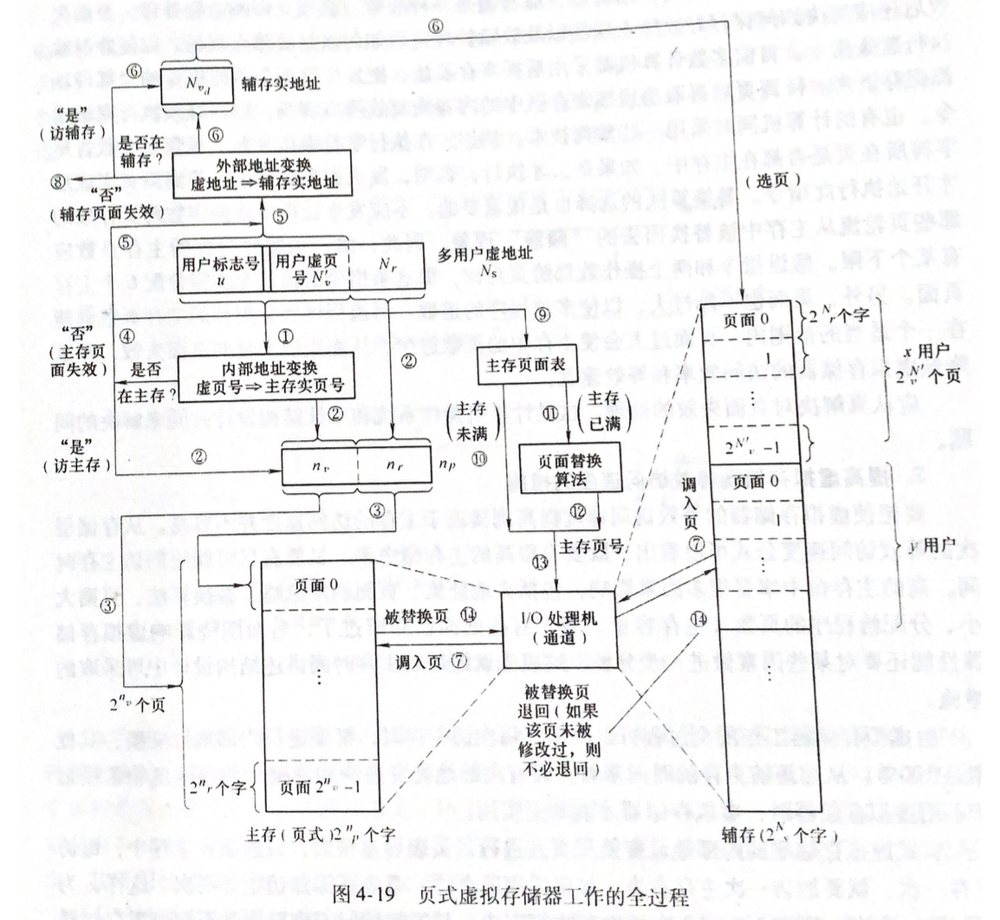
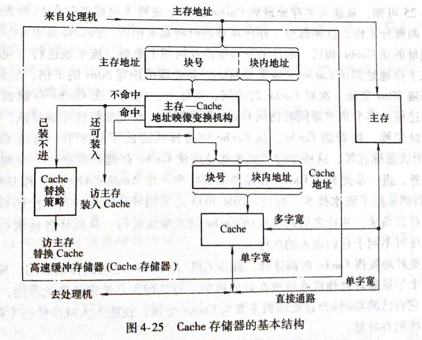

## **存储体系**

> 多级存储体系：成本，容量，速度折中的结果
>
> 虚拟存储器：解决主存容量不足问题，在主存和辅存之间增加软硬件设备，让主存和辅存构成一个整体
>
> Cache存储器：由硬件实现，解决CPU与内存部件的速度差
>
> 存储体系性能参数：
>
> 1. 平均价格
> 2. 命中率
> 3. 平均访问周期

#### **虚拟存储器** （解决空间不足问题）

> 虚拟存储器：自动实现部分装入和部分替换功能，从逻辑上为用户提供一个比物理存储容量大的存储空间。虚拟存储区的容量与物理主存大小无关，受限于计算机地址结构和可用磁盘容量
>
> *虚拟存储器通过设置地址映像表机构来实现逻辑地址与物理地址的转换与定位*
>
> - **段式管理**
>
>   > *将程序划分单独的段，该段的逻辑地址以起点为0进行编址，当由辅存载入主存时基址加上段内逻辑地址形成在主存中物理地址*
>   >
>   > 段表：记录程序段与基址的映射关系
>   >
>   > 优点：使大程序模块化，使其程序空间与主存容量无关，以段为单位实现存储保护
>   >
>   > 缺点：段表内容过大，增加辅助硬件开销，降低查表速度，存在碎片空间
>
> - **页式管理**
>
>   > *把存储空间和程序空间划分等大固定的页，按页顺序编号，主存单元地址 = 页内地址+页号 组成*
>   >
>   > 优点：空间利用率高于段式管理，地址转换速度高于段式
>
> - **段页式管理**
>
>   > *将程序按段分块，在将段分页(页长相等)*
>   >
>   > 逻辑地址： 
>   >
>   > 段表记录段号，页表长度，页表实际存放块号（页表起始地址），
>   >
>   > - 内存划分：按页式存储管理方案
>   > - 内存分配：以页为单位进行分配
>
> **页式虚拟存储器映像和转变**（解决实页冲突）
>
> - 页表法（全相联映像）
>
>   > 仅当一个任务要求同时调入主存页数的$2^{n_v}$时才会发生页面冲突
>
> - 目录表法
>
>   > 查找时使用一对多进行匹配查询是否载入主存
>
> **页面替换算法**
>
> - 随机算法（RAND) 命中率最低
>
> - 先进先出（FIFO)
>
>   >每次选择淘汰的页面是最早进入内存的页面
>
> - 近期最少使用算法（LRU)
>
>   > 每次淘汰页面是最近最久未使用的页面，**访问字段记录上次被访问时间**，使用逆推判断时间最早的内存块
>
> - 优化替换算法(OPT)
>
>   >**每次选择最长时间内不再被访问的页面，** 缺页率 = $\frac{缺页中断次数}{页面访问次数}$
>   >
>   >---
>   >
>   >需要知道进程访问页面的顺序，操作系统无法预知进程访问的页面序列，**无法实现**
>
> ---
>
> **虚拟存储器工作流程**
>
>  
>
> 1. 将多用户虚拟地址转换为主存地址
> 2. 判断虚页此时是否在主存中
> 3. 虚地址转换为辅存地址
> 4. 查外页表判断虚页是否载入辅存，没有则程序执行异常
> 5. 告诉IO处理机到辅存中调页载入主存
>
> ---
>
> **页面失效处理（内存抖动）**
>
> - 后援寄存器（把发生页面失效时现场指令记录下来，等到重新调页后在回复运行）
> - 预判技术（判断所需操作条件是否都在主存中）
> - 替换算法
>
> **提高虚拟存储器等效访问速度方法**
>
> - 块表（使用硬件快页表访问速度，相当于中间缓存）
> - 散列查找
>
> **影响主存命中率和CPU效率因素**
>
> 1. **页面大小**（页地址在同一个页中，页面越大命中率高，不在同一页中，命中率较小）
> 2. **页面调度算法**

#### **高速缓冲存储器**（解决CPU与主存速度差异问题）

> *弥补主存速度不足，在CPU与主存之间设置一个高速，小容量的存储部件，速度接近于CPU，容量记为主存*
>
> 高速缓存（Cache）用来存放当前最活跃的程序和数据，其特点是:容量一般在几千字节到几兆字节之间，速度一般比主存块五到十倍，其内容是主存局部域的副本，对程序员来说是透明的
>
>  
>
> **Cache地址映像与变换**
>
> - 全相联映像和变换
>
>   > 块冲突低最低，空间利用率最高，映像表（块表）容量过大，转换速度慢
>   >
>   >  
>   >
>   > 其中块号S与Cache行号相等时命中 （Cache行号与块表长度相等，**块表容量=Cache行号 * 主存块号位数**）
>
> - 直接映像和变换 （主存块只能映射到指定Cache行中）
>
>   > 节省所需硬件，块冲突高，直接映射方式一般用于大容量的cache中
>   >
>   >  
>   >
>   > - 主存块号与是Cache行号的倍数时命中
>   > - 主存中块数为s-m 项
>   > - 块表长度为 s-m ， 块表容量 $2^m \times (s-m)$
>
> - 组相联映像和变换(常用）
>
>   > 减少块冲突概率，提高Cache空间利用率，**地址转变比全相联映像块**
>   >
>   >  
>
> **Cache存储器的透明性及性能分析**
>
> *解决CPU与主存数据变化不一直问题*
>
> - 写回法
>
>   > CPU进行写操作时，数据只写入Cache，仅当需要替换时，才写回主存
>   >
>   > 适用于单处理器机器（节约成本）
>
> - 直达法
>
>   > 双写策略，当CPU写入Cache的同时也写入主存，直接替换
>
> - 播写法
>
>   > 多核CPU环境下，CPU将数据写入Cache时，将写的信息传播到所有记录此数据的Cache部件，将其设置为失效，以便其他CPU读取时候从主存中获取最新更改的数据
>
> **三级存储体系**
>
> - 物理地址Cache
>
>   > 将主存物理地址通过MMU转为Cache地址才能访问Cache，将增大Cache访问时间
>
> - 虚地址Cache
>
>   > Cache->主存->辅存 构成
>
> - 全Cache