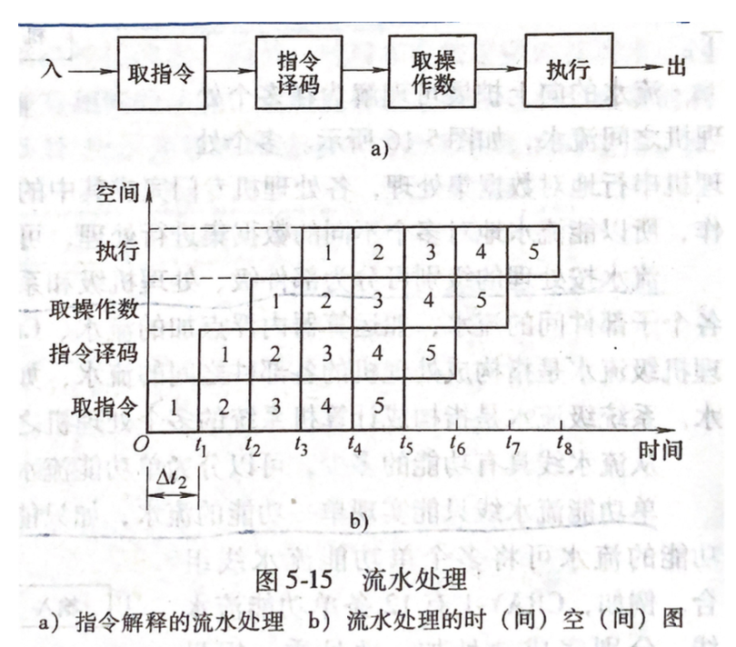
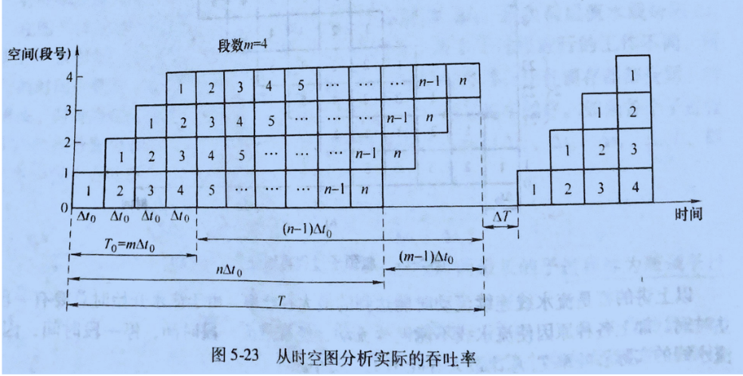

## 标量处理机

> *加快标量处理机的机器语言解释解决途径有：1.选用更高速的器件，采用更快的算法，提高指令内微操作并行程度。2.通过控制机同时解释多条以及整段程序的方式。*
>
> 指令执行步骤：
>
> 1. 取址：按指令计数器的内容访问主存，取出该指令送到指令寄存器
> 2. 分析（解释）：对指令操作码进行译码，将逻辑地址转为物理地址。形成下条指令地址
> 3. 执行：对操作数进行运算，处理，存储运算结构
>
> #### **顺序执行**(按指令执行步骤一条条执行)
>
> > 控制简单，转入下一条指令的时间易于控制。上一条指令未执行完成，下一步指令不能开始，机器利用率低
>
> #### **重叠方式**（执行与分析上时间重叠）
>
> - **重叠解释**(在指令解释第k条指令操作完成前，可以开始解释第k+1条指令)
>
>   > **重叠解释带来的问题**
>   >
>   > 1. 解决访问主存冲突
>   >
>   >    > - 让操作数与指令放入两个独立编码的存储空间（增加计算机复杂度）
>   >    > - 采用多体交叉主存结构（有局限性，只要第k条指令的操作数与第k+1条指令不在同一个体内，仍可在一个主存周期取得）
>   >    > - 先进先出的指令缓存器（缓存器预取下一条指令）
>   >
>   > 2. 解决分析与执行操作的并行
>   >
>   >    > 设计独立的指令分析部件和执行部件
>   >
>   > 3. 解决分析与执行操作同步（保证任何时间**执行k**与**分析k+1重叠**为一次重叠）
>   >
>   >    > 一次重叠节省硬件
>   >
>   > 4. **指令间相关处理**
>   >
>   >    > - 指令转移：条件转移成功，重叠解释就变成了顺序解释（采用延迟转移技术避免）
>   >    >
>   >    > - 执行相关处理：在指令运行过程中修改操作数，将指令相关变成数相关
>   >    >
>   >    > - 存储空间数相关处理：采用写优先级高于读方式推后指令的预读
>   >    >
>   >    > - 寄存器组相关处理（*寄存器中指令分析与执行所操作的数据位不同带来的数据处理也不同*）
>   >    >
>   >    >   > 1. 采用推后读方式（降低重叠解释效率）
>   >    >   > 2. 相关专用通路（把通用器作为累加器，将处理结果预先放入寄存器中存储）
>   >
>   > *实现指令在时间上重叠解释，需要付出空间代价（消耗机器资源）*
>
> #### **流水方式**
>
> > *将一个重复的时序过程分解成若干个子过程，而每个子过程都有效的在专用功能段上与其他子过程同时执行，流水的最大吞吐率取决于子过程经过时间 t*
> >
> >  
> >
> > ​                           执行5条指令所花费时间
> >
> > **流水线分类：**
> >
> > - 单/多功能流水线
> >
> > - 静态流水线（**同一时刻**，流水线的各段只能按照一种功能连接方式工作，只有流水线排空后才能切换其他作业）
> >
> > - 动态流水线（同一时刻，各段可以按功能不同的连接方式工作）
> >
> > - 部件机流水线（以算术逻辑分段，便于数据类型操作）
> >
> > - 处理机级流水线（按指令解释过程分段，使其各段在独立部件中执行）
> >
> > - 标量处理机：不具有向量指令和向量数据表示
> >
> > - 向量处理机
> >
> > - 线性流水线：没有反馈回路，各段串行连接
> >
> > - 非线性流水线：具有反馈回路，其他各段依旧串行连接
> >
> > - 顺序流动：流水线任务流出顺序与输入端任务流入顺序相同
> >
> > - 异步流动
> >
> > **标量流水线主要性能**
> >
> > 1. 吞吐率$T_p$ 和加速比$S_p$
> >
> >    > 当各段最长执行时间为$\Delta t_2$时，最大吞吐率为$T_{pmax} = \frac{1}{\Delta t_2}$
> >    >
> >    > **提高流水线吞吐率：将瓶颈子任务再细分**
> >    >
> >    > 
> >    >
> >    > 流水线实际吞吐率
> >    > $$
> >    > 处理时间相等： \\ 
> >    > T_p = \frac{n}{m\Delta t_0 + (n-1)\Delta t_0} = \frac{1}{\Delta t_0(1+\frac{m-1}{n})} = \frac{T_{pmax}}{1+\frac{m-1}{n}}
> >    > \\ m 为段数 ~~~\ n为任务数  \ \ \  \Delta t_0 为各段执行时间  \\ \\
> >    > 当 n >> m时，实际吞吐率接近于最大吞吐率  \\ 
> >    > S_p = \frac{nm \Delta t_0}{m \Delta t_0 + (n-1)\Delta t_0} = \frac{m}{1+\frac{m-1}{n}} \\
> >    > 处理时间不等： \\  
> >    > T_p = \frac{n}{\sum_{i=1}^m \Delta t_i + (n-1)\Delta t_i} \\ \\
> >    > S_p = \frac{n\sum_{i=1}^{m} \Delta t_i}{\sum_{i=1}^{m} \Delta t_i +(n-1)\Delta t_i}
> >    > $$
> >    >  
> >
> > 2. 效率(设备实际使用时间占运行时间比)
> >
> >    > $$
> >    > \eta = \eta _0 = \frac{mn \Delta t_0}{mT}
> >    > $$
> >
> > 
> >
> > **标量流水机的相关处理和控制机构**
> >
> > - **局部相关**
> >
> >   > 采用总线式，分布式控制管理，其中包含相关判断标识，入出端缓存信息，站号控制总线连接通路，
> >
> > - **全局相关**
> >
> >   > - 猜测法（使用编译方式猜测条件命中率）
> >   >
> >   > - 加快和提前生成条件码（提前知道流向分支）
> >   >
> >   > - 延迟转移
> >   >
> >   >   > 采用软件方式静态指令调度技术（不必增加硬件），在程序生成目标指令时，将不相关的指令转移位置，让其延迟在其他指令完成后执行
> >   >
> >   > - 加快短循环程序处理
> >   >
> >   >   > 将小于指缓容量的循环指令一次性装载，并暂停预取指令。
> >
> > - **中断**
> >
> >   > 精确断点，需要设置多个后援寄存器
> >
> > - **非线性流水线调度** 😜
>
> 
>
> #### **指令级高度并行的超级处理机**
>
> - 超标量处理机（每个子过程经过的时间为$\Delta t$ ) 每个$\Delta t$ 同时流出m条指令，m为该处理机的度
>
> - 超长指令字处理机（VLIW)
>
>   > *其特点是每条指令所需拍数比超标量处理少，指令译码容易，随机并行性方便*
>
> - 超流水线处理机
>
> - 超标量超流水线处理机

