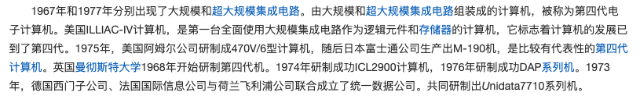

## **向量处理机**

*向量：由一组有序，具有相同类型和位数的元素。在处理机中，能处理和识别向量指令的机器为向量处理机，主要用来处理同一种操作，数据很少相关的批量数据*

- #### **分向量流水处理机**

  > - 横向处理方式
  >
  >   > 从左向右依次读取指令循环执行，组成循环程序处理，不适用于并行
  >
  > - 纵向处理方式
  >
  >   > 按列从上往下进行（与数据无关）
  >
  > - 横纵分组
  >
  >   > 把向量分为若干组，组内按纵向方式处理
  >
  > 向量流水处理方式：横纵分组
  >
  > ---
  >
  > **向量流水处理机结构**
  >
  > 1. 存储器-存储器型结构（纵向处理）
  >
  >    > - 向量指令的源向量和目的向量都是存放在存储器中，运算的中间结果需要送回存储器
  >    > - **流水线运算部件的输入输出直接与存储器相连**
  >    >
  >    > ---
  >    >
  >    > **对存储器的带宽和通讯带宽要求高，采用多体交叉并行存储器和缓冲器技术**
  >
  > 2. 寄存器-寄存器结构（分组处理）
  >
  >    > *设置快速访问的向量寄存器，用于存放源向量，目的向量及中间结果，让运算部件的输入，输出端与向量寄存器相联*
  >
  > ---
  >
  > **提高向量处理机性能技术**
  >
  > 1. 设置多个功能部件，使其并行工作
  >
  > 2. 采用链接技术（当前一条指令的结果寄存器是后一条指令源寄存器）
  >
  >    > 无向量寄存器使用冲突
  >    >
  >    > 前一条指令向量结果与向量寄存器时钟同步
  >
  > 3. 加快条件语句
  >
  > 4. 稀疏矩阵处理

- #### **阵列处理机**

  > **阵列处理机特点**
  >
  > *与向量流水线处理机对比，阵列处理机利用资源重复提升速度，在并行处理中，偏向于同时性，使每个处理单元读同时负担各种运算，但部件利用率低，成本高*
  >
  > 
  >
  > **阵列处理机构形**
  >
  > - **分布式存储器**
  >
  >   > 各处理单元由局部存储器PEM存放分布数据（只能被本处理单元直接访问），批量的指令分布在PEM中存储，并由PE处理单元执行，PE单元可以通过ICN互连网络交换数据
  >
  > - **集中式共享存储器**
  >
  >   > 存储系统由k个存储分体组成，**通过ICN为全部N个处理单元共享**，与分布式不同的是，ICN用于处理单元与存储分体之间数据交换
  >
  > 
  >
  > **ILLIAC IV处理单元阵列结构**（第四代计算机，超大规模集成电路）
  >
  >  
  >
  >  
  >
  > 

