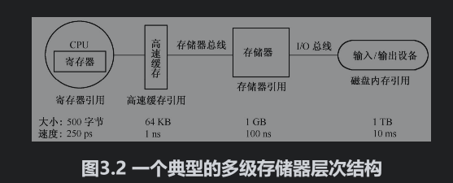
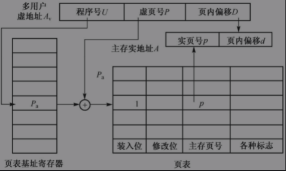
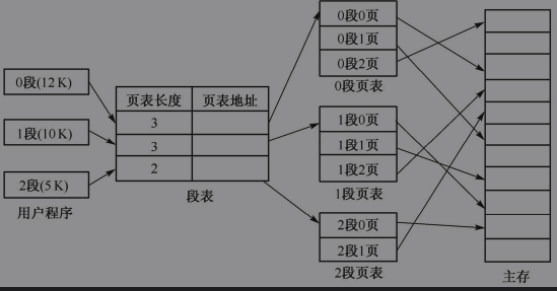
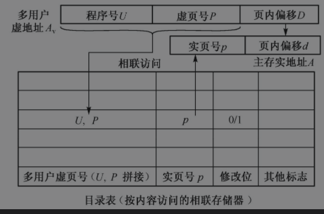
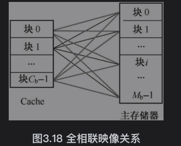
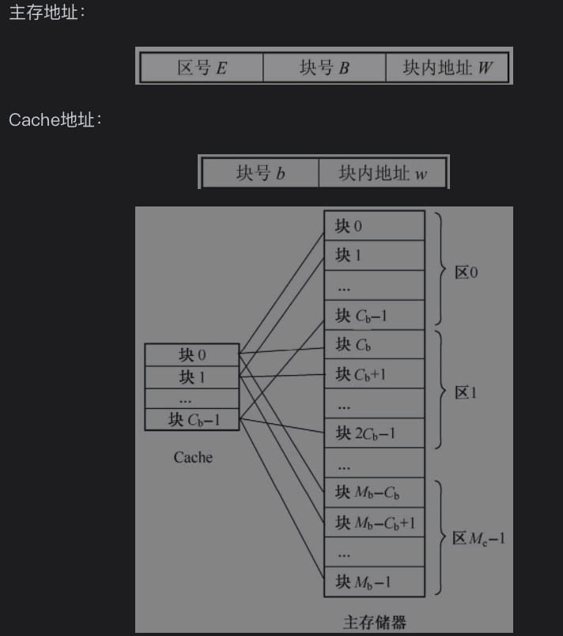

## 存储体系

> 现代计算机系统以存储为中心,其中包括**高速缓存存储器(Cache),主存和外部存储器**形成一个层次化的存储结构.
>
> 存储器性能三要素
>
> 1. 容量  $S_M=W\times l \times m$ 其中 W存储体的字长, l为每个存储体的字数,m为并行工作的存储个数 
> 2. 价格
> 3. 速度
> 4. $T_M$连续启动一个存储体需要的间隔时间
>
> ---
>
> 
>
> **存储器的层次结构**
>
> 
>
> ---
>
> 
>
> **存储体系构成的主要依据**
>
> > 程序执行所用到的指令和数据是相对簇聚成智能的块或页，载入到CPU时可以是部分载入。
>
> **三级存储体系**
>
> > 1. CPU用程序虚拟地址访问，进存储管理部件MMU中的地址转变部件变成物理主存地址访问Cache，命中Cache，就访问Cache，不命中，就将主存中物理地址与Cache交换
> > 2. 虚地址Cache，虚地址Cache是将Cache---主存---辅存直接构成三级存储层次形式
>
> **虚拟存储器**
>
> > 在具有层次结构存储器的[计算机系统](https://baike.baidu.com/item/计算机系统)中，自动实现部分装入和部分替换功能，能从逻辑上为用户提供一个比物理贮存容量大得多，可寻址的“[主存储器](https://baike.baidu.com/item/主存储器)”。虚拟存储区的容量与物理[主存](https://baike.baidu.com/item/主存)大小无关，而受限于计算机的地址结构和可用[磁盘](https://baike.baidu.com/item/磁盘/2842227)容量。根据所用的存储器映像算法，虚拟存储器管理方式主要有段式、页式、和段页式三种。
>
> **虚拟存储器的地址映像和地址变换**
>
> > 虚拟存储器地址空间有三种
> >
> > 1. 虚拟地址空间，程序编写的地址
> > 2. 主存地址空间
> > 3. 辅存地址空间（Cache）
> > 4. 地址映像是用户虚拟地址编写的程序按某种规则装入主存时，建立多用户虚拟地址与主存地址的对应关系（指令）
> > 5. 地址变换时程序运行时，用户虚拟地址转变主存地址或辅存地址（便于数据存取）
>
> > **三种类型的虚拟存储方式**
> >
> > 1. 段式虚拟存储器
> >
> > > 存在段表，程序装入主存式分段载入，段表记录主存中物理地址，程序段长，利用段长与基地址计算出程序在主存中物理地址
> >
> > 2. 页式虚拟存储器
> >
> >     
> >
> >    > 把虚拟空间和主存空间划分固定大小的页，页表记录程序页与主存地址关联关系，虚拟地址由程序号U，虚页号P和页内偏移地址D组成，主存地址由实页号p和页内偏移地址d组成
> >    > 页式虚拟优点的主要优点是主存利用率高，简单，虚拟地址与物理地址转变速度快
> >
> > 3. 段页式虚拟存储器
> >
> >    > 
>
> **地址转变返回的改进（加快地址变换方法）**
>
> 1. 多级页表 （加快地址转变速度） 
>
> 2. 目录表（压缩表的存储容量）
>
>    > 页表中只存在已载入主存的程序数据，并使用Cache存储页表，加快访问速度
>
> 3. 快慢表
>
>    > 程序在固定时间内，只访问部分数据，因此将页表分为快表和慢表两级
>
> 4. 散列表
>
> 5. 外部地址转变
>
> **页面替换算法**
>
> > 虚拟存储空间页数大于主存空间，当发生页面失效时，必须从外存中调入新页面进行替换
> >
> > 1. 随机算法
> > 2. 先进先出算法
> > 3. 近期最少使用算法（LRU）使用计数器进行统计，使用时加一，获取最小值进行替换
> > 4. 最优替换算法（OPT）
>
> **堆栈型替换算法**
>
> $B_T(m)  \subseteq B_t(n)$  随着分配给程序的主存页面数增加，主存的命中率也会提高
>
> **提高主存命中率方法**
>
> 一个虚拟存储系统的等效访问速度为
>
>  $T=H\cdot T_1 + (1-H)\cdot T_2$  其中 $T_1$是主存访问速度,包含地址变换时间  $T_2$是磁盘存储器访问周期  H为命中率
>
> **影响主存命中率的主要因素**
>
> 1. 程序执行中页地址的分布
> 2. 采用页面替算法
> 3. 页面大小
> 4. 主存容量
> 5. 采用页面调度方法

#### 高速缓存存储器

> 高速缓存存储器(Cache)接近CPU速度,弥补CPU与主存之间速度差
>
> **Cache存储器的基本工作原理**
>
> 
>
> **Cache的地址映像与变换方法**
>
> Cache的地址映像把主存地址空间映像到Cache地址空间中,建立主存地址与Cache地址的对应关系
>
> 1. **全相联映像及转变**
>
> > $C_B \times M_B$调映射关系,主存中任意一块映像可以到Cache中任意位置上
> >
> > 
> >
> > 
>
> 2. **直接映像及其变换**
>
>    > 主存中1块映像到Cache的特定块中,Cache和主存中以块为单位,将区划分为块  Cache与主存中一对多关系映射
>    >
>    >  $B= B mod C_b$
>    >
>    > 
>    >
>    >

