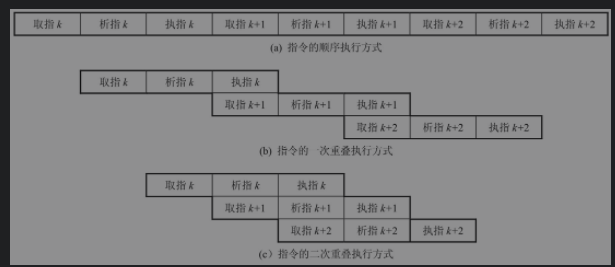
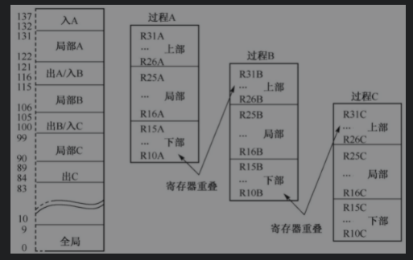
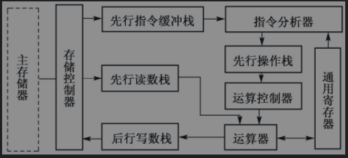

## 流水线技术与向量处理技术

__提高处理机指令的执行速度__

> 1. 提高CPU工作主频(目前依靠提高集成度来提高半导体主频频率)
> 2. 采用更好的算法和功能部件 (RISC)
> 3. 采用指令并行技术(提高单处理器性能的主要方法,流水线技术,超标量流水线技术)
>
> 

__指令的重叠执行__

> 
>
> 
>
> 指令执行过程
>
> > 取指令(向寄存器,主存读入CPU)
> >
> > 分析指令(对指令操作码进行译码,按照指定的寻址方式读取数据)
> >
> > 执行指令(完整规定的操作,运算,并把结果写回主存,,寄存器中)
>
> 多条指令在处理机中执行时,执行方式
>
> __顺序执行__
>
> > T = $\sum_{i=1}^n(t_{取值i}+t_{析址i}+t_{执指i})$
> >
> > 设每一段时间相等为t 则n条指令执行的时间为 T = 3nt
> >
> > __顺序执行控制简单,节省设备,指令执行速度慢,功能部件利用率低(单个部件使用)__
>
> __重复执行方式__
>
> > T= (1+2n)t $\approx$2nt    T= (2 + n) t $\approx$ nt
>
> __重叠技术支持__
>
> > 相对独立的取值,分析,执行部件(存储控制器,指令控制器,运算控制器)
> >
> > 访问主存冲突问题实现方案(实现并行访存)
> >
> > 1. 将主存分为两个独立编址存储器:指令存储器和数据存储器,CPU可以分别独立访问,没有取址冲突和析址冲突
> > 2. 低位交叉存取方式,并行访问不在同一个存储体中的指令或数据
> > 3. 先行控制技术
> > 4. 功能部件运行速度大致相等,避免相互等待(先行控制技术缓冲,RISC技术支持)
>
> __RISC对流水线的技术支持__
>
> > RISC 指令简单,几乎所有指令都在一个机器周期内完成,并注重编译的优化,RISC容易做到指令重叠运行时各个功能部件的运行时间相等
> >
> > __延迟转移技术__
> >
> > 转移指令执行后插入一条有效指令,使转移指令延时(编译器完成)
> >
> > __指令取消技术__
> >
> > 不能调整指令顺序,则取消转移指令的下一条指令
> >
> > __重叠寄存器窗口技术__
> >
> > 减少CALL,RETURN指令访存次数,相邻窗口共用
> >
> > 
> >
> > __指令流调整技术__
> >
> > 通过指令序列调整或寄存器置换方法来消除原来可能存在的数据依赖
> >
> > 
>
> ### 先行控制技术
>
> > 先行控制方式的结构与工作过程
>
> 
>
> > 先行指令缓冲栈
> >
> > _用于平滑主存和指令分析器的工作,指令缓存栈未满,执行指令放入缓冲栈中,指令分析器中分析完一条指令后,自动从指令缓冲栈中取走下一条分析指令,控制逻辑指令缓冲栈以FIFO方式工作,维持指令正确执行顺序_
> >
> > 
>
> 

