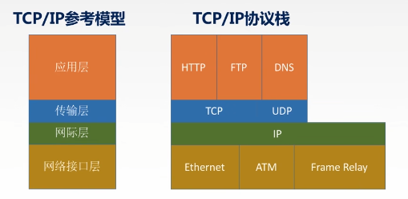

## 计算机网络概念

> 计算机网络：将分散，具有独立功能的计算机系统，通过通信设备与线路连接起来，**由功能完善的软件实现资源共享和消息传递功能**
>
> **计算机网络功能**
>
> 1. 数据通信
> 2. 资源共享
> 3. 分布式处理
> 4. 提供可靠性
>
> **计算机网络组成部分**
>
> 1. 硬件
> 2. 软件
> 3. **协议**（核心）
>
>  **计算机网络工作方式**
>
> - 核心
> - 边缘（端系统，P2P，C/S)
>
> **计算机功能组成**
>
> - 通信子网（实现数据通信）
>   - 物理（集线器，中继器），数据链路（交换机，网桥），网络（路由器）
> - 资源子网（实现资源共享和数据处理）
>   - 传输，会话，表示，应用
>
> **网络分类**
>
> - 分布范围
>   1. WAN：广域网（交换协议）
>   2. MAN：城域网
>   3. WAN：局域网（广播技术）
>   4. PAN：个人区域网（蓝牙技术,个人穿戴设备共联 (1~10m)
> - 使用者分类
>   1. 公用
>   2. 专用
> - 交换技术
>   - 电路：电路建立物理通道被占用
>   - 报文：信息附加上目的地址及控制信息，构成一个完整的报文，**以报文为单位在网络结点上进行存储和转发**
>   - 分组：将一个数据报文分组发送
> - 拓扑结构
>   1. 总线：使用广播信道为公共线路(易产生冲突,排查困难)
>   2. 星型：网络中主机点对点连接中央结点(局域网/个域网),受限于中心结点
>   3. 环型：将结点连成环,发送数据的结点负责清除其发送的数据
>   4. 网状型：（常用于广域网）
> - 传输技术
>   1. 广播网络
>   2. 点对点网络
>
> **标准化工作相关组织**
>
> - ISO：OSI参考模型，HDLC协议
> - ITU：通信规则
> - IEEE：学术机构，IEEE802，5G
> - IETF
>
> **网络性能指标**
>
> - 速率：（数据传输率，比特率）：单位时间传输数量大小 （1000进制）
> - 带宽：网络通信线路传输数据最大能力（最高速率）
> - 吞吐量：单位时间内通过网络的数据量（受环境因素影响，多为表示实际速率）
> - 时延：从网络发送端到接收端所用时间
>   1. 发送时延= $\frac{数据长度}{信道带宽}$    信道带宽为理想速度
>   2. 传播时延（取决于电磁波传播速度及链路长度）
>   3. 排队时延（等待，转发所耗时间）
>   4. 处理时延
> - 时延带宽积：描述数据量容量指标
>   - 时延带宽积= **传播时延 * 带宽**  
> - 往返时延RTT
>   - **往返传播时延*2** + 末端处理时间
> - 利用率
>   1. 信道利用率 = $\frac{有数据通过时间}{总耗时时间}$
>   2. 网络利用率 = 信道利用率加权平均值
>   3. 利用率越大时延越长
>
>  
>
> **网络分层结构**
>
> - 分层原则
>   1. 各层之间独立，并实现一种相对独立功能
>   2. 各层依赖尽可能少
>   3. 下层单向对上层提供服务
>   4. 整个分层结构促进标准化
> - 协议：对等实体数据交换规则，标准（水平协议）
>   1. 语法：规定交换信息的格式与结构
>   2. 语义：规定完成的功能
>   3. 同步：规定操作顺序
> - 接口SAP：层次之间规定入口
> - 服务：相邻层级之间功能单向调用（垂直）
>
> SDU：服务数据单元
>
> PCI：协议控制信息
>
> PDU：协议数据单元
>
> **PDU = SDU + PCI** 
>
>  
>
> **OSI参考模型** ：解决异构网络系统相互通信
>
> - 应用：与用户交互产生网络流量的程序（FTP，SMTP，HTTP）
> - 表示：数据加解密，数据格式转换，数据压缩与恢复
> - 会话：会话之间相互独立，实现断点通信，实现数据同步通信
> - **传输**：负责进程间通信（报文交换)实现可靠/不可靠传输，差错控制，流量控制，复用分用
> - **网络**：分组交换为不同主机提供通信服务（数据报）实现路由，流量，差错，拥塞控制
> - 数据链路：把报文拆分封装成帧，差错控制，流量控制，对信道控制（共享信道控制）
> - 物理：比特流透明传输
>
> **TCP/IP参考模型**
>
> - 应用
> - 传输
> - 网际
> - 网络接口
>
>  
>
> 