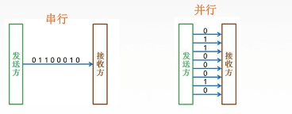
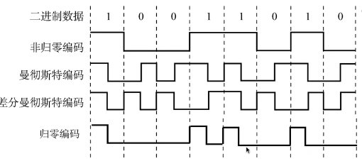
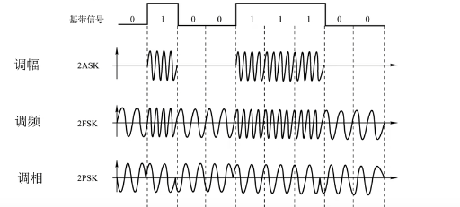

## 物理层

> *连接各种计算机的传输媒体上传输数据比特流，确定与传输媒体接口有关的特性*
>
> 机械特性：规定物理连接采用的规格，接口，引线，引脚数量和排列情况
>
> 电气特性：规定传输电平意义，接口部件的信号用途
>
> 规程特性：各条物理线路的工作规程和时序关系
>
> 
>
> 通信交互方式：（确定发送，接收方）
>
> 1. 单工：只存在一个方向的通信，仅需一条信道
> 2. 半双工：双方不能同时发送和接收消息，需要两条信道
> 3. 全双工：同时发送和接收消息，需要两条信道
>
> 
>
> 数据传输方式：
>
> - 串行：速度慢，费用低，适合远距离
> - 并行：速度快，费用高，适合近距离
> -  
>
> 
>
> 码元：固定时长的波形信号，时长为码元长度，一个8长度的二进制码元可以表示 $2^8$bit 容量
>
> 码元传输速率（脉冲个数）：单位时间内信号变化量  单位波特 （Baud）
>
> 信息传输速率（比特率）：单位时间内传输的二进制码元个数 单位比特每秒 （b/s)
> $$
> 一个码元携带n bit(位)信息量。则M Bound的码元对应信息传输率 V = M \times n \\
> 表示N进制的码元需要使用 log_2N 比特位表示
> $$
>  **信号失真因素：**
>
> 1. 码元速率（码间串扰）
> 2. 信号传输距离
> 3. 噪声干扰
> 4. 传输媒体质量
>
> 信道带宽：表示信号在能在信道能传输的最高频率与最低频率之差
>
> **奈氏定理：在理想信道下码元极限速率为 2W Baud （W为信道带宽，单位HZ）**
> $$
> 极限码元传输率 = 2Wlog_2V ~~ (b/s)   \\
>   W为信道频率，V表示离散信号种类
> $$
>
> - 码元传输数量受奈氏准则制约，提高码元传输率需要提高**信道频率**或**码元容量**
>
> **香农定理：定义极限比特速率与噪声干扰影响**
>
> - 信噪比 = $\frac{信号平均功率}{噪声平均功率} = \frac{S}{N}$  单位分贝 dB   单位转换  $1 db = 10log_{10} \frac{S}{N}$
> - 在带宽受限且有噪声的信道中，求极限比特率大小
> - $V_{max} = W log_2(1+ \frac{S}{N}) ~~~（b/s）~~~W表示信道频率(Hz)$
>
> 
>
> 信道上传输信号
>
> - 基带信号：来自信源的信号（**使用物理信号直接表达要传输的消息**）
> - 宽带信号：将基带信号通过调制器形成频分复用的模拟信号在信道上传输
>
> 
>
> **编码与调制**
>
> - 数据转为数字信号：编码，数据转为模拟信号：调制
>
> - **数字数据编码为数字信号规则**
>
>   1. 非归零编码：高1低0，没有检错功能，无法判断码元开始和结束，接收方无法同步通信
>   2. **曼彻斯特编码**：信号在一个周期内发生跳变（一个周期，脉冲2次）
>   3. **差分曼彻斯特编码**：码元中间的电平转换边只作为定时信号，数据表示在与每一位开始处是否有电平转换，**有电平转换表示0，无电平转换表示1**
>   4. 归零编码：信号在一个周期内由1变为0表示1，其他表示0
>   5. 反向不归零编码：信号在一个周期内不变表示1，信号变动表示0
>   6. 4B/5B编码：
>
>    
>
> - **数字数据调制为模拟信号**
>
>   1. 调幅（2ASK)
>   2. 调频（2FSK）
>   3. 调相（2PSK）
>   4. 调幅+调相 （QAM）
>
>     
>
> - **模拟数据编码为数字信号** （PCM）
>
>   1. 抽样：对模拟信号周期性扫描，把时间上连续信号变成离散信号 $f_{采样}\ge 2f_{模拟最高频率}$
>   2. 量化：将抽样的电平高低按标准转为具体离散数字值
>   3. 编码：将出现的离散数值种类转为二进制编码
>
> - **模拟数据调制模拟信号** （通常用作模拟信号加强）
>
>   
>
> **传输介质与分类**
>
> - 双绞线（1-10km范围）
> - 同轴电缆（抗干扰性好，传播远）
> - 光纤
> - 无线电波：较强穿透能力，远距离传输，用于通信领域
> - 微波：通信频率高，频段范围宽，数据率高（卫星通信，微波接力通信）
> - 红外线
>
>  
>
> **物理层设备**
>
> - 中继器：对衰减的信号放大和还原，增加信号传输距离（中继器两端需要规定同一个协议）
>
> - 集线器（多口中继器）
>
>   

