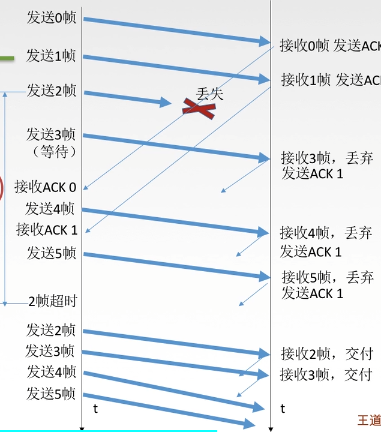
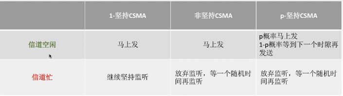

## **数据链路层**

> 结点：主机，路由器
>
> 链路：结点之间物理通道
>
> 数据链路：网络中两个结点之间逻辑通道（实现数据传输协议的硬件与软件）
>
> 帧：链路层协议数据单元，封装网络层数据报
>
> **数据链路层实现功能**
>
> *加强物理层传输原始比特流，将物理连接改为逻辑上无差错的数据链路*
>
> - 为网络层提供服务
> - 链路建立，维持，释放
> - 组帧
> - 流量控制
> - 差错控制
>
> 组帧：在数据前后加上特殊标识，使接收端根据标识读取数据开始及结束（帧同步）
>
> - MTU：最大传输单元（帧长）
>
> - 组帧方法
>
>   1. 字符计数：帧首部字段标识数据长度
>   2. 字符填充：SOT，EOT特殊字符标识（添加转义字符）
>   3. **零比特填充**：在发送端扫描整个数据，连续5个1就立即填入一个0
>   4. **违规编码法**：通过曼彻斯特编码规定帧的起止（一个周期内高-高，低-低电平判断帧头）
>
> 
>
> **差错控制**（噪声影响，提供信噪比减少干扰，链路层差错控制通常检验比特位错）
>
> - 位错（比特位出错）
>
>   1. **检错编码**（积偶校验，循环冗余码CRC）
>
>      **积/偶检验**：加上校验单元，判断比特位为1的个数是奇数还是偶数（检测能力50%）
>
>      **CRC循环冗余码：**  
>
>      ```sql
>      发送端									     接收端
>       数据 % 多项式 = FCS   
>                          发送数据(数据+FCS)---->  
>       								    	接收数据 % 多项式 = 0 （无差错）
>
>      ```
>
>      $FCS位数为多项式的阶（多项式N位，其阶位N-1，\\若多显示采用X^n+X^{n-1}+...描述，其转换规则为存在阶级补1，不存在补0）$ 
>
>      多项式为10011，发送数据为1101 011011 ，FCS为1110，最终发送数据为 1101 011011 1110
>
>       
>
>   2. **纠错编码**（海明码，能发现双比特错，纠正单比特错） 
>
> 
>
> **流量控制与可靠传输机制** （解决发送与接收速度不匹配问题，及丢帧处理）
>
> - 反馈帧：接收方收不下，则不向发送端回复确认
>
> - 停止等待协议：单帧等待确认回复，效率低
>
>   > 数据帧丢失或检测到差错帧丢失：发送方超时重传
>   >
>   > ACK丢失：发送方超时重传，接收方丢去重发的帧，并返回ACK
>   >
>   > ACK延迟：发送方丢弃重复的ACK
>   >
>   > 信道利用率 =$\frac{T_D}{T_D+RTT+T_A} = L / C /T,~~~T_D：发送方占用时间，T_A：ACK处理时间，\\L表示T内发送L比特数据，C表示发送方数率， T表示发送周期$ 
>   >
>   > 信道吞吐率 = 信道利用率 *  发送方发送速率
>
> - 滑动窗口协议
>
>   1. GBN（后退N帧协议，发送窗口大于1，接收端口等于1）
>
>      > 发送方累计确认：**标明接收方已收到n号帧及其前面所有帧，当滑动窗口最左边帧确认，则移动窗口**
>      >
>      > 发送方超时事件：**在时间内发送方未收某个帧的ACK，则会重新发送窗口所有未确认的帧**
>      >
>      > 接收方：只接收当前窗口中的帧（接收窗口为1），**并返回当前已确认帧最大ACK码**
>      >
>      >   
>      >
>      > 发送方窗口长度：**采用n位对帧编号（帧编号最大表示长度），发送窗口W满足 $1 \le W \le 2^n -1$**
>
>   2. **SR（选择重传协议，发送接收端口均大于1）**
>
>      > 接收方：**可以接收窗口内所有帧，当窗口最左边的帧确认，则移动窗口**
>      >
>      > 发送方与接收方窗口长度：$W_{Tmax} = W_{Rmax} = 2^{n-1}$
>
> 
>
> **信道介质及访问控制**
>
> - MAC协议（介质访问控制，实现多个用户在一根物理信道上传输数据）
>
>   1. 静态： （单用户不能使用全信道）
>
>      - FDM（频分）：所有用户在同样时间内占用不同的带宽资源（用户使用频率不一样，吞吐量低，并发高）
>      - TDM（时分）：用户占用一个固定的时隙，所有用户轮流使用信道（用户使用时间不一样，吞吐量高，并发低）
>      - STDM（统计时分复用）：动态分配用户时隙
>      - WDM（波分）
>      - **CDM（码分）**
>        - **CDMA：**码分多址
>          1. 每个用户都指定一个唯一的m位芯片序列/地址码（表示比特位含义）
>          2. 判断多用户是否允许同时发送：用户芯片序列相互正交（相比特位的芯片序列同位相乘，相加，在除以m，**得到结果为0时允许同时发送**）
>          3. 多用户发送数据格式：用户芯片序号线性相加（相比特位的芯片序号同位相加）
>          4. 接收方数据分离：合并数据与用户芯片序列规格化内积（相比特位的芯片序列同位相乘，相加，在除以m）
>
>   2. 动态（共享信道效率高，单用户可以使用信道全带宽）
>
>      - 轮询
>
>        - 令牌传递（特殊MAC控制帧），发送方持有令牌发送数据，接收方复制完数据后
>
>      - **随机（容易产生冲突开销）**
>
>        - ALOHA
>
>          1. 冲突检测：接收方进行差错检测，对冲突帧丢弃，对正常帧返回ACK码
>          2. 冲突解决：超时重传
>
>        - CSMA
>
>          1. CS：载波监听信道上是否存在其他用户发送数据
>          2. MA：多点介入
>          3. 发送帧之前，监听信道是否空闲，信道忙则延迟发送
>             -  
>
>        - **CSMA/CD**：CD：碰撞检测
>
>          > 发生冲突时，停止发送数据，
>          >
>          > 发送方最大知道冲突时间：RTT(链路往返时间)
>          >
>          > 自定重传次数
>
>        - **CSMA/CA**
>
>          > CA：碰撞避免
>
> **局域网**：广播信道
>
> - **以太网(Ethernet)**：逻辑为总线拓扑，物理常用于星型拓扑，使用CSMA/CD控制，
>
>   > **使用IEEE 802.3标准**
>   >
>   > 采用无连接，不可靠方式传输，差错帧直接丢弃。
>   >
>   > 10BASE-T以太网：传输基带信号，使用双绞线（UTP）传输，速率为10MB/S,长度最长为100M，采用曼彻斯特编码，使用CSMA/CD介质访问控制
>   >
>   > 适配器：网卡，NIC网络接口卡，存在MAC地址
>   >
>   > 
>
> - FDDI网
>
> - ATM网
>
> - WLAN 无线局域网，使用IEEE 802.11  LAN/MAN协议
>
>  
>
> **LLC：**逻辑链路控制子层，负责识别网络层协议。
>
> **MAC：**包括数据帧封装，卸载，帧寻址和识别，帧发送与接收，链路差错管理，屏蔽物理层电路特性差异
>
> 

