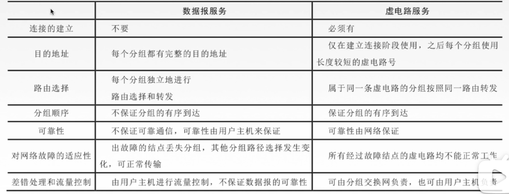
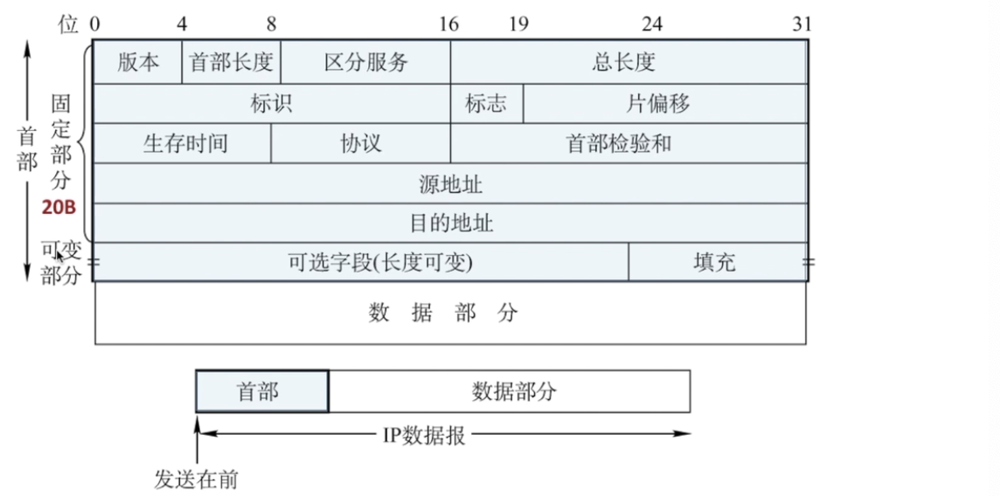
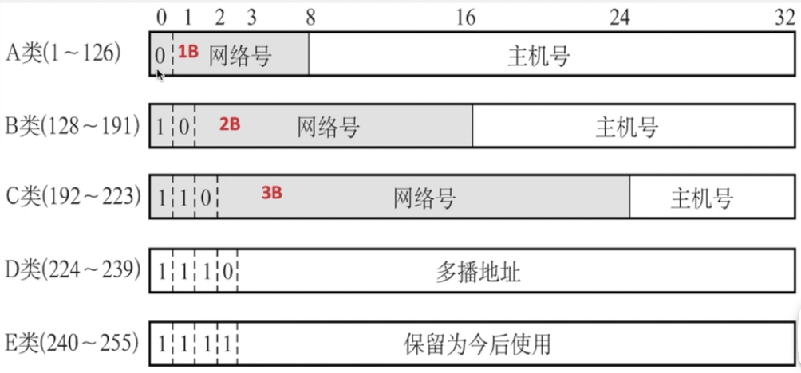
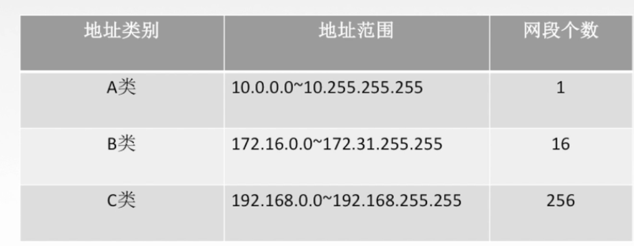

## **网络层**

> 把分组数据从源端转发到目的端，实现分组交换网上的不同主机提供通信服务。
>
> 实现功能
>
> 1. 路由选择与分组转发
> 2. 异构网络互联
> 3. 拥塞控制（缓解网络阻塞，区别于链路层流量控制解决发送接收端速度不一致情况）
>
>  **数据交换**
>
> - 电路：使用**多路复用**技术独占网络资源。**通信时延小**，有序传输，**没有冲突**，实时性强，建立连接时间长，网络使用效率低，灵活性差，**无法差错控制（交换机只转发数据）**。
> - 报文：无需建立连接，**具有存储转发，动态分配路线**，线路利用率高，多目标服务。有存储转发时延，网络节点存储缓存交换
> - 分组：同报文交换，需要额外的信息量，需要对分组排序存储
>   - 数据报方式：提供无连接服务（不确定分组传输的路径）
>   - 虚电路方式：提供连接服务（确定分组传播路径，类似于电路交换建立逻辑电路）
>   -  
>
> **IP协议**
>
>  
>
>  
>
> - 版本（IPV4、IPV6）
> - 总长度（65525种数据）
> - 生存时间TTL：IP报生存时间，经过一个路由减1，为0丢弃
> - 协议：数据部分使用协议，TCP(6)，UDP(17)
>
> **IP数据报分片**
>
> - 标识：同一数据报的分片使用同一标识
>
> - 标志：DF=1，禁止分片，DF=0，运行分片，MF=1：后续还有分片，MF=0代表最后一个分片
>
> - 片偏移：原数据报相对位置（8B为单位），数据起始位置除以8等于片偏移
>
> **IP地址**（32位/4字节标识符，网络号+主机号）
>
> - 分类IP地址
>
>     
>
> - 特殊IP地址
>
>    
>
>   **私有地址**
>
>    
>   
>   | 网络类别   | 最大可用网号  | 第一可用网号 | 最后可用网号 | 最大主机数  |
>   | ---------- | ------------- | ------------ | ------------ | ----------- |
>   | A(固定0)   | $2^7$ -2 =126 | 1            | 126          | $2^{24}-2$  |
>   | B(固定10)  | $2^{14}$-1    | 128.1        | 191.255      | $2^{16}-2$  |
>   | C(固定110) | $2^{21}-1$    | 192.0.1      | 233.255.255  | $2^8-2$=254 |
>
> **网络地址转换NAT**（专用网络连接到互联网协议）
>
> 
>
> 
>
> 
>
> **路由算法与路由协议**
>
> - 静态（手动配置，适用于结构简单，拓扑变化不大的网络中）
>
> 
>
> - 动态（自适应）
>
>   - 全局(OSPF)
>   - 分散（RIP)
>   - 外部网络（BGP)
>
> 

