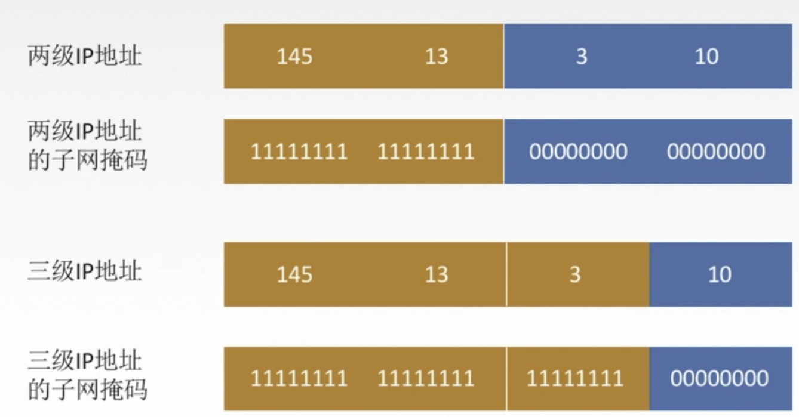
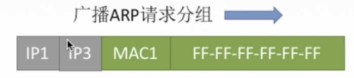
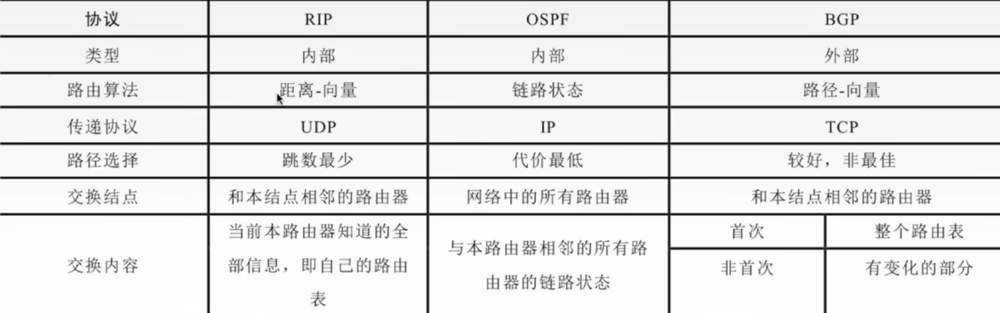

## **网络层**

> 把分组数据从源端转发到目的端，实现分组交换网上的不同主机提供通信服务。
>
> 实现功能
>
> 1. 路由选择与分组转发
> 2. 异构网络互联
> 3. 拥塞控制（缓解网络阻塞，区别于链路层流量控制解决发送接收端速度不一致情况）
>
>  **数据交换**
>
> - 电路：使用**多路复用**技术独占网络资源。**通信时延小**，有序传输，**没有冲突**，实时性强，建立连接时间长，网络使用效率低，灵活性差，**无法差错控制（交换机只转发数据）**。
> - 报文：无需建立连接，**具有存储转发，动态分配路线**，线路利用率高，多目标服务。有存储转发时延，网络节点存储缓存交换
> - 分组：同报文交换，需要额外的信息量，需要对分组排序存储
>   - 数据报方式：提供无连接服务（不确定分组传输的路径）
>   - 虚电路方式：提供连接服务（确定分组传播路径，类似于电路交换建立逻辑电路）
>   -  
>
> **IP协议**
>
>  
>
>  
>
> - 版本（IPV4、IPV6）
> - 总长度（65525种数据）
> - 生存时间TTL：IP报生存时间，经过一个路由减1，为0丢弃
> - 协议：数据部分使用协议，TCP(6)，UDP(17)
>
> **IP数据报分片**
>
> - 标识：同一数据报的分片使用同一标识
>
> - 标志：DF=1，禁止分片，DF=0，运行分片，MF=1：后续还有分片，MF=0代表最后一个分片
>
> - 片偏移：原数据报相对位置（8B为单位），数据起始位置除以8等于片偏移
>
> **IP地址**（32位/4字节标识符，网络号+主机号）
>
> - 分类IP地址
>
>     
>
> - 特殊IP地址
>
>    
>
>   **私有地址**
>
>    
>
>   | 网络类别   | 最大可用网号  | 第一可用网号 | 最后可用网号 | 最大主机数  |
>   | ---------- | ------------- | ------------ | ------------ | ----------- |
>   | A(固定0)   | $2^7$ -2 =126 | 1            | 126          | $2^{24}-2$  |
>   | B(固定10)  | $2^{14}$-1    | 128.1        | 191.255      | $2^{16}-2$  |
>   | C(固定110) | $2^{21}-1$    | 192.0.1      | 233.255.255  | $2^8-2$=254 |
>
> 
>
> **IP组播** （多播）  TODO
>
> - 单播（点对点方式）
>
> - 广播
>
> - 多播（效率最高）
>
>   > 使用UDP协议
>   >
>   > 不产生ICMP报文
>   >
>   > 组播地址范围 224.0.0.0 ~ 239.255.255.255
>
> 
>
>  **移动IP**（使用固定IP，实现跨越不同网段的漫游功能，网络IP权限不会在漫游中发生改变）
>
> - 移动节点：具有永久IP地址的移动设备
> - 归属代理（实际网络代理）
>
> 
>
> **网络地址转换NAT**（专用网络连接到互联网）
>
> - 宽带分享
> - 安全防护
>
> **子网划分与子网掩码**
>
> - 子网结构：网络号+子网号+主机号
>
> - 子网掩码：**区分子网IP网络号与主机号界限**（网络号位数全1，主机号位数全0）
>
> -  
>
> - **子网IP计算：通过子网掩码与外网IP逐位相与**
>
> - 特殊网段IP与二进制表示
>
>   | 二进制表示 | 十进制表示 |
>   | ---------- | ---------- |
>   | 10000000   | 128        |
>   | 11000000   | 192        |
>   | 11100000   | 224        |
>   | 11110000   | 240        |
>   | 11111000   | 248        |
>   | 11111100   | 252        |
>   | 11111110   | 254        |
>   | 11111111   | 255        |
>
> **无分类编址CIDR**
>
> - 消除分类IP及划分子网概念
>
> - CIDR标记法：eg：128.14.35.7/20：前20位网络号
>
>   > ~~~sh
>   > 二进制：  10000000 00001110 00100011 00000111 (128.14.35.7)
>   > 最小地址: 10000000 00001110 00100000 00000000 (128.14.32.0)
>   > 最大地址: 10000000 00001110 00100000 00000000 (128.14.47.255)
>   > 地址掩码: 11111111 11111111 11110000 00000000 (255.255.240.0)
>   > ~~~
>
> **构成超网：** 将多个子网聚合成较大的子网（路由聚合）
>
> - 将相同位数和相同的网络号合并成一个路由（路由器记录下一跳地址）
> - 查找路由时通过**最长匹配网络号进行路由**
>
> 
>
> **ARP协议**（地址解析协议，建立IP地址与Mac地址映射）
>
> - 路由器广播ARP请求分组（广播询问IP对应的Mac地址）
>
>    
>
>   单波ARP响应分组（返回本机IP地址及MAC地址给路由器）
>
>     
>
> 
>
> **DHCP协议**（服务器向客户端动态分配IP，子网掩码，默认网关，DNS服务器）
>
> ***DHCP属于应用层协议，使用C/S方式，客户端和服务端广播进行交互，基于UDP***
>
> 1. 入网主机广播DHCP发现报文，寻找网络中DHCP服务器
> 2. 服务器广播DHCP提供报文（服务拟分配主机一个IP地址及相关配置）
> 3. 主机广播DHCP请求报文
> 4. 服务器确定DHCP报文
>
>  **ICMP协议**（用于差错报告，网络探寻）
>
> - 差错报文
>
>   1. 终点不可达（路由器或主机不能交付分组到目的时，向源点发送不可达报文）
>   2. 源点抑制（网络拥塞丢弃分组）
>   3. 时间超过（分组中TTL为零）
>   4. 参数问题（首部数据问题）
>   5. 改变路由（重定向）
>
>   ---
>
>   - 一个报文只存在一个ICMP差错报文（一个分组出发后，后续所有分组都不发送）
>
>   - 对具有组播地址的数据不会发送ICMP差错报文
>   - 对ICMP差错报告报文不再发送ICMP差错报文
>   - 对特殊地址（127.0.0.1或0.0.0.0)不发送ICMP报文
>
> - 询问报文（测试目的站是否可达及了解相关状态）
>
>   1. 请求回答（ping）
>   2. 本地时间错校验（用时钟同步测量连通时间，traceroute）
>   3. 掩码地址请求回答
>   4. 路由器询问和通告
>
>   
>
>   
>
> **路由算法与路由协议**
>
> - 静态（手动配置，适用于结构简单，拓扑变化不大的网络中）
>
> - 动态（自适应）
>
>   - 内部网关协议
>
>     1. RIP(距离向量)：路由器中维护从它到目的网络的最佳路径（**最大15跳，UDP，应用层**）
>
>        > 仅和相邻的路由器交换信息（路由表）
>        >
>        > 每30秒交换一次路由信息，若超过180秒没接收到邻居路由信息，则判断邻居路由不可达，并更新自己路由表
>        >
>        > 经过多次交换后所有路由器将存储内网网络所有路由表
>        >
>        > **距离向量算法**
>        >
>        > 1. 更改相邻路由RIP报文路由表所有表项（**下一跳改为相邻路由地址，TTL加1**）
>        > 2. 更新本地路由表，存在相同的目的网络和相同的下跳网络（更新跳数），存在相同的目的网络则比较跳数（跳数较短的更新替代）
>        > 3. 180s未收到邻居路由报文，则把邻居路由标记不可达，设置跳数为16
>
>     2. OSPF：最短路径优先
>
>        > 路由器广播发送相邻的所有路由器链路信息（只有链路变化才发送）。
>        >
>        > 子网中所有路由器链路信息都交换完毕后使用Dijkstra算法依据链路状态构造最短路径
>
>   - 外部网络（BGP)：交换路基向量（应用协议，使用TCP传输）
>
>    
>
> - **路由器转发分组算法**
>
>   1. 提取目的地址IP
>   2. 判断是否直接交付（**目的IP与各个子网掩码相与操作，判断IP是否与相应的子网IP匹配**，匹配则将IP转为Mac地址，并封装成Mac帧发送到目的主机
>
>   3. 特定主机路由地址（路由器中存在目的地址的特殊路由）
>   4. 检测路由表中是否存在合适路径**（目的地址与各网子掩码相与操作，判断IP网络号与子网网络号是否相同，相同则交付给子网路由下一条地址）**
>   5. 默认路由地址（路由器传给下一路由地址，**路由器默认网关**）
>   6. 报告转发分组出错
>
> 

