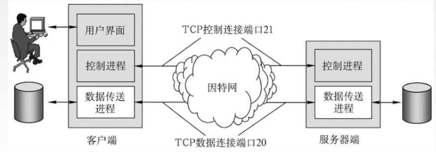
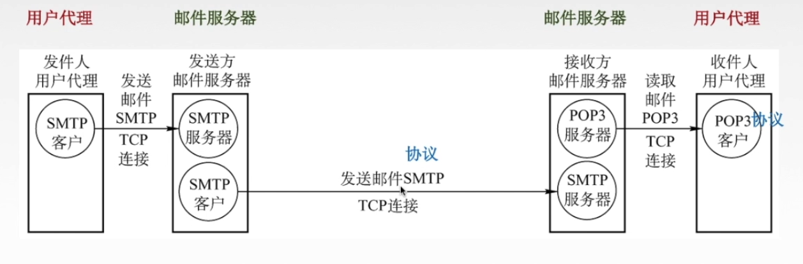
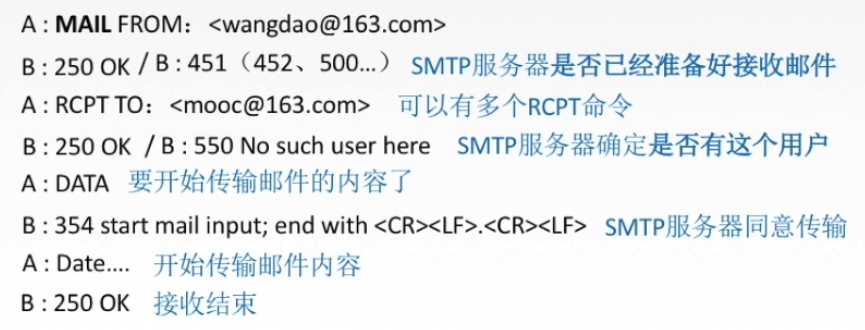
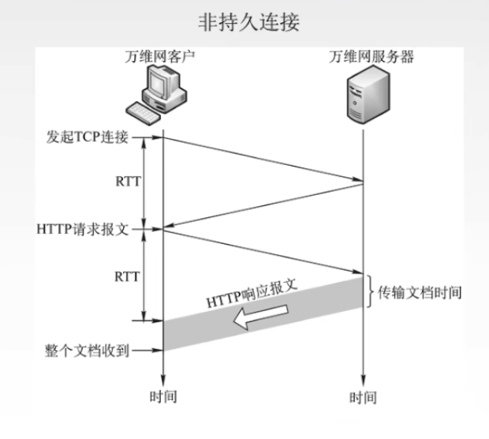
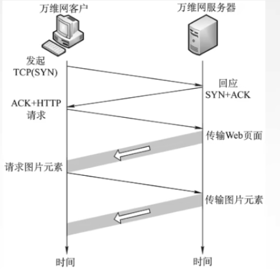

## **应用层**

> - 应用进程交换报文类型（请求、响应）
> - 报文类型语法，语义
> - 进程对套接字请求，响应规则
>
> **应用层功能**
>
> 1. 文件传输，访问，管理
> 2. 电子邮件
> 3. 虚拟终端（远程桌面）
> 4. 查询服务与远程作业登录
>
> **应用层重要协议**
>
> - FTP（21~20）
> - SMTP，POP3
> - HTTP
> - DNS
>
> 网络应用模型
>
> - C/S：
>
>   > Server：提供计算服务设备，通常具有永久提供服务，永久访问地址/域名
>   >
>   > Client：与服务器通信的设备，使用动态IP，间接性与服务器通讯，客户机不直接与其他客户机通讯
>
> - P2P
>
>   > 主机可以提供服务与请求，可扩展性好，节点动态更改IP地址，节点间接入网
>
> **DNS系统**（使用域名解析IP）
>
> > **域名**（不区分大小写，包含字母，数字，及英文-）
> >
> > - 顶级域名
> >   1. 国家顶级域名（cn，us，uk）
> >   2. 通用机构域名（com，net，org，gov）
> >   3. 基础结构域名/反向域名（由IP地址寻找域名） arpa
> > - 二级域名
> >   1. 类别域名
> >   2. 行政域名
> >   3. **自定义域名（全球唯一）**
> > - 三级域名
> >   1. mail（邮件相关）
> >   2. www（万维网）
> >   3. ftp
> >
> > **域名服务器**
> >
> > - 根域名（包含所有的顶级域名）
> > - 顶级域名（包含所有的二级域名）
> > - 权限域名
> > - 本机域名服务器（请求不经过其他结点，本机完成IP域名映射）
> >
> > 递归查询：主机发送DNS请求查询时，首先在本机缓存，host查找是否存在相应域名映射，未找到则直接请求根域名服务器让其根域名服务器进行递归查询下级域名服务器，并由根域名服务器将IP返回主机
> >
> > 迭代查询：由主机服务分别向根域名服务器，顶级域名服务器，权限域名分区请求对应的IP
>
> **文件传输协议**
>
> - FTP：提供不同主机操作系统（软，硬件体系不同）之间文件传输协议
>
>   >C/S应用模式，使用TCP实现可靠传输
>   >
>   > 
>   >
>   >- 控制连接（控制连接始终打开）
>   >
>   >- 数据连接（当文件传输时建立连接）
>   >
>   >  FTP传输模式
>   >
>   >  - ASCII模式，以文件序列方式传输
>   >  - Binary模式，以二进制序列传输数据
>
> - TFTP（简单文件传输协议）
>
> **电子邮件**
>
> >  
> >
> > 用户代理：邮件客户端（通讯，编写邮件，处理邮件，与服务器通讯）
> >
> > 邮件服务器：发送和接收邮件
> >
> > - SMTP：发送邮件协议
> >
> >   1. 连接建立（发送方->发送方服务器->接收方服务器）
> >
> >   2. 邮件发送
> >
> >       
> >
> >   3. 连接释放
> >
> > - POP3，IMAP：收取邮件协议
> >
> >   > 下载并保留
> >   >
> >   > 下载并删除
>
> **万维网与Http协议**
>
> > URL：统一资源定位符，<协议>://<主机>:<端口>/<路径>
> >
> > **Http：超文本传输协议**
> >
> >  
> >
> > 1. 浏览器分析URL
> > 2. 浏览器向DNS服务器请求解析域名
> > 3. 浏览器与服务器建立TCP连接
> > 4. 浏览器向服务发送Http请求
> > 5. 服务器响应Http请求
> > 6. 浏览器展示内容
> > 7. 断开TCP连接
> >
> > http连接方式：
> >
> > 1. 非持久连接
> >
> >     
> >
> > 2. 持久连接（复用TCP链接）
> >
> >     
> >
> > HTML：超文本标记语言
> >
> > 

