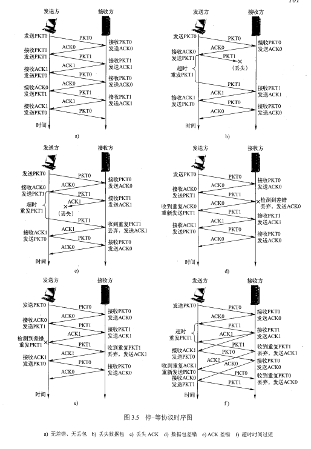

## 传输层

> _传输层为网络应用进程之间的通讯提供了端到端的报文传输服务_
>
> ###### 基本服务
>
> > - 传输层寻址与端口(对应用层报文进行分段和重组)
> >
> >   > 以TCP/IP体系网络以端口号+IP寻址(__唯一标识一个通讯端点__)
> >   >
> >   > __端口范围: 0~65536__
> >
> > - 复用与分解
> >
> >   > _支持多个应用进程公用一个传输层协议,需要对数据进行多路复用与多路分解__实现复用与分解的关键是传输层协议能够唯一标识一个套接字__
> >  >
> >   > 
> > 
> > - 流量控制
> >
> > - 拥塞控制
> >
>
> ###### 可靠数据传输服务
>
> > - 差错检测
> > - 确认
> > - 重传
> > - 序号
> > - 计时器
> >
> > __停 - 等协议__(ARQ) 信道利用率低
> >
> > > _发送方等待接收方确认后再次发送_
> > >
> > > 
> >
> > ###### 滑动窗口协议(管道协议)
> >
> > > _发送方在等待确定之前连续发送多个分组_
> > >
> > > 

