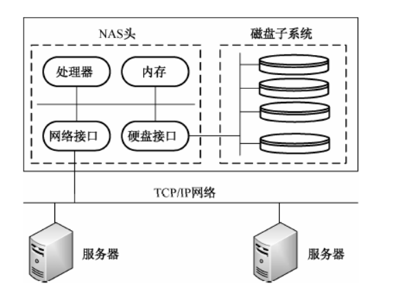
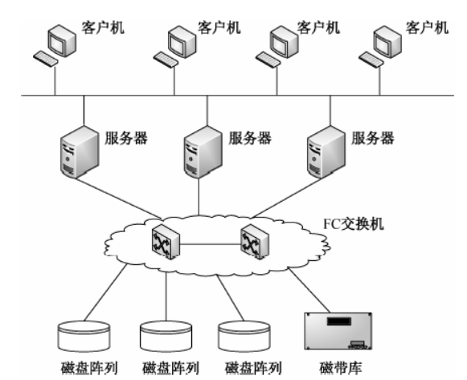

## **网络工程**

> **常见应用层协议**
>
> 1. FTP：（TCP，21端口控制信息，20端口传输文件）
> 2. TFTP：简单文件传输协议（UDP）
> 3. HTTP
> 4. SMTP
> 5. DHCP：动态主机配置协议（UDP，给客户机分配IP）
> 6. Telnet：远程登录协议（允许用户登录进入远程计算机系统）
> 7. DNS：域名系统
> 8. SNMP：简单网络管理协议
>
> **网络层协议**（处理信息路由和主机地址解析）
>
> 1. IPV4
>
> 2. IPV6
>
>    > IPV6的长度为128位，以16位为一段，共分为8段（每一段16位）每段之间使用`:`分开，每段使用16进制表示  2001：0da8：d001：0001：0000：0000：0000：0001
>    >
>    > IPV6压缩表示：
>    > 2001：da8：d001：1：0：0：0：1
>    >
>    > 2001：da8：d001：1：：1（每个IPv6地址只允许有一个“：：”）
>
> 3. ICMP：差错报文协议（解决IP报文丢失、重复、延迟或乱序传递）
>
> 4. IGMP：组播协议（解决本地网络之间通信及路由问题）
>
> 5. ARP：地址解析协议（动态完成IP到MAC地址转换）
>
> 6. RARP：反向地址解析协议（动态完成MAC到IP地址转换）
>
> 
>
> **无线网络**
>
> - WLAN
>
>   >  AP：网络接入点，用于提供无线网络连接
>   >
>   >  Ad hoc：使用无线网卡实现点对点连接（整个网络都使用无线通信）
>   >
>   >  IEEE802.11标准：无线局域网协议（CSMA/CA)
>
> - 3G通信技术（WCDMA，CDMA2000，TD-SCDMA复用技术）
>
> - 4G通信技术（上传20Mbps，下载100Mbps）
>
>   > TD-LTE
>   >
>   > FDD-LTE
>   >
>   > WiMAX（IEEE802.16）：全球微波互联接入(2GHz到66GHz)
>   >
>   > - 实现50公里的无线信号传输
>   > - 无法满足高速运动下的网络连接
>
> 
>
> **网络工程**
>
> - 规划
>
>   > 功能需求
>   >
>   > 通信需求
>   >
>   > 性能
>   >
>   > 可靠
>   >
>   > 安全
>   >
>   > 运行与维护
>   >
>   > 管理
>   >
>   > ---
>   >
>   > 服务器数量与位置
>   >
>   > 客户机数量与位置
>   >
>   > 同时访问量
>   >
>   > 用户数
>   >
>   > 使用时间
>   >
>   > 数据传输量
>   >
>   > 网络拥塞时间段
>   >
>   > 协议
>   >
>   > 通信方式
>
> - 设计
>
>   > 1. 网络逻辑结构
>   > 2. IP地址方案
>   > 3. 具体的软件，硬件，广域网连接设备和服务及费用
>   >
>   > ---
>   >
>   > 1. 物理网络布线方案
>   > 2. 设备和部件清单
>   > 3. 软件，硬件，安装费用估计
>   > 4. 安装日程表，测试计划
>   > 5. 用户培训
>
> - 实施
>
>   > 工程实施计划
>   >
>   > 网络设备验收
>   >
>   > 设备安装与调试
>   >
>   > 系统测试
>   >
>   > 系统试运行
>   >
>   > 用户培训
>
>   
>
> **网络存储技术**
>
> - DAS：直接附加存储
>
>   > 将存储设备与服务器相联，通过服务器完成IO（在传递距离、连接数量、传输速率等方面受到限制，无法扩展）
>
> - NAS：网络附加存储
>
>   > NAS存储设备仅提供文件系统功能
>   >
>   >   
>
> - SAN：存储区网络
>
>   >  
>   >
>   > FC ：光纤通道
>
> **综合布线**
>
> 模块化的、灵活性极高的建筑物内或建筑群之间的信息传输通道，使话音设备、数据设备、交换设备及各种控制设备与信息管理系统连接起来，同时也使 这些设备与外部通信网络相连
>
> - 工作区
>
> - 配线子系统
>
> - 干线子系统
>
> - 建筑群子系统
>
> - 设备间
>
> - 进线间
>
> - 管理
>
>   