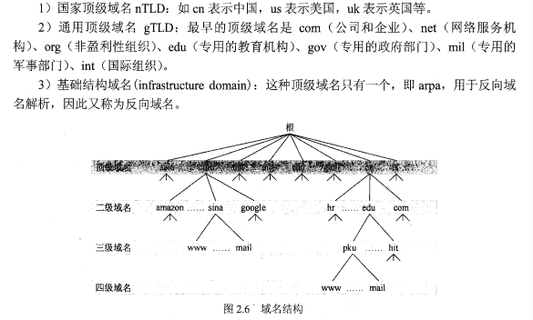
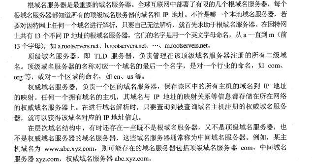
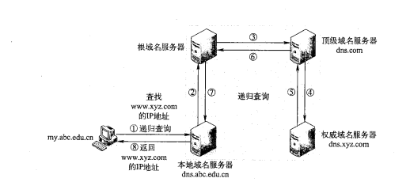
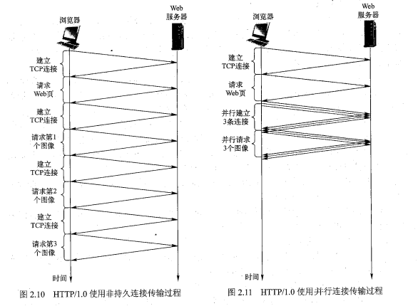
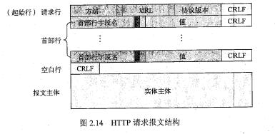
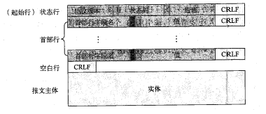
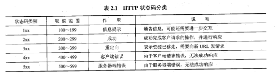
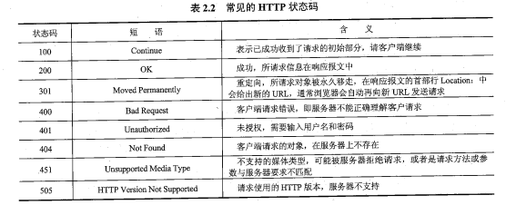
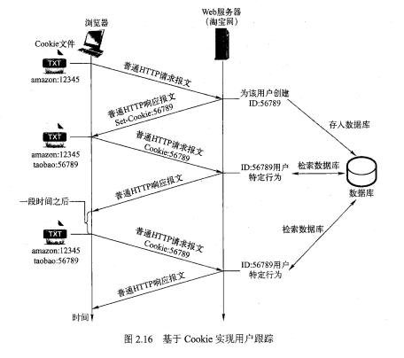
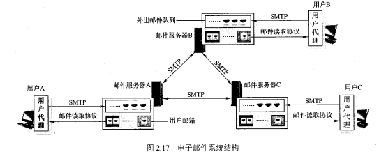

## 网络应用

> ###### 网络应用体系结构
>
> > - C/S
> > - P2P
> > - 混合应用
>
> #### 网络应用基本原理
>
> > __网络应用编程接口套接字(Socket),进程应用可以通过创建套接字实现与底层协议接口,实现进程与协议之间报文交换(应用进程与其他应用进程进行网络通讯的通道)__
>
> > 通过IP地址与主机上端口可以确定用户进程
>
>   
>
> - TCP服务
>
>   > 面向连接服务(三次握手保证服务器进程与用户进程的套接字建立逻辑连接)
>   >
>   > 可靠的数据传输房屋(无差错,按顺序交付所有发送的数据)
>
> - UDP服务
>
>   > 不可靠传输
>
> #### DNS域名系统(Domain Name System)
>
> > _使用域名进行网络通讯时,首先请求DNS应用,将域名映射为IP地址,实现域名与IP地址转换(域名解析)_
> >
> > - 层次化命名
> >
> >   >  
> >
> > - 域名服务器
> >
> >   > 
> >
> > - 域名解析
> >
> >   >  
>
> #### 万维网应用
>
> > - Http
> >
> >   > - 非持久连接
> >   >
> >   >   > 单次请求创建TCP连接,响应后断开
> >   >
> >   > - 并行连接(建立多条TCP连接同时传输数据)
> >   >
> >   >   >  
> >   >
> >   > - 持久连接(响应后不立即断开TCP连接)
> >   >
> >   >   > 非流水方式持久连接(同步请求,等待上一次请求响应后才能继续请求)
> >   >   >
> >   >   > 流水方式持久连接(连续发送请求)
> >   >
> >   > - __HTTP报文__
> >   >
> >   >   >  
> >   >   >
> >   >   >  
> >   >   >
> >   >   >  
> >   >   >
> >   >   >  
> >
> > - Cookie(Http无状态协议)
> >
> >   > _Http服务器在向客户发送请求文件后,不会保存该客户的状态信息,客户端与服务器数据交换完成,无法跟踪用户会话_
> >   >
> >   > __Cookie包含内容__
> >   >
> >   > - HTTP响应报文的Cookie头行 Set-Cookie
> >   > - 用户浏览器本地存储
> >   > - Http请求报文中Cookie行
> >   > - 后台维护的数据(用户ID等)
> >   >
> >   >  
>
> #### Internet 电子邮件
>
> > _SMTP,用户代理,邮件读取协议_
> >
> >  
> >
> > ###### SMTP
> >
> > > _实现用户到用户服务器之间的邮件传输_
> > >
> > > 

