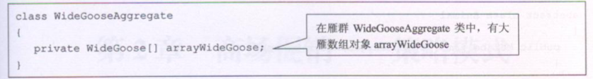
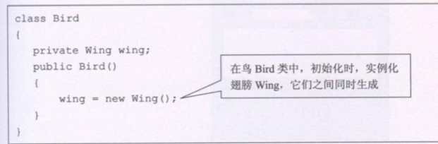
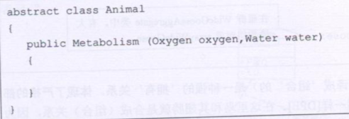

## 设计模式
> UML类图
>
> >  
> >
> > __类图基础属性__
> >
> > _第一层为类名(接口有interface),第二层为类的特性(属性),第三层为类的行为(方法)_
> >
> >  
> >
> > - -表示private
> > - #表示protected
> > - ~表示default 包权限
> > - _ 表示static
> > - _斜体表示抽象_
> >
> > __类与类之间关系__
> >
> > - 继承 (空心三角形+实线)
> > - 实现(空心三角性+虚线)
> > - 关联 (_一个类包含另一个类_ (实线+箭头)  
> > - 聚合(__has-a关系,两个对象具有各自的生命周期__)使用空心菱形+实线箭头
> >
> >    
> >
> > - 组合(__部分与整体的声明周期一样__)使用实心菱形+实线
> >
> >    
> >
> > - 依赖关系 (虚线箭头表示) 作为方法参数
> >
> >  
> >
> > 