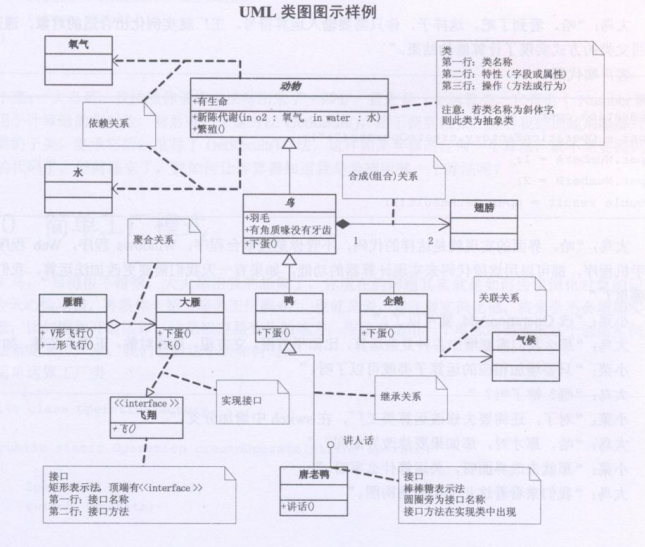
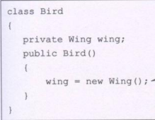
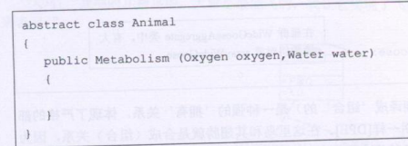

## UML概述

> __Unifiled Modeling Language__是一种面向对象的建模语言,为软件系统建立可视化模型,文档
>
>  
>
> __矩形框__:
>
> - 第一层表示类名(抽象类使用斜体,接口使用<interface>表示
> - 第二层表示类的特性(属性)
>   - +表示public
>   - -表示private
>   - `#`表示protected
>   - ~表示default
> - 第三次表示类的行为(方法)
>
> __类之间关系表示__
>
> - 继承(空心三角形+实线)
> - 实现(空心三角形+虚线)
> - 关联(箭头+实线) __关联之间实体不属于同一个生命周期__   
> - 聚合(空心菱形+实线) 关联之间实体属于同一个生命周期   
> - 依赖(箭头+虚线) __作为方法入参关联__   
>
> 

