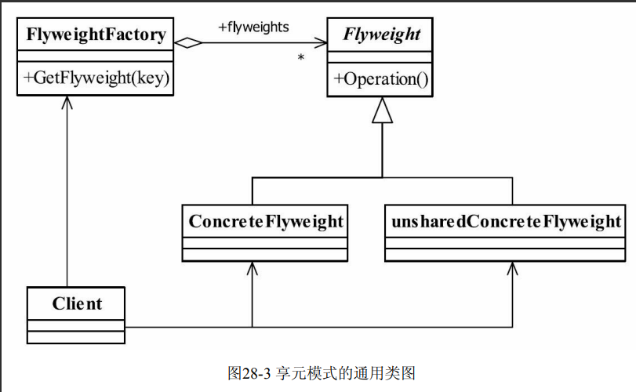

## 享元模式(Flyweight Pattern)

> 享元模式主要用于减少创建对象的数量,以减少内存占用和提高性能
>
> _享元模式尝试重用现有的**同类对象(属性相同的对象抽取)**,如果未找到匹配对象,则创建新对象_
>
> **主要解决：**在有大量对象时，有可能会造成内存溢出，我们把其中共同的部分抽象出来，如果有相同的业务请求，直接返回在内存中已有的对象，避免重新创建。
>
> **何时使用：**
>
>  1、系统中有大量对象。
>
>  2、这些对象消耗大量内存。
>
>  3、这些对象的状态大部分可以外部化。
>
>  4、这些对象可以按照内蕴状态分为很多组，当把外蕴对象从对象中剔除出来时，每一组对象都可以用一个对象来代替。 
>
> 5、系统不依赖于这些对象身份，这些对象是不可分辨的。
>
> **如何解决：**用唯一标识码判断，如果在内存中有，则返回这个唯一标识码所标识的对象。
>
> 
>
> - **Flyweight 抽象享元角色**
>
> > 构建对象的抽象类,同时定义出对象的外部状态(**不可共享的属性**)与内部状态(**可以共享的属性**)
>
> - **ConcreteFlyweight具体享元角色**
>
> > 具体的产品类,实现抽象享元定义的业务.*定义内部角色时应该与环境无关,不应该出现一个操作改变内部状态*
>
> - **unsharedConcreteFlyweight 不可共享的享元角色**
>
> > 不存在外部状态或者安全要求不能够使用共享技术的对象,该对象一般不会出现在享元工厂中
>
> - **FlyweightFactory 享元工厂**
>
> > 构建一个容量池,同时提供从池中获取对象方法
>
>  
>
> 

