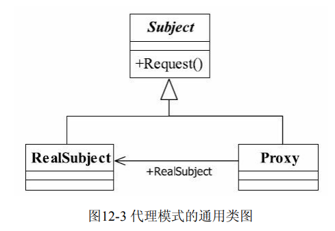
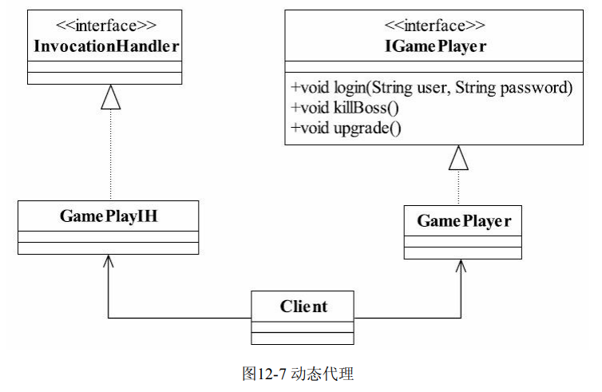

## 代理模式(Proxy Pattern)

> 为其他对象提供一种代理控制这个对象访问
>
>  
>
> - Subject 抽象主题
>
> > 抽象类/接口,与业务进行定义
>
> - RealSubject 具体主题
>
>   > 被委托角色,业务逻辑具体执行者
>
> - Proxy代理主题
>
>   > 抽象主题的方法__限制委托__给具体实现类,并在具体实现类__之前或者之后增强工作__
>
> 代理模式应用
>
> - 职责清晰
> - 高扩展性
>
> #### 动态代理
>
> 运行时决定代理对象(使用JDK接口反射实现)
>
> ~~~java
> // 生成动态代理实例   
> Object newProxyInstance(ClassLoader loader,Class<?>[] interfaces,
>                                           InvocationHandler h)
> // 该方法用于获取指定代理对象所关联的InvocationHandler
> InvocationHandler getInvocationHandler(Object proxy) 
> //获取关联于指定类装载器和一组接口的动态代理类的类对象
> Class getProxyClass(ClassLoader loader, Class[] interfaces) 
> //该方法用于判断指定类是否是一个动态代理类
> boolean isProxyClass(Class cl)        
> ~~~
>
>  
>
>  
>
> _动态代理实现代理的职责，业务逻辑Subject实现相关的 逻辑功能，两者之间没有必然的相互耦合的关系。通知Advice从另一个切面切入，最终在高 层模块也就是Client进行耦合，完成逻辑的封装任务_
>
> eg:
>
> ~~~java
> 
> ~~~
>
> 

