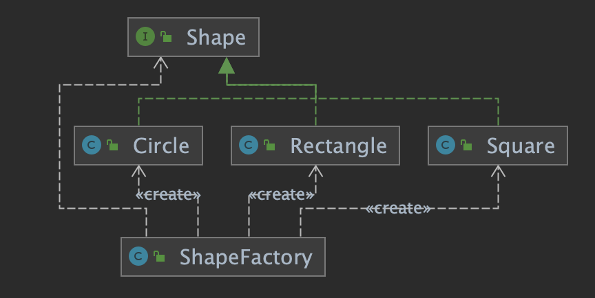

## 工厂模式

> *工厂模式主要将实例化的代码抽取出来,放到一个类统一维护和管理,达到依赖关系的解耦,提供项目的扩展性*
>
> **使用设计原则中依赖抽象原则,创建过程在抽象类的子类完成**
>
> #### 简单工厂模式(静态工厂方法,直接创建产品)
>
> > 使用工厂类封装实例化对象方法(将创建方法逻辑判断封装成一个类)
>
> #### **工厂模式(使用接口约束产品)**
>
> > 定义一个创建对象接口(约束创建对象),让其子类自己决定实例化哪一个工厂类,工厂模式使其创建过程延迟到子类完成(Java多态),子类返回抽象产品
> >
> >  
>
> #### 抽象工厂方法模式
>
> > 使用抽象工厂类对产品分类,使其组合成一个更大的产品(**创建一系列相关或相互依赖对象的接口**)
> >
> >  
> >
> > - AbstractFactory  组合其他工厂(顶级抽象,约束产品工厂类)
> > - ShapeFactory 与 ColorFactory 分别生成不同产品
> > - FactoryProducer 逻辑判断
>
> #### 工厂模式在JDK中应用
>
> > Calendar 创建
>
> 