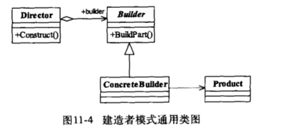
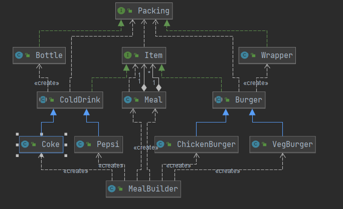

## 建造者模式(Builder Pattern)  

> **使用多个简单的对象一步步构建成一个复杂的对象,Builder类独立于其他建筑对象**
>
> *将复杂的构建与其表示分离,使用同样的建造过程可以创建不同的表示*
>
> _建造者模式关注的是零件类型和执行顺序_
>
> - 封装性(客户端不需要了解对象内部组成细节)
> - 建造者独立,容易扩容(ConcreateBuilder)
> - 便于控制细节风险(Director控制构造细节)
>
> ###### 使用场景
>
> > - 相同的方法,不同执行顺序,产生不同的事件结果
> > - 多个部件装配到一个对象中,产生的运行结果不同
> > - 产品类非常复杂,通过调用顺序产生不同产品
>
>  
>
> Product:  具体产品(Meal)
>
> Builder: 创建Product接口/抽象类 (约束建造流程)
>
> ConcreateBuilder: 实现Builder 
>
> Director:使用Builder构造出具体产品
>
>  
>
> **建造者模式在JDK中应用**
>
> > StringBuilder 
>
> **建造者和工厂模式区别**
>
> > - 建造者注重方法的调用顺序(产品组合)
> > - 创建对象的力度不同，建造者模式创建复杂的对象，由各种复杂的部件组成，工厂模式创建出来的对象都一样
> > - 建造者模式根据建造过程中的顺序不一样，最终对象部件组成也不一样。

