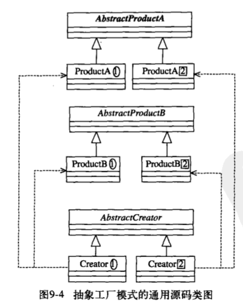

## 抽象类工厂(Abstract Factory Pattern)

> ###### 为创建一组相关或相互依赖的对象提供一个接口,而且无需指定它们的具体类
>
> ###### 接口定义功能->抽象类实现接口公共方法->实现类实现扩展方法(易于扩展)
>
> - 封装性(通过具体的工厂类方法创建对象)
>
> > 一个对象族(一组没有任何关系的对象)都有__相同的约束(存在相同的行为)__,可以 使用抽象工厂模式
>
>  
>
> 抽象类工厂实例
>
> ###### Interface(定义功能)->Abstract(实现部分功能)->创建抽象类实例
>
>  

