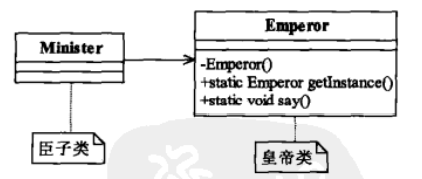

## 单例模式

> __一个类只能产生一个对象,所有类对它的依赖是相同的__
>
>  
>
> ~~~java
> /**
>  * 单例模式通用代码
>  */
> public class Singleton {
>     //类加载时创建一次
>     private static final Singleton singleton = new Singleton();
> 
>     //私有化构造方法  
>     private Singleton() {
>     }
> 
>     // 提供获取单个对象
>     public static Singleton getSingleton() {
>         return singleton;
>     }
> 
>     public static void doSomeThing() {
>         System.out.println("created  one Singleton");
>     }
> }
> ~~~
>
> #### 单例模式的优点
>
> > - 内存中只存在一个实例,减少内存开支,易于对象创建,销毁,生命周期管控
> > - 单例模式可以避免对资源的多重次占用
> > - 系统设置全局的访问点,优化和共享资源访问(设计一个单例类,负责所有数据表的映射处理)
>
> #### 单例缺点
>
> > - 没有接口,扩展困难
> > - 单例模式与单一职责存在冲突,一个类应该只实现一个逻辑,而不关系他是否是单例
>
> #### 单例模式使用的场景
>
> > - 生成唯一序号环境
> > - 一个共享访问点或共享数据,确保线程安全
> > - 访问IO和数据库资源(使用单例复用)
> > - 定义大量静态常量和静态方法(工具类).可以采用单例(也可以直接static)
>
> #### 单例模式最佳实践
>
> > Spring容器中Bean的创建默认时单例,

