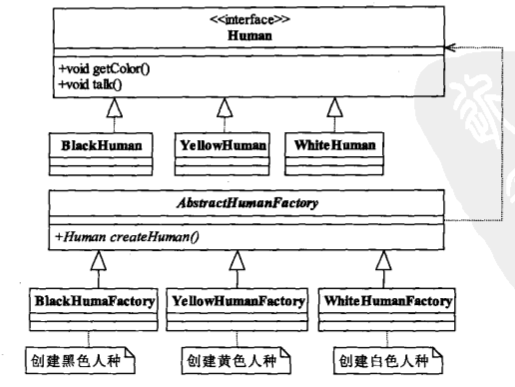

## 工厂方法模式 

> __定义一个用于创建对象的接口,让子类决定实例化哪一个类,工厂方法使用一个类实例化延迟到其他子类__
>
> _在工厂模式中,抽象产品类Product负责定义产品的共性,实现对事物最抽象的定义,Creator为抽象创建类,具体创建产品类是由实现的工厂ConcreteCreator完成_
>
>  
>
> - 降低模块之间耦合
> - 扩展性非常优秀(只需要增加实现类完成任意扩展)
> - 屏蔽实现类(通过接口定义,完成具体实现)
>
> >   
>
> > ~~~java
> > // 抽象人类创建工厂
> > public abstract class AbstractHumanFactory {
> >  public abstract <T extends Human> T createHuman(Class<T> c);
> > }
> > ~~~
> >
> > - 抽象工厂类(使用泛型限制createHuman入参)
> >
> > ~~~ java
> > // 工厂创建类
> > public class HumanFactory extends AbstractHumanFactory {
> >     @Override
> >     public <T extends Human> T createHuman(Class<T> c) {
> >         Human human = null;
> >         try {
> >             human = (Human) Class.forName(c.getName()).newInstance();
> >         } catch (InstantiationException e) {
> >             e.printStackTrace();
> >         } catch (IllegalAccessException e) {
> >             e.printStackTrace();
> >         } catch (ClassNotFoundException e) {
> >             e.printStackTrace();
> >         }
> >         return (T) human;
> >     }
> > }
> > ~~~
> >
> > - 实现抽象类中创建方法
> >
> > > 通过工厂类创建实体
> > >
> > > ~~~java
> > > public static void main(String[] args) {
> > >      // 声明创造类实体
> > >      AbstractHumanFactory humanFactory = new HumanFactory();
> > > 
> > >      WhiteHuman WhiteHuman = humanFactory.createHuman(WhiteHuman.class);
> > > 
> > >      BlackHuman BlackHuman = humanFactory.createHuman(BlackHuman.class);
> > > 
> > >      YellowHum human = humanFactory.createHuman(YellowHum.class);
> > > 
> > >  }
> > > ~~~
> >
>
> #### 使用工厂模式代替单列
>
> > ###### 与单例中聚合
> >
> >  
> >
> > ~~~java
> > public class SingletonFactory {
> >     private static Singleton singleton;
> >     static {
> >         try {
> >             Class<?> aClass = Class.forName(Singleton.class.getName());
> >             // 获取无参构造
> >             Constructor declaredConstructor = aClass.getDeclaredConstructor();
> >             declaredConstructor.setAccessible(true);
> >             // 创建实例
> >             singleton = (Singleton) declaredConstructor.newInstance();
> >         } catch (ClassNotFoundException e) {
> >             e.printStackTrace();
> >         } catch (NoSuchMethodException e) {
> >             e.printStackTrace();
> >         } catch (InstantiationException e) {
> >             e.printStackTrace();
> >         } catch (IllegalAccessException e) {
> >             e.printStackTrace();
> >         } catch (InvocationTargetException e) {
> >             e.printStackTrace();
> >         }
> >     }
> >     public static Singleton getSingleton() {
> >         return singleton;
> >     }
> > }
> > ~~~
>
> ###### 延迟初始化(一个对象被消费完毕后,不立即释放,工厂类保持器初始化状态,等待再次被使用)
>
>  
>
> _减少对象创建销毁带来的开销_
>
> ~~~java
> /**
>  * 延迟加载的工厂类
>  */
> public class ProductFactory {
>     private static final Map<String, Product> parMap = new HashMap();
>     public static synchronized Product createProduct(String type) {
>         Product product = null;
>         if (parMap.containsKey(type)) {
>             product = parMap.get(type);
>         } else {
>             if (type.equals("Product1")) {
>                 product = new ConcreteProduct1();
>             } else {
>                 product = new ConcreteProduct2();
>             }
> 
>             parMap.put(type, product);
>         }
>         return product;
>     }
> }
> ~~~
>
> 

## 简单工厂(静态工厂模式)

> 工厂方法模式:定义一个用于创建对象的接口,子类决定实例化哪一个类(一个类的实例化延迟到其子类)
>
> 静态工厂模式:不易于工厂类扩展(使用静态方法代替抽象类实现)
>
>  
>
> ~~~java
> // 简单工厂模式中工厂类
> public class SimpleHumanFactory {
>     public static <T extends Human> T createHuman(Class<T> c) {
>         Human human = null;
>         try {
>             human = (Human) Class.forName(c.getName()).newInstance();
>         } catch (InstantiationException e) {
>             e.printStackTrace();
>         } catch (IllegalAccessException e) {
>             e.printStackTrace();
>         } catch (ClassNotFoundException e) {
>             e.printStackTrace();
>         }
>         return (T) human;
>     }
> }
> ~~~

## 多个工厂类

> _拆分工厂创建类为多个_
>
>  

