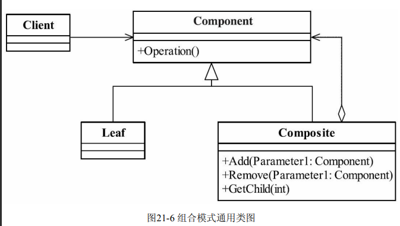
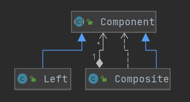
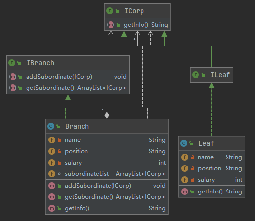

## 组合模式(Composite)

> _描述整体与部分的关系,适用于树形结构数据操作(使用于XML模式)_
>
> 将对象组合成树形结构以表示__部分-整体__的层次结构,使得用户对单个对象和组合对象的使用__具有一致性__
>
> - 高层模块调用简单
> - 节点自由增加
>
>  
>
> - Component  抽象构件角色(结点行为)
>
> > 定义参加组合对象共有的方法和属性(定义一些默认的行为和属性)
>
> - Leaf 叶子构件(特殊的结点)
>
> > 组合的最小单位
>
> - Composite(操作结点)
>
> > 组合树枝节点和叶子结点,使其成为一个树形结构
>
>  
>
>  
>
> ~~~java
> /**
>  * 组合类 负责父子结点关联
>  * 实现通用方法
>  */
> public class Branch implements IBranch {
>     private String name = "";
>     private String position = "";
>     private int salary = 0;
>     //聚合ICop
>     ArrayList<ICorp> subordinateList = new ArrayList<>();
>     //通过构造函数生成结点必要信息
>     public Branch(String name, String position, int salary) {
>         this.name = name;
>         this.position = position;
>         this.salary = salary;
>     }
>     @Override
>     public void addSubordinate(ICorp corp) {
>         this.subordinateList.add(corp);
>     }
>     @Override
>     public ArrayList<ICorp> getSubordinate() {
>         return this.subordinateList;
>     }
>     @Override
>     public String getInfo() {
>         String info = "";
>         info = "姓名：" + this.name;
>         info = info + "\t职位：" + this.position;
>         info = info + "\t薪水：" + this.salary;
>         return info;
>     }
> }
> ~~~

