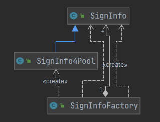
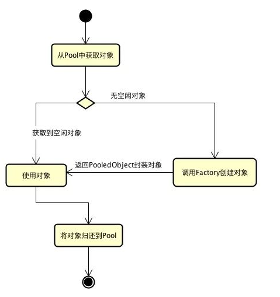

## 享元模式(Flyweight Pattern)

> **享元模式主要用于减少创建对象的数量,以减少内存占用和提高性能**
>
> **_享元模式尝试重用现有的同类对象(属性相同的对象抽取),如果未找到匹配对象,则创建新对象_**
>
> **主要解决：**在有大量对象时，有可能会造成内存溢出，我们把其中共同的部分抽象出来，如果有相同的业务请求，直接返回在内存中已有的对象，避免重新创建。
>
> - 对象复用
> - 减少直接new对象
> - 通常使用于组合对象中对象赋值
>
> 
>
> - **Flyweight 抽象享元角色**
>
> > 构建对象的抽象类,同时定义出对象的外部状态(**不可共享的属性**)与内部状态(**可以共享的属性**)
>
> - **ConcreteFlyweight具体享元角色**
>
> > 具体的产品类,实现抽象享元定义的业务.*定义内部角色时应该与环境无关,不应该出现一个操作改变内部状态*
>
> - **unsharedConcreteFlyweight 不可共享的享元角色**
>
> > 不存在外部状态或者安全要求不能够使用共享技术的对象,该对象一般不会出现在享元工厂中
>
> - **FlyweightFactory 享元工厂**
>
> > 构建一个容量池,同时提供从池中获取对象方法
>
>  
>
> **对象池(Apache Common Pool2)**
>
> > 存储系统中可以重用并长期使用的对象(线程,TCP连接,Redis连接),统一生命周期管理
> >
> > - ObjectPool 对象池(定义对象获取,归还操作)
> > - PooledObjectFactory 对象工厂,提供对象创建,初始化,销毁操作
> > - PooledObject: 对池中对象的封装(功能添加)
> >
> >  
> >
> > [引用博客](https://blog.csdn.net/weixin_42868638/article/details/87070582)

