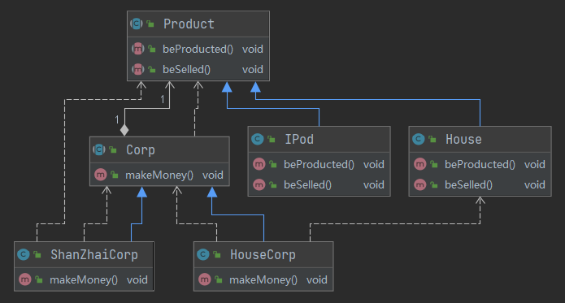

## 桥梁模式(Bridge Pattern)

> 把抽象与实现化解耦,使得二者可以独立变化(**提供抽象化与实现化的桥接结构,实现二者的解耦**)
>
> - 满足最小抽象原则
>
> - 抽象类之间相互依赖(使用依赖代替直接继承)
>
> - 多种可能会变化的情况下,代替继承解决类爆炸问题
> - 不希望或不适用继承的场景
>
>  
>
>  
>
> **抽象角色的部分实现是由实现角色完成的**
>
> - Abstraction 抽象化角色(桥接角色一)
>
> >  定义抽象方法约束该角色行为,同时保存对另一个角色的依赖(依赖于桥接角色二)
>
> - Implementor 实现化角色
>
> > 定义角色必要的行为和属性
>
> - RefinedAbstraction修正抽象化角色
>
> > 它引用实现化角色对抽象化角色进行修正。
>
> - ConcreteImplementor 具体实现化角色
>
> > 它实现接口或抽象类定义的方法和属性。

