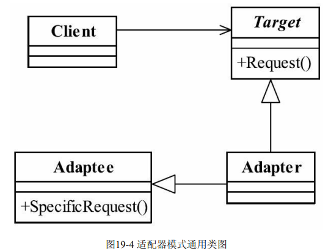
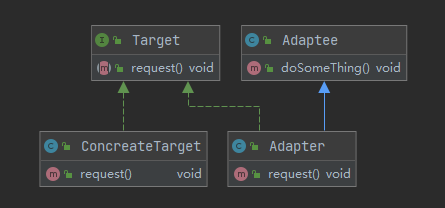
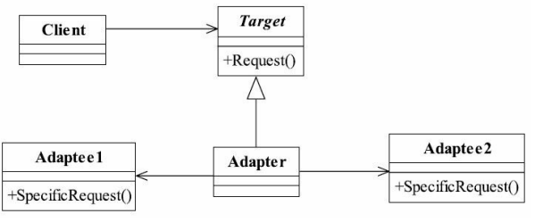

## 适配器模式(Adapter Pattern)

> 将一个类的接口转变成客户端期待的另一种接口,使其原本接口不匹配而无法实现的两个类能够实现
>
> - 使用继承或依赖
> - 适配器继承或依赖已有的对象,实现想要的目标接口
>
> _适配器模式是一个补救模式,通常解决接口不相容问题_
>
>   __A和B之间加上适配器C__
>
> __适配器通用模式__
>
>  
>
> 
>
> - Target 目标角色
>
> > 待转换类
>
> - Adaptee 源角色
>
> > 被转换类
>
> - Adapter适配器角色
>
>   > 转换类
>
>  
>
> ####  适配器模式扩展(适配多个类合成一个目标类) 
>
> > _将多个Adaptee关联到一个适配器中_ 
> >
> > _对象适配器(把继承关系改为关联)_
> >
> > - 对象适配器是对象的合成关系
>
>  
>
> **适配器模式**
>
> - SpringMvc 请求方式
> -  

