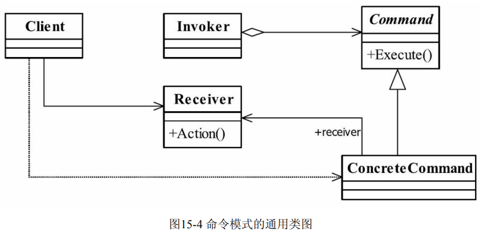
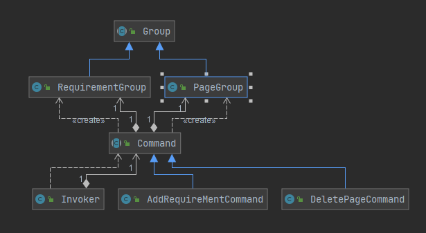

## 命令模式

> 命令模式（Command Pattern）是一种数据驱动的设计模式，请求以命令的形式包裹在对象中，并传给调用对象。调用对象寻找可以处理该命令的合适的对象，并把该命令传给相应的对象，该对象执行命令。将请求和执行分开操作
>
> **将命令的请求者与执行者分开**
>
> 
>
> - Receive接收者
>
> > 需要执行的命令
>
> - Command命令者
>
> > 命令声明类
>
> - ConcreteCommand
>
> > **将命令与命令接收者绑定**(聚合关系)
>
> - Invoker调用者
>
> > 与ConcreteCommand聚合,并执行命令
>
> 
>
> [代码实例](https://gitee.com/miaomiaole/DesignPattern/tree/master/src/main/java/org/example/Command)
>
>  
>
> **Spring中命令模式应用**
>
> - **JDBCTemplate**
>

