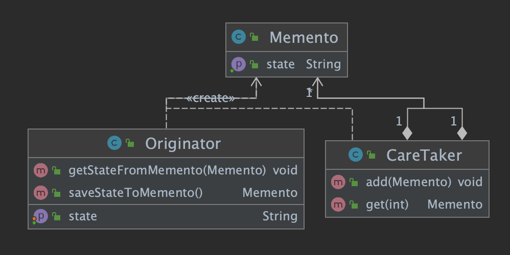
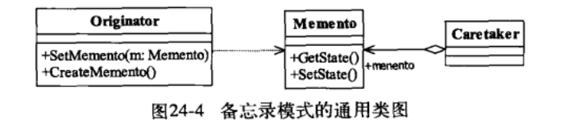

## 备忘录模式(Memento Pattern)

> 保存一个对象的某个状态,以便在适当的时候恢复对象
>
> **在不破坏封装的前提下,捕获一个对象的内部状态,并在该对象外保存这个状态**
>
> 
>
>  
>
> - Originator 发起人角色
>
> > 记录当前时刻内部状态,定义备份范围
>
> - Memento 备忘录
>
> > 存储备份内容
>
> - Caretaker 备忘录管理员
>
> > 对备份进行管理(容器)
>
> #### **备忘录模式应用场景**
>
> - JDBC驱动,事务控制
> - CTRL+Z撤回
>
> #### **备忘录模式扩展(clone)**
>
> > ~~~java
> > package org.example.Memento.Case2;
> > 
> > public class Originator implements Cloneable {
> >     private String state = "";
> > 
> >     private Originator backup;
> > 
> >     public String getState() {
> >         return state;
> >     }
> > 
> >     public void setState(String state) {
> >         this.state = state;
> >     }
> > 
> >     public void createMemento() {
> >         this.backup=this.clone();
> >     }
> > 
> >     public void restoreMemento() {
> >         this.setState(this.backup.getState());
> >     }
> > 
> >     @Override
> >     protected Originator clone() {
> >         try {
> >             return (Originator) super.clone();
> >         } catch (CloneNotSupportedException e) {
> >             e.printStackTrace();
> >         }
> >         return null;
> >     }
> > }
> > ~~~
>
> #### **多状态的备忘录模式**
>
> > BeanUtils 使用
>
> 
>
> 